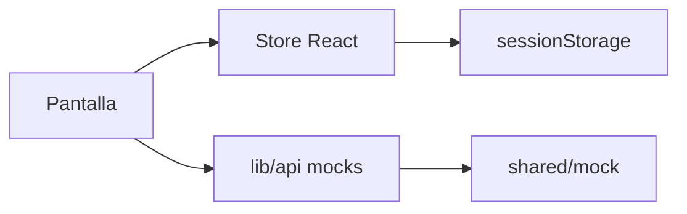

# SynchroDesk — funcionalidades actuales (front mock)

Inventario de **lo que el prototipo ya permite hacer** en el navegador. No hay backend: no hay API real, base de datos, autenticación ni persistencia entre dispositivos.

Todas las acciones viven en el cliente. Las que “se guardan” lo hacen en **memoria de la pestaña** (`sessionStorage` o React state). Cerrar la pestaña restaura los seeds de `src/shared/mock/`.

| Leyenda | Significado |
|---------|-------------|
| **Sesión** | El cambio se ve al instante y sobrevive un F5 en la misma pestaña |
| **Memoria** | El cambio se ve al instante; se pierde al recargar |
| **Navegable** | Pantalla completa con datos mock; no hay alta/edición real |
| **Visual** | Control o botón de diseño; no muta datos |

---

## 1. Reglas de la demo

1. Cualquier valor en `/login` entra al dashboard. No se validan credenciales.
2. Los delays de envío (`400–800 ms`) simulan red (`simulateApiDelay`).
3. Los toasts (éxito / error / info) confirman acciones de demo.
4. El badge *Prototype* en el sidebar deja claro que los datos son estáticos de origen.
5. **No hay** middleware, cookies de sesión, RLS, Storage ni Realtime.

---

## 2. Acceso y cromo de la consola

| Funcionalidad | Tipo | Qué hace |
|---------------|------|----------|
| Login correo / contraseña | Visual | Navega a `/dashboard` sin comprobar el valor |
| Continuar con Google / Microsoft | Visual | Igual: `router.push('/dashboard')` |
| Olvidé mi contraseña | Visual | Botón deshabilitado |
| Cerrar sesión | Navegable | Enlace del menú de perfil → `/login` (no limpia store) |
| Dark / light | **Sesión** | Toggle en header y login; clave `synchrodesk:theme-mode` |
| Sidebar contextual | Navegable | Ítems de mesa de ayuda o inventario según la ruta |
| Pestañas de sistema | Memoria | Abrir inventario añade pestaña; cerrarla (salvo mesa de ayuda) vuelve al otro sistema |
| Drawer móvil | Navegable | Menú hamburguesa bajo `md` |
| Selector de tenant | Memoria | 5 recientes + búsqueda; cambia logo y `tenantId` activo (no se restaura al recargar) |
| `TenantEyebrow` | Navegable | Nombre del cliente en cabeceras |
| Breadcrumbs | Navegable | Tickets, clientes, roles, usuarios, conocimiento |
| 404 global y de consola | Navegable | `ErrorPage` 404 |
| 403 inventario | Navegable | Si el tenant no contrata inventario (p. ej. Nexus Salud) |

---

## 3. Búsqueda, notificaciones y atajos

| Funcionalidad | Tipo | Qué hace |
|---------------|------|----------|
| **Cmd/Ctrl+K** | Navegable | Paleta: tickets (del tenant), clientes, usuarios, rutas. Debounce 300 ms, mínimo 2 caracteres. Flechas + Enter. Escape cierra |
| Búsqueda del header | Navegable | Mismo índice; placeholder según sistema; Enter al primer resultado |
| Notificaciones | **Sesión** | Click → ticket o ruta; marca leída; “Marcar todas”; badge del header. IDs leídos en `sessionStorage` |
| Preferencia de filas por tabla | **Sesión** | 10 / 25 / 50 en tickets, usuarios, clientes, artículos y movimientos |

La paleta **no** busca artículos de conocimiento ni SKUs (Sprint 8).

---

## 4. Plataforma — clientes

Rutas: `/clientes`, `/clientes/[id]`.

| Funcionalidad | Tipo | Qué hace |
|---------------|------|----------|
| Listado de tenants | Navegable | 12 empresas; plan, sistemas, usuarios, estado |
| Búsqueda | Memoria (filtro) | Nombre, dominio, plan, región |
| Paginación | **Sesión** (tamaño) | 10 / 25 / 50 |
| Ficha de contrato | Navegable | Logo, admin, dominio, sistemas, región |
| Suspender / reactivar | **Sesión** | Diálogo + delay + toast; override en `tenant-admin-storage` |
| Cambiar plan | **Sesión** | Starter / Business / Enterprise; mismo patrón |
| Empty state | Navegable | Si el filtro no da filas, CTA “Limpiar búsqueda” |

Los cambios de plan/estado se ven en el listado al volver. No tocan el selector del header ni los seeds globales.

---

## 5. Mesa de ayuda — dashboard

Ruta: `/dashboard`.

| Funcionalidad | Tipo | Qué hace |
|---------------|------|----------|
| KPIs por tenant | Navegable | Abiertos, pendientes, resueltos, SLA, técnicos, tiempo de respuesta — cambian al cambiar de cliente |
| Gráfico 7 días | Navegable | Abiertos vs resueltos (Recharts) |
| Tickets recientes | **Sesión** | Hasta 6 del tenant, incluyendo los creados en demo |
| Técnicos activos | Navegable | Lista mock del snapshot del tenant |
| CTA “Nuevo ticket” | Navegable | Enlace a `/tickets/nuevo` |
| Skeleton | Visual | `loading.tsx` si hay delay de ruta |

---

## 6. Tickets (módulo estrella)

### Cola `/tickets`

| Funcionalidad | Tipo | Qué hace |
|---------------|------|----------|
| Tabla | **Sesión** | Filas del store; clic → detalle |
| Kanban | Navegable | Toggle tabla/kanban; columnas Nuevo, En progreso, Pendiente, Resuelto; clic → detalle. **Sin drag & drop** |
| Filtro texto | URL | Asunto / ID |
| Chips de estado | URL | Todos + 5 estados |
| Filtros avanzados | URL | Prioridad (Baja/Media/Alta/Crítica), técnico, categoría, desde/hasta; “Limpiar filtros” |
| Paginación | URL + **Sesión** | Página en query; tamaño en `sessionStorage` |
| Empty state | Navegable | CTA crear ticket o limpiar filtros |
| Vista compartible | URL | `q`, `estado`, `prioridad`, `tecnico`, `categoria`, `desde`, `hasta`, `vista`, `page`, `size` |

Al cambiar de tenant la página vuelve a 1 y la cola se recorta a ese `tenantId`.

### Alta `/tickets/nuevo`

| Funcionalidad | Tipo | Qué hace |
|---------------|------|----------|
| Formulario | **Sesión** | Asunto, descripción, categoría, prioridad (Baja/Media/Alta/Crítica a mano), solicitante, técnico, equipo |
| Validación | Memoria | Asunto y descripción obligatorios; errores inline + toast |
| Adjuntos | **Sesión** (blob URL) | Dropzone de imágenes → evidencias del ticket |
| Loading | Visual | Botón disabled 400–800 ms |
| Resultado | **Sesión** | ID `TCK-xxxx`, toast, redirect al detalle; aparece en cola y dashboard |

El ticket hereda el `tenantId` activo.

### Detalle `/tickets/[id]`

| Funcionalidad | Tipo | Qué hace |
|---------------|------|----------|
| Metadatos | Navegable | Estado, prioridad (Baja/Media/Alta/Crítica), categoría, equipo, SLA (texto libre, no calculado) |
| Panel de gestión | **Sesión** | Editar estado, prioridad, técnico, categoría (desktop; drawer en móvil) |
| Confirmar resolver/cerrar | **Sesión** | Diálogo antes de Resuelto o Cerrado |
| Timeline | **Sesión** | Creado, asignado, cambio de estado, comentario, resuelto |
| Tickets relacionados | Navegable | Hasta 3 por misma categoría o solicitante |
| Hilo de comentarios | **Sesión** | Publicar texto + imágenes; autor demo Elena Ruiz |
| Plantillas de respuesta | Memoria | Chips que insertan texto en el draft |
| Preview de imagen | Memoria | Diálogo sobre adjunto |
| Imprimir | Visual | `window.print()`; oculta chrome |
| 404 | Navegable | ID inexistente |

Kanban no incluye la columna Cerrado; esos tickets solo salen en tabla si se filtra.

**Prioridades hoy vs. mesa de soporte IT:** el prototipo ya usa Baja · Media · Alta · Crítica. No hay código P1–P4, ni tipo (Incidente/Solicitud/Problema/Cambio), ni impacto × urgencia, ni SLA calculado por nivel (el texto de SLA es decorativo; `/configuracion` solo guarda primera respuesta crítica y resolución alta). El modelo objetivo está en [`ROADMAP.md`](./ROADMAP.md#modelo-de-prioridades--soporte-informático) (Sprint 2).

---

## 7. Usuarios, roles, equipos, activos, conocimiento

### Usuarios `/usuarios`, `/usuarios/[id]`

| Funcionalidad | Tipo | Qué hace |
|---------------|------|----------|
| Directorio | Navegable | Filtrado por tenant; búsqueda nombre/correo/rol |
| Paginación | **Sesión** (tamaño) | |
| Ficha | Navegable | Avatar, correo, rol, equipo, estado, último acceso; 404 si no es del tenant |
| Invitar usuario | Visual + toast | Modal correo/rol/equipo; valida email; **no añade fila** al listado |

### Roles `/roles`, `/roles/nuevo`, `/roles/[id]`

| Funcionalidad | Tipo | Qué hace |
|---------------|------|----------|
| Tabla de roles | Navegable | Alcance por sistema y recuento de permisos |
| Matriz | Memoria | Checkboxes ver/crear/editar/eliminar/exportar/aprobar; fila “Acceso al sistema” |
| Crear / editar | Visual | Campos editables; **Guardar deshabilitado** |

### Equipos `/equipos`

Tarjetas mock (lead, miembros, abiertos, SLA). Sin CRUD.

### Activos TI `/activos`

Tabla mock (equipo, impresora, router, switch, licencia). Sin CRUD.

### Conocimiento `/conocimiento`, `/conocimiento/[id]`

| Funcionalidad | Tipo | Qué hace |
|---------------|------|----------|
| Tablero | Navegable | Búsqueda por título/extracto; chips de categoría |
| Detalle | Navegable | Contenido, vistas, % útil |
| Empty state | Navegable | Limpiar filtros |

**No** se filtra por tenant.

---

## 8. Configuración del tenant

Ruta: `/configuracion`.

| Campo | Tipo |
|-------|------|
| Cliente (org) y dominio | **Sesión** (por `tenantId`) |
| SLA: primera respuesta crítica, resolución alta, horario | **Sesión** (solo P1 respuesta + P2/P1 resolución; no hay matriz de 4 niveles) |
| Zona horaria e idioma | Visual (`defaultValue`) |
| Switches de notificaciones | Visual |
| Guardar cambios | Toast “Cambios guardados (demo)” |

---

## 9. Inventario

Guard 403 si el tenant no tiene el sistema. Los datos de stock **no** cambian al cambiar de cliente (deuda Sprint 8).

### Dashboard `/inventario`

KPIs mock, 5 movimientos recientes, alertas de stock bajo. Navegable.

### Artículos `/inventario/articulos` + `/nuevo`

| Funcionalidad | Tipo | Qué hace |
|---------------|------|----------|
| Listado | **Sesión** | Incluye altas de la pestaña |
| Filtros | Memoria | Texto, estado (Disponible / Stock bajo / Agotado), categoría |
| Alta | **Sesión** | SKU único, nombre, categoría, almacén, stock, mínimo, unidad; estado derivado; toast + redirect |

### Movimientos `/inventario/movimientos` + `/nuevo`

| Funcionalidad | Tipo | Qué hace |
|---------------|------|----------|
| Listado | **Sesión** | Filtro texto + tipo (Entrada / Salida / Traslado / Ajuste) |
| Alta | **Sesión** | Tipo, SKU del catálogo, cantidad, origen/destino según tipo, usuario; validación + toast |

La alta de movimiento **no** recalcula el stock del artículo en el store.

### Almacenes y proveedores

Catálogos mock. Sin alta ni edición.

---

## 10. Feedback de UI transversal

| Funcionalidad | Tipo |
|---------------|------|
| Toasts tipo isla | Éxito / error / info tras guardar, comentar, validar, invitar, suspender |
| Empty states | Tickets, usuarios, clientes, inventario, conocimiento |
| Skeletons | Dashboard, tickets, usuarios (`loading.tsx`) |
| Delay opcional de ruta | `NEXT_PUBLIC_DEMO_ROUTE_LOADING_DELAY_MS` |
| Reduced motion | Anula fade/hover/toasts si el SO lo pide |
| Focus visible y teclado | Sidebar, chips, filas, paleta, botones |
| Layout responsive | Drawer, tablas apiladas, panel de ticket en drawer |

---

## 11. Qué persiste en la pestaña vs qué no

**Sí (sessionStorage):** tickets y comentarios; artículos y movimientos dados de alta; notificaciones leídas; tema; tamaño de tabla; org/dominio/SLA; plan y estado de cliente.

**No (se pierde o nunca se guardó):** tenant activo y recientes; pestañas de sistema; filtros de conocimiento/inventario (salvo tickets en URL); matriz de roles; invitación de usuario; switches de configuración; zona horaria/idioma; stock recalculado tras un movimiento.

---

## 12. Fuera de alcance (aún no)

- Backend, Postgres, Supabase, API Routes con persistencia
- Login real, middleware, cookies httpOnly
- Validar que el dashboard exija estar “logueado”
- Aislamiento de inventario/conocimiento/roles por tenant
- Drag & drop en Kanban
- Export CSV/PDF de servidor
- WebSockets / notificaciones push
- Adjuntos reales (hoy son blob URLs locales)
- Playwright en el repo (`package.json` no tiene `test:e2e`)

Próximo trabajo: épica **Mesa de ayuda IT lista para backend** — [`ROADMAP.md`](./ROADMAP.md) (sprints 1–5, HU-1 … HU-33, sin backend). Incluye el modelo de prioridades de soporte informático (se conservan Baja/Media/Alta/Crítica; se añaden P1–P4, impacto, urgencia, tipo y SLA por nivel). El ciclo anterior hacia Supabase quedó en [`ROADMAP-historico.md`](./ROADMAP-historico.md).

---

*Última revisión: septiembre 2026 — extraído de `src/app/`, `src/components/`, `src/stores/` y `src/shared/config/`.*
