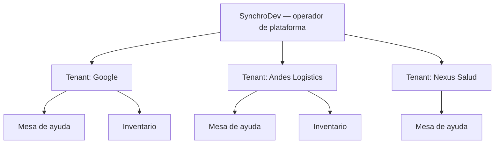
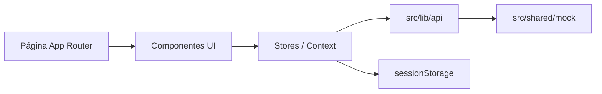

# SynchroDesk — documentación del proyecto

Documento de referencia del producto, la arquitectura y el estado real del repositorio. Complementa (no sustituye) las especificaciones de diseño, el roadmap y el contrato de datos.

| | |
|---|---|
| **Producto** | SynchroDesk |
| **Operador** | SynchroDev |
| **Tipo** | SaaS multi-tenant (consola de plataforma + sistemas por cliente) |
| **Fase** | Prototipo UI navegable e interactivo en sesión |
| **Stack** | Next.js 16.3 · React 19 · TypeScript · MUI v6 · Turbopack |
| **Backend** | Ninguno. Datos mock + capa `lib/api` lista para Supabase |
| **Idioma de la UI** | Español |

---

## 1. Qué es SynchroDesk

SynchroDesk es una **plataforma de sistemas** que SynchroDev opera para empresas clientes (tenants). No es un único módulo de tickets: es una consola enterprise con productos contratables por cliente.

Está pensada para:

- Departamentos TI internos y mesas de ayuda
- Empresas de soporte informático y técnicos de terreno
- Gestión de incidentes, solicitudes, activos TI e inventario de stock

La consola actual representa al **administrador de plataforma** (SynchroDev), no al usuario final del cliente.

### Capas del producto

| Capa | Qué es | Ejemplo |
|------|--------|---------|
| Operador | SynchroDev administra la plataforma | Elena Ruiz (`prueba@synchrodev.cl`) |
| Tenant | Empresa contratada | Google, Andes Logistics, Nexus Salud |
| Sistemas | Productos dentro del tenant | Mesa de ayuda, Inventario |
| Consola | Vista del administrador de plataforma | Selector de tenant + pestañas de sistema |



Nexus Salud (y otros tenants sin el sistema contratado) **no** tienen inventario: el prototipo muestra un 403 embebido.

---

## 2. Estado actual (septiembre 2026)

El repositorio es un **prototipo de interfaz premium**. Se ve y se navega como un SaaS real; no hay API, base de datos ni autenticación verdadera.

Inventario detallado de pantallas y acciones: [`FEATURES.md`](./FEATURES.md).

### Lo que sí hace hoy

- Maqueta completa de mesa de ayuda, inventario y consola de clientes
- Acciones de demo que **persisten en la pestaña** (`sessionStorage`): tickets, comentarios, inventario, notificaciones leídas, tema, tamaño de tabla, ajustes del tenant
- Multi-tenant creíble en tickets, usuarios y dashboard: cambiar de Google a Andes o Nexus cambia KPIs y listados
- Capa `src/lib/api/` con la misma forma que tendrán las queries de Supabase (filtros, paginación, `tenantId`)
- Búsqueda global (`Ctrl/Cmd+K`), Kanban de tickets, matriz de permisos, toasts, skeletons, 403/404
- Accesibilidad básica: focus visible, navegación por teclado, `prefers-reduced-motion`

### Lo que no hace (aún)

- Validar credenciales ni emitir sesión (cualquier envío en `/login` entra al dashboard)
- Middleware que proteja `(dashboard)`
- Persistencia entre pestañas, dispositivos o recargas de navegador distintas
- CRUD real ni validaciones de servidor
- Playwright en el árbol de código (el Sprint 7 lo da por hecho; `package.json` no incluye el script)
- `tenantId` en inventario, conocimiento, roles, equipos, activos y notificaciones (épica vigente · S1·HU-1)

### Cómo leer el resto de `docs/`

Plan de trabajo vigente: [`ROADMAP.md`](./ROADMAP.md) (épica **Mesa de ayuda IT lista para backend**, sprints 1–5, front mock).  
El ciclo anterior hacia Supabase está en [`ROADMAP-historico.md`](./ROADMAP-historico.md). Este documento y `src/` describen el estado del código.

| Ámbito | En el código |
|--------|----------------|
| Fundación, tickets interactivos, listados, navegación, Kanban, conocimiento, inventario (altas) | Implementado (mock) |
| `lib/api`, 403/404, a11y, preferencias en sessionStorage | Implementado |
| Tenant persistente, aislamiento total, invitar/guardar rol, stock al mover | Pendiente — Sprint 1 de la épica |
| Prioridades IT (P1–P4, impacto, urgencia, SLA por nivel), catálogos, flujo operativo | Pendiente — Sprints 2–5 |
| Backend / Supabase / auth real | Fuera de este ciclo |

---

## 3. Arranque

Requisitos: Node.js 20+ y npm.

```bash
npm install
npm run dev
```

Abrir [http://localhost:3000](http://localhost:3000). La raíz redirige a `/login`.

| Script | Comando | Uso |
|--------|---------|-----|
| Desarrollo | `npm run dev` | Next.js + Turbopack |
| Build | `npm run build` | Compilación de producción |
| Start | `npm run start` | Servir el build |
| Lint | `npm run lint` | ESLint (core-web-vitals + TypeScript) |

**Usuario de demo:** Elena Ruiz · `prueba@synchrodev.cl` · contraseña visible `synchrodev`. Cualquier valor entra; no hay validación.

Delay opcional al cargar rutas (para enseñar skeletons):

```bash
NEXT_PUBLIC_DEMO_ROUTE_LOADING_DELAY_MS=600 npm run dev
```

---

## 4. Stack técnico

| Pieza | Elección | Notas |
|-------|----------|--------|
| Framework | Next.js 16.3 (App Router) | `src/app/`, Turbopack en `dev` |
| UI | React 19 | Server Components por defecto; `'use client'` solo con estado |
| Lenguaje | TypeScript 5.8 (`strict`) | Alias `@/*` → `src/*` |
| Componentes | MUI v6 + Emotion | `ThemeRegistry` evita mismatch de hidratación |
| Iconos | `@mui/icons-material` | |
| Gráficos | Recharts 2 | Dashboard de tickets |
| Fuentes | Plus Jakarta Sans | `next/font/google` |
| Lint | ESLint 9 + `eslint-config-next` | |

No hay React Query, Zustand, Redux, axios ni cliente Supabase. El estado de negocio vive en Context (`src/stores/`).

---

## 5. Arquitectura

### Flujo de una pantalla



1. Las páginas en `src/app/` ensamblan layout, metadatos y un board o formulario.
2. Los boards leen el tenant activo (`TenantProvider`) y, si hay mutaciones, el store de sesión.
3. Las lecturas paginadas pasan por `src/lib/api` (hoy filtra arrays mock; mañana será `supabase.from(...)`).
4. Las escrituras de tickets e inventario se aplican en memoria y se serializan en `sessionStorage` de la pestaña.

### Shell de la consola

`src/app/(dashboard)/layout.tsx` monta `AppShell`. El árbol de providers (de fuera hacia dentro):

1. `WorkspaceProvider` — sistema activo (mesa de ayuda / inventario) y pestañas
2. `TenantProvider` — tenant activo y recientes
3. `ToastProvider` — confirmaciones tipo Dynamic Island
4. `NotificationsProvider` — campana del header
5. `TicketsProvider` — cola de tickets de la sesión
6. `InventoryProvider` — artículos y movimientos de la sesión
7. `CommandPaletteProvider` — `Ctrl/Cmd+K`

El login usa `AuthShell` (pantalla completa, sin sidebar).

### Server vs Client

| Server Components | Client Components |
|-------------------|-------------------|
| Páginas que solo componen layout y datos de ruta | Sidebar, header, dark mode, gráficos, matrices, formularios, boards con filtros |
| `loading.tsx` / `not-found.tsx` | Providers, stores, command palette |

---

## 6. Estructura del repositorio

```
synchrodesk/
├── docs/                      Documentación (este archivo + diseño, sprints, Supabase)
├── src/
│   ├── app/                   Rutas Next.js (App Router)
│   │   ├── layout.tsx         Root: fuente, ThemeRegistry, metadata
│   │   ├── page.tsx           Redirect → /login
│   │   ├── login/             Acceso visual
│   │   └── (dashboard)/       Consola (route group; no aparece en la URL)
│   ├── components/
│   │   ├── layout/            Shell, tenant, búsqueda, pestañas
│   │   ├── tickets/           Detalle, Kanban, filtros, hilo
│   │   ├── inventario/        Formularios y guard 403
│   │   ├── clientes/          Ficha de tenant
│   │   ├── usuarios/          Ficha e invitación
│   │   ├── conocimiento/
│   │   ├── dashboard/
│   │   ├── roles/
│   │   ├── settings/
│   │   └── ui/                Primitivas reutilizables + skeletons
│   ├── lib/api/               Frontera mock → Supabase
│   ├── stores/                Estado de sesión (tickets, inventario, toasts, notificaciones)
│   ├── shared/
│   │   ├── mock/              Seeds tipados
│   │   ├── types/             Contratos TypeScript
│   │   ├── config/            Claves sessionStorage y delay de demo
│   │   ├── search/            Índice Cmd+K
│   │   ├── validation/        Formularios de ticket e inventario
│   │   └── utils/
│   ├── theme/                 Paleta, tokens, MUI light/dark
│   ├── styles/                Liquid glass, print, a11y, reduced-motion
│   └── hooks/
├── package.json
├── next.config.ts
└── tsconfig.json
```

Convención de importación: `@/components/ui/PageHeader`, `@/lib/api`, `@/shared/types/ticket`.

---

## 7. Sistemas y rutas

El sidebar cambia según el sistema activo (`src/shared/systems.ts`). Al abrir un segundo sistema aparecen pestañas (`SystemTabs`). **Plataforma → Clientes** está siempre visible.

### Acceso

| Ruta | Descripción |
|------|-------------|
| `/` | Redirect a `/login` |
| `/login` | Correo/contraseña + SSO visual (Google, Microsoft) |

### Plataforma (operador SynchroDev)

| Ruta | Descripción |
|------|-------------|
| `/clientes` | Listado paginado de tenants |
| `/clientes/[id]` | Contrato, sistemas, suspender / cambiar plan |

### Mesa de ayuda

| Ruta | Descripción |
|------|-------------|
| `/dashboard` | KPIs, gráfico, tickets recientes, técnicos — **filtrado por tenant** |
| `/tickets` | Tabla o Kanban; filtros en la URL (`q`, `estado`, `prioridad`, `page`, …) |
| `/tickets/nuevo` | Alta con validación, loading simulado y evidencias en memoria |
| `/tickets/[id]` | Hilo, panel de gestión, timeline, relacionados, impresión |
| `/usuarios` | Directorio paginado |
| `/usuarios/[id]` | Ficha; invitación desde el listado |
| `/roles` · `/roles/nuevo` · `/roles/[id]` | Matriz por sistema y módulo |
| `/equipos` | Agrupación de técnicos |
| `/activos` | Catálogo visual de activos TI |
| `/conocimiento` · `/conocimiento/[id]` | Base de conocimiento |
| `/configuracion` | Ajustes del tenant (sessionStorage) |

### Inventario

| Ruta | Descripción |
|------|-------------|
| `/inventario` | Dashboard de stock |
| `/inventario/movimientos` · `/inventario/movimientos/nuevo` | Historial y alta |
| `/inventario/articulos` · `/inventario/articulos/nuevo` | Catálogo y alta |
| `/inventario/almacenes` | Almacenes |
| `/inventario/proveedores` | Proveedores |

Si el tenant no contrata inventario, `InventoryAccessGuard` renderiza **403** dentro del shell.

Estados de ticket: Nuevo · En progreso · Pendiente · Resuelto · Cerrado.  
Prioridades **hoy:** Baja · Media · Alta · Crítica (chips; el SLA es texto libre).  
**Objetivo de la épica (Sprint 2):** se conservan esas cuatro etiquetas y se completan con código P1–P4, tipo (Incidente / Solicitud / Problema / Cambio), impacto × urgencia y SLA por nivel. Detalle: [`ROADMAP.md` · modelo de prioridades](./ROADMAP.md#modelo-de-prioridades--soporte-informático).

---

## 8. Multi-tenant

- Cada empresa es un `Tenant` (`id` tipo `TEN-GOOGLE`).
- El header muestra **5 recientes** y un buscador por nombre, dominio, plan o región.
- Al elegir tenant cambia el logo (`TenantLogo`) y, en mesa de ayuda, los datos con `tenantId`.
- `TenantEyebrow` recuerda el cliente activo en páginas clave.

### Tenants de demo con datos diferenciados

| ID | Cliente | Sistemas | Uso en demo |
|----|---------|----------|-------------|
| `TEN-GOOGLE` | Google | Mesa de ayuda + Inventario | Activo por defecto |
| `TEN-ANDES` | Andes Logistics | Mesa de ayuda + Inventario | Contraste de KPIs/tickets |
| `TEN-NEXUS` | Nexus Salud | Solo mesa de ayuda | 403 en `/inventario` |

Hay 12 tenants en el catálogo (Google, Nexus Salud, Andes Logistics, Aurora Bank, Costa Retail, Órbita Energía, Pulso Media, Sierra Mining, Lumen Hospitals, Nova Airlines, Quilla Foods, Atlas Telecom). Solo los tres de `demoTenantIds` tienen seeds de tickets/usuarios/dashboard propios; el resto reutiliza la marca visual sobre el mismo patrón de datos.

### Aislamiento actual vs objetivo

| Dominio | ¿Filtra por `tenantId` en runtime? |
|---------|-------------------------------------|
| Tickets, usuarios, dashboard | Sí |
| Clientes (plataforma) | Listado global (correcto: es consola de operador) |
| Inventario, conocimiento, roles, equipos, activos, notificaciones | No — seeds globales; Sprint 1 de la épica vigente |

---

## 9. Capa de datos (`src/lib/api`)

Objetivo: **las pantallas no importan mocks**. Hoy cada función filtra arrays locales; el comentario `// TODO: supabase.from('...')` marca la tabla destino.

| Módulo | Lecturas principales |
|--------|----------------------|
| `tickets.ts` | `listTickets`, `getTicketById`, `filterTickets` |
| `users.ts` | `listUsers`, `getUserById` |
| `tenants.ts` | `listTenants`, `getTenantById`, operador de plataforma |
| `inventory.ts` | artículos, movimientos, almacenes, proveedores, KPIs |
| `notifications.ts` | `listNotifications`, href de cada alerta |
| `pagination.ts` | `paginate` → `{ items, total, page, pageSize, pageCount, from, to }` |

Paginación de tablas: 10 / 25 / 50 filas.

Aún importan `@/shared/mock` desde UI (deuda Sprint 8): conocimiento, roles, equipos, activos, plantillas de comentario y el gráfico del dashboard.

### Tipos (`src/shared/types`)

`Ticket`, `User` y `TenantDashboard` ya llevan `tenantId` (base de RLS).  
`InventoryItem`, `KnowledgeArticle`, `Role`, `Team`, `Asset` y las notificaciones **no**.

Contrato PostgreSQL previsto: [`supabase.md`](./supabase.md).

---

## 10. Estado de sesión (demo)

Al recargar la **misma pestaña** se conservan cambios. Al cerrar la pestaña vuelven los seeds.

| Clave / módulo | Qué guarda |
|----------------|------------|
| `TicketsProvider` + `tickets-session-storage` | Tickets creados, editados y comentarios |
| `InventoryProvider` + `inventory-session-storage` | Artículos y movimientos dados de alta |
| `NotificationsProvider` | IDs leídos |
| `ui-preferences-storage` | Tema claro/oscuro y tamaño de página por listado |
| `tenant-settings-storage` | Org, dominio, SLA en `/configuracion` |
| `tenant-admin-storage` | Suspender / cambiar plan del cliente |

No usar `localStorage` para auth ni para datos de negocio: la política del prototipo es **sessionStorage o memoria**. En producción serán cookies httpOnly + Postgres.

---

## 11. Autenticación y permisos

**Hoy:** `/login` es maqueta. Correo, Google y Microsoft hacen `router.push('/dashboard')`. Cerrar sesión es un enlace a `/login`.

**Plan original (UI):** Better Auth — ver [`auth.md`](./auth.md).  
**Plan de plataforma:** Supabase Auth + claim `tenant_id` en `app_metadata` — ver [`supabase.md`](./supabase.md). El Sprint 9 añadirá middleware y sesión mock **antes** de instalar ningún proveedor.

Los **roles de producto** no son el login: son autorización de negocio en `/roles` (`PermissionMatrix`). Acciones: ver, crear, editar, eliminar, exportar, aprobar. La fila *Acceso al sistema* habilita mesa de ayuda, inventario o plataforma.

---

## 12. Diseño

Identidad **Apple Liquid Enterprise**: glass suave, sidebar navy, motion tipo iOS. Sin estética fintech ni tinte lila.

Catálogo de estilos (tokens CSS, clases, tema MUI, badges, print): [`STYLES.md`](./STYLES.md).  
Guía operativa corta: [`DESIGN-README.md`](./DESIGN-README.md).  
Especificación original de la maqueta: [`system-design.md`](./system-design.md).

| Token | Valor |
|-------|-------|
| Primary | `#2563EB` |
| Background | `#F3F6FB` |
| Surface | `#FFFFFF` |
| Navy | `#0F172A` |
| Success / Warning / Error | `#10B981` / `#F59E0B` / `#EF4444` |
| Radius glass | `24px` |
| Blur | `24px` + saturate `180%` |
| Ease | `cubic-bezier(0.22, 1, 0.36, 1)` |

Dark mode: fondo `#020617`, superficie `#0F172A`, bordes blanco 12%. El toggle está en header y login; el modo se guarda en `sessionStorage` (el `DESIGN-README` aún dice “solo memoria”).

Indicador de prototipo: `PrototypeBadge` — *SynchroDesk UI Prototype · Static demo data*.

---

## 13. Permisos de inventario y errores

- `tenantHasInventoryAccess` mira si `tenant.systems` incluye inventario.
- 404 de consola: `src/app/(dashboard)/not-found.tsx` (embebido en el shell).
- 404 global: `src/app/not-found.tsx`.
- 403 de inventario: `InventoryAccessGuard` + `ErrorPage`.

No hay `error.tsx` ni `global-error.tsx` (Sprint 9).

---

## 14. Convenciones para contribuir

1. Textos de UI en **español**.
2. No añadir backend, variables de entorno de API ni cliente Supabase en este ciclo (plan vigente: [`ROADMAP.md`](./ROADMAP.md)).
3. Lecturas nuevas: función en `src/lib/api` con `tenantId` + `// TODO: supabase.from('...')`. No importar mocks desde `components/` ni `app/`.
4. Mutaciones de demo: store de sesión, no arrays globales mutables.
5. Respetar tokens y motion de [`STYLES.md`](./STYLES.md), `docs/DESIGN-README.md` y `src/styles/design-system.css`.
6. `'use client'` solo si hace falta estado, efectos o APIs del navegador.
7. Compilar con `npm run dev` / `npm run lint` sin errores.

---

## 15. Equipo y ownership

| Persona | Rol | Enfoque |
|---------|-----|---------|
| **Rubén** | Fullstack senior | Arquitectura, stores, `tenantId`, motor SLA, inventario; S1·HU-1/4/7, S2·HU-10/11, S3·HU-16/19, S4·HU-22/26, S5·HU-28/32 |
| **José** | Frontend junior | Header, Cmd+K, badges, filtros, pestañas, cromo de settings; S1·HU-2/8/9, S2·HU-14/15, S3·HU-20/21, S4·HU-25/27, S5·HU-31/33 |
| **Sebastián** | Fullstack junior | Formularios, CRUD de catálogos, settings, alta de ticket; S1·HU-3/5/6, S2·HU-12/13, S3·HU-17/18, S4·HU-23/24, S5·HU-29/30 |

Historias vigentes: [`ROADMAP.md`](./ROADMAP.md) (S1·HU-1 … S5·HU-33). **Solo Rubén mergea PRs.** El ciclo anterior hacia Supabase: [`ROADMAP-historico.md`](./ROADMAP-historico.md).

---

## 16. Qué sigue

El plan activo es la épica **Mesa de ayuda IT lista para backend** ([`ROADMAP.md`](./ROADMAP.md)): cinco sprints de front mock (aislamiento, prioridades/SLA, catálogos, flujo operativo, configuración del tenant).

Notas de un ciclo anterior (no se ejecutan ahora): [`supabase.md`](./supabase.md), [`ROADMAP-historico.md`](./ROADMAP-historico.md).

---

## 17. Índice de documentos

| Documento | Contenido |
|-----------|-----------|
| [README](../README.md) | Arranque rápido y mapa del producto |
| [PROJECT.md](./PROJECT.md) | Este documento: producto + arquitectura + estado |
| [FEATURES.md](./FEATURES.md) | Funcionalidades mock actuales del front (qué hace / qué no persiste) |
| [STYLES.md](./STYLES.md) | Tokens CSS, clases, tema MUI, motion, foco e impresión |
| [DESIGN-README.md](./DESIGN-README.md) | Identidad visual y shell (guía corta) |
| [system-design.md](./system-design.md) | Especificación inicial de la maqueta |
| [ROADMAP.md](./ROADMAP.md) | Plan vigente: épica Mesa de ayuda IT lista para backend (sprints 1–5) |
| [ROADMAP-historico.md](./ROADMAP-historico.md) | Archivo del ciclo anterior hacia Supabase (sprints 0–10) |
| [auth.md](./auth.md) | Login actual y plan Better Auth / sesión |
| [supabase.md](./supabase.md) | Tablas, RLS, Storage, Realtime (ciclo anterior) |
| [sprint-pre-supabase.md](./sprint-pre-supabase.md) | Notas Sprint 7 (archivo) |
| [sprints-8-9-pre-supabase.md](./sprints-8-9-pre-supabase.md) | Notas pre-Supabase (archivo) |

---

*Última revisión: septiembre 2026 — alineada con el código en `main`, no solo con el estado declarado en el roadmap.*
