# Roadmap — SynchroDesk

Plan de trabajo por sprints para la fase de **prototipo UI**. Solo frontend; los mocks y la capa `lib/api` preparan la migración futura a **Supabase** (PostgreSQL, Auth, Storage, Realtime).

**Stack:** Next.js 16 · TypeScript · MUI v6 · datos mock en `src/shared/mock/`

**Duración sugerida por sprint:** 1–2 semanas.

**Estados:** `Hecho` · `En curso` · `Pendiente`

---

## Convenciones

| Campo | Descripción |
|-------|-------------|
| **ID** | `HU-N` — se reinicia en cada sprint (`S1·HU-1`, `S2·HU-1`, …) |
| **Sprint** | Bloque de entrega |
| **Depende de** | `S{n}·HU-{m}` entre sprints; `HU-{m}` dentro del mismo sprint |
| **Prioridad** | Alta · Media · Baja |
| **Dirigido a** | Desarrollador responsable de implementar la HU |
| **Complejidad** | Escala 1–10 (1 = trivial · 10 = muy compleja) |

### Numeración de HUs

- Cada sprint empieza en **HU-1**.
- Referencia completa: `S0·HU-5` = Sprint 0, historia 5.
- Dependencias dentro del sprint: `HU-2` (sin prefijo).
- Dependencias de otro sprint: `S0·HU-5`, `S1·HU-1`, etc.

**DoD global (todas las HU):**

- Compila sin errores en `npm run dev`
- Respeta `docs/DESIGN-README.md`
- Textos en español
- Sin backend ni variables de entorno de API en esta fase

---

## Equipo

| Persona | Rol | Enfoque en SynchroDesk |
|---------|-----|------------------------|
| **Rubén** | Fullstack senior | Arquitectura front, store, modelo de datos (`tenantId`), capa `lib/api`, schema Supabase, revisiones |
| **José** | Frontend | Componentes UI, diseño liquid glass, command palette, Kanban, accesibilidad, pulido visual |
| **Sebastián** | Fullstack junior | Formularios, listados, integración con store, notificaciones, páginas CRUD guiadas |

### Responsabilidades por rol

**Rubén**
- Decisiones técnicas, estructura de carpetas y features de mayor complejidad
- HU bloqueantes y de integración: store (S1·HU-1), paginación (S2·HU-1), multi-tenant (S3·HU-1–3), Cmd+K (S4·HU-1), panel ticket (S5·HU-1), `lib/api` (S7·HU-1), schema Supabase (S7·HU-6)
- Mayor volumen de HUs por sprint; code review del equipo

**José**
- Componentes UI reutilizables y pulido visual (toasts, skeletons, empty states, Kanban)
- Experiencias de interfaz donde el dato ya está resuelto por Rubén
- Coherencia con `docs/DESIGN-README.md`

**Sebastián**
- HUs acotadas sobre patrones ya definidos (formularios, listados secundarios, modales)
- Pair programming con Rubén en integraciones con store
- Crece en complejidad hacia Sprint 6–7

### Líder por sprint

| Sprint | Líder | Apoyo |
|--------|-------|-------|
| 1 — Demo interactiva | Rubén | José (toasts), Sebastián (comentarios) |
| 2 — Listados | Rubén | José (skeletons, vacíos), Sebastián (listados) |
| 3 — Multi-tenant | Rubén | José (UI tenant), Sebastián (config) |
| 4 — Navegación | Rubén | José (header, breadcrumbs), Sebastián (notificaciones) |
| 5 — Tickets | Rubén | José (timeline, imprimible), Sebastián (relacionados) |
| 6 — Módulos extra | Rubén | José (Kanban), Sebastián (conocimiento, usuarios) |
| 7 — Supabase-ready | Rubén | José (a11y), Sebastián (E2E con Rubén) |

### Reglas de trabajo

1. **Rubén** mergea PRs de arquitectura (store, `lib/api`, tipos compartidos).
2. **José** mergea PRs de componentes UI en `src/components/ui/`.
3. Nadie empieza una HU sin que sus dependencias estén **Hecho**.
4. Sebastián abre PR en draft si necesita revisión antes de terminar.
5. Daily de 10 min: ¿bloqueos en dependencias entre HUs?

---

## Sprint 0 — Fundación

**Objetivo:** Maqueta navegable multi-tenant.  
**Estado del sprint:** Hecho

| HU | Título | Dirigido a | Complejidad |
|----|--------|------------|-------------|
| HU-1 | Login visual | Equipo | 4/10 |
| HU-2 | Shell de aplicación | Equipo | 6/10 |
| HU-3 | Selector de tenant | Equipo | 5/10 |
| HU-4 | Sistemas y pestañas | Equipo | 5/10 |
| HU-5 | Listado de tickets | Equipo | 5/10 |
| HU-6 | Detalle de ticket | Equipo | 6/10 |
| HU-7 | Matriz de permisos | Equipo | 7/10 |
| HU-8 | Rutas y dashboards base | Equipo | 5/10 |

---

### HU-1 Login visual

**Como** visitante de demo  
**Quiero** iniciar sesión desde una pantalla atractiva con SSO visual  
**Para** entender la identidad del producto antes de entrar a la consola

**Criterios de aceptación:**

- Ruta `/login` con panel navy y tarjeta glass
- Formulario correo/contraseña y botones Google / Microsoft (solo diseño)
- Cualquier envío navega a `/dashboard`
- Cerrar sesión en header vuelve a `/login`
- Toggle de tema disponible en login

**Sprint:** 0 · **Estado:** Hecho · **Prioridad:** Alta · **Complejidad:** 4/10 · **Dirigido a:** Equipo

---

### HU-2 Shell de aplicación

**Como** administrador de plataforma  
**Quiero** navegar con sidebar, header y área de contenido  
**Para** orientarme en la consola de SynchroDev

**Criterios de aceptación:**

- `AppShell` con sidebar flotante y header glass
- Sidebar responsive con drawer en móvil
- Navegación activa según ruta (`usePathname`)
- `PrototypeBadge` visible en demo

**Sprint:** 0 · **Estado:** Hecho · **Prioridad:** Alta · **Complejidad:** 6/10 · **Dirigido a:** Equipo  
**Depende de:** S0·HU-1

---

### HU-3 Selector de tenant

**Como** administrador de plataforma  
**Quiero** cambiar entre clientes (tenants) desde el header  
**Para** simular operación multi-empresa

**Criterios de aceptación:**

- Muestra 5 tenants recientes + búsqueda
- Al elegir tenant cambia logo y marca
- `TenantProvider` expone tenant activo
- Lista en `/clientes` y detalle en `/clientes/[id]`

**Sprint:** 0 · **Estado:** Hecho · **Prioridad:** Alta · **Complejidad:** 5/10 · **Dirigido a:** Equipo  
**Depende de:** S0·HU-2

---

### HU-4 Sistemas y pestañas

**Como** administrador de plataforma  
**Quiero** abrir mesa de ayuda e inventario como sistemas separados  
**Para** ver SynchroDesk como plataforma de productos

**Criterios de aceptación:**

- Sidebar contextual por sistema (`helpdesk` / `inventario`)
- Al abrir segundo sistema aparecen pestañas (`SystemTabs`)
- Cerrar pestaña vuelve al sistema restante
- Sección Plataforma → Clientes siempre visible

**Sprint:** 0 · **Estado:** Hecho · **Prioridad:** Alta · **Complejidad:** 5/10 · **Dirigido a:** Equipo  
**Depende de:** S0·HU-2

---

### HU-5 Listado de tickets

**Como** agente de mesa de ayuda  
**Quiero** ver la cola de tickets con filtros y paginación  
**Para** recorrer incidentes sin scroll infinito

**Criterios de aceptación:**

- Tabla en `/tickets` con filtros por texto y estado
- Paginación con opciones Mostrar 10 / 25 / 50
- Contador `X–Y de Z` y navegación anterior/siguiente
- Fila clicable lleva a `/tickets/[id]`

**Sprint:** 0 · **Estado:** Hecho · **Prioridad:** Alta · **Complejidad:** 5/10 · **Dirigido a:** Equipo  
**Depende de:** S0·HU-2, S0·HU-4

---

### HU-6 Detalle de ticket

**Como** agente de mesa de ayuda  
**Quiero** abrir un ticket con hilo de comentarios y adjuntos visuales  
**Para** revisar el contexto completo de un incidente

**Criterios de aceptación:**

- Ruta `/tickets/[id]` con metadatos (estado, prioridad, SLA, técnico)
- Hilo de comentarios con autor, rol y fecha
- Adjuntar imágenes en comentarios (preview en memoria)
- Formulario crear ticket en `/tickets/nuevo` con dropzone de imágenes

**Sprint:** 0 · **Estado:** Hecho · **Prioridad:** Alta · **Complejidad:** 6/10 · **Dirigido a:** Equipo  
**Depende de:** S0·HU-5

---

### HU-7 Matriz de permisos

**Como** administrador de plataforma  
**Quiero** gestionar roles con permisos por sistema y módulo  
**Para** visualizar el modelo de autorización del producto

**Criterios de aceptación:**

- Listado en `/roles`, crear en `/roles/nuevo`, editar en `/roles/[id]`
- `PermissionMatrix` interactiva por sistema (mesa de ayuda, inventario, plataforma)
- Acciones: ver, crear, editar, eliminar, exportar, aprobar
- Fila "Acceso al sistema" habilita el producto

**Sprint:** 0 · **Estado:** Hecho · **Prioridad:** Media · **Complejidad:** 7/10 · **Dirigido a:** Equipo  
**Depende de:** S0·HU-2, S0·HU-4

---

### HU-8 Rutas y dashboards base

**Como** administrador de plataforma  
**Quiero** recorrer dashboards y listados de todos los módulos  
**Para** tener cobertura visual del producto en demo

**Criterios de aceptación:**

- Dashboard mesa de ayuda: KPIs, gráfico, tickets recientes
- Dashboard inventario: KPIs, movimientos, alertas de stock
- Listados: usuarios, equipos, activos, conocimiento, configuración
- `PageHeader` consistente en todas las rutas

**Sprint:** 0 · **Estado:** Hecho · **Prioridad:** Media · **Complejidad:** 5/10 · **Dirigido a:** Equipo  
**Depende de:** S0·HU-2, S0·HU-4

---

## Sprint 1 — Demo interactiva

**Objetivo:** Las acciones del usuario tienen efecto en la sesión, sin API.  
**DoD del sprint:** Crear ticket → aparece en lista → comentar → persiste en sesión.

| HU | Título | Dirigido a | Complejidad | Notas |
|----|--------|------------|-------------|-------|
| HU-1 | Store en memoria | **Rubén** | 8/10 | Bloqueante — día 1 del sprint |
| HU-2 | Sistema de toasts | **José** | 3/10 | En paralelo con HU-1 |
| HU-3 | Crear ticket funcional | **Rubén** | 6/10 | Tras HU-1 + HU-2 |
| HU-4 | Comentarios persistentes | **Sebastián** | 5/10 | Tras HU-1; pair con Rubén |
| HU-5 | Validación de formularios | **Sebastián** | 4/10 | Tras HU-3 |
| HU-6 | Estado de carga | **José** | 2/10 | Tras HU-3 |

---

### HU-1 Store en memoria

**Como** desarrollador  
**Quiero** centralizar tickets y comentarios en un store de sesión  
**Para** mutar datos en demo sin backend y preparar la capa que luego usará Supabase

**Criterios de aceptación:**

- Store con Context o Zustand (`TicketsStore` o equivalente)
- Operaciones: listar, crear, actualizar ticket; añadir comentario
- Los mocks iniciales se cargan al arrancar; los cambios viven solo en sesión
- Al recargar la página vuelven los datos mock (comportamiento esperado)
- Tipos alineados con `src/shared/types/ticket.ts` (preparado para `tenant_id` futuro)

**Sprint:** 1 · **Estado:** Pendiente · **Prioridad:** Alta · **Complejidad:** 8/10 · **Dirigido a:** Rubén  
**Depende de:** S0·HU-5, S0·HU-6

---

### HU-2 Sistema de toasts

**Como** agente de mesa de ayuda  
**Quiero** recibir confirmación visual al guardar o comentar  
**Para** saber que la acción se registró en la demo

**Criterios de aceptación:**

- Provider global de `Snackbar` / toast reutilizable
- Variantes: éxito, error, info
- Mensajes en crear ticket, comentar y validación fallida
- Accesible desde layout del dashboard

**Sprint:** 1 · **Estado:** Pendiente · **Prioridad:** Alta · **Complejidad:** 3/10 · **Dirigido a:** José  
**Depende de:** S0·HU-2

---

### HU-3 Crear ticket funcional

**Como** agente de mesa de ayuda  
**Quiero** crear un ticket desde el formulario y verlo en la cola  
**Para** simular el flujo completo de alta

**Criterios de aceptación:**

- Enviar `/tickets/nuevo` genera ID (`TCK-XXXX`) y guarda en store
- El ticket aparece en `/tickets` sin recargar
- Redirección al detalle del ticket creado
- Toast de éxito al crear

**Sprint:** 1 · **Estado:** Pendiente · **Prioridad:** Alta · **Complejidad:** 6/10 · **Dirigido a:** Rubén  
**Depende de:** S1·HU-1, S1·HU-2, S0·HU-6

---

### HU-4 Comentarios persistentes en sesión

**Como** agente de mesa de ayuda  
**Quiero** que mis comentarios persistan en el detalle del ticket  
**Para** probar el hilo conversacional sin API

**Criterios de aceptación:**

- Nuevo comentario se añade al store y aparece al instante en el hilo
- Conserva autor demo, fecha generada y adjuntos en memoria
- Toast de confirmación al publicar
- Al volver al listado y reentrar, el comentario sigue visible (misma sesión)

**Sprint:** 1 · **Estado:** Pendiente · **Prioridad:** Alta · **Complejidad:** 5/10 · **Dirigido a:** Sebastián  
**Depende de:** S1·HU-1, S1·HU-2, S0·HU-6

---

### HU-5 Validación de formularios

**Como** agente de mesa de ayuda  
**Quiero** ver errores si dejo campos obligatorios vacíos  
**Para** entender cómo se comportará el formulario con Supabase

**Criterios de aceptación:**

- Asunto y descripción obligatorios en crear ticket
- Mensajes de error inline bajo cada campo
- Toast de error si el envío falla validación
- El botón enviar se deshabilita mientras hay errores bloqueantes

**Sprint:** 1 · **Estado:** Pendiente · **Prioridad:** Media · **Complejidad:** 4/10 · **Dirigido a:** Sebastián  
**Depende de:** S1·HU-3, S1·HU-2

---

### HU-6 Estado de carga en formularios

**Como** visitante de demo  
**Quiero** ver un loading breve al enviar formularios  
**Para** percibir feedback similar a una app conectada a API

**Criterios de aceptación:**

- Delay simulado 400–800 ms antes de confirmar envío
- Botón en estado loading (`disabled` + indicador)
- Aplica a crear ticket y publicar comentario

**Sprint:** 1 · **Estado:** Pendiente · **Prioridad:** Media · **Complejidad:** 2/10 · **Dirigido a:** José  
**Depende de:** S1·HU-3, S1·HU-4

---

## Sprint 2 — Consistencia de listados

**Objetivo:** Misma experiencia de tabla en todos los módulos.  
**DoD del sprint:** Usuarios, clientes e inventario comparten paginación, búsqueda y vacíos.

| HU | Título | Dirigido a | Complejidad | Notas |
|----|--------|------------|-------------|-------|
| HU-1 | Componente de paginación | **Rubén** | 6/10 | Bloqueante — día 1 del sprint |
| HU-2 | Paginación en usuarios | **Rubén** | 4/10 | Tras HU-1 |
| HU-3 | Paginación en clientes | **José** | 4/10 | Tras HU-1 |
| HU-4 | Paginación en inventario | **Sebastián** | 4/10 | Tras HU-1 |
| HU-5 | Skeletons de carga | **José** | 3/10 | En paralelo |
| HU-6 | Estados vacíos con CTA | **José** | 3/10 | Tras HU-1 |

---

### HU-1 Componente de paginación reutilizable

**Como** desarrollador  
**Quiero** extraer paginación y toolbar de tabla a un componente compartido  
**Para** no duplicar lógica entre pantallas

**Criterios de aceptación:**

- Componente `TablePagination` o similar (tamaño 10/25/50, contador, flechas)
- Al filtrar, la página vuelve a 1
- Usado primero en tickets (refactor de `TicketsBoard`)
- API de props documentada para otros listados

**Sprint:** 2 · **Estado:** Pendiente · **Prioridad:** Alta · **Complejidad:** 6/10 · **Dirigido a:** Rubén  
**Depende de:** S0·HU-5

---

### HU-2 Paginación en usuarios

**Como** administrador de plataforma  
**Quiero** paginar y buscar en el directorio de usuarios  
**Para** manejar listas grandes en demo

**Criterios de aceptación:**

- `/usuarios` usa componente de paginación (S2·HU-1)
- Búsqueda por nombre, correo o rol
- Opciones Mostrar 10 / 25 / 50

**Sprint:** 2 · **Estado:** Pendiente · **Prioridad:** Alta · **Complejidad:** 4/10 · **Dirigido a:** Rubén  
**Depende de:** S2·HU-1, S0·HU-8

---

### HU-3 Paginación en clientes

**Como** administrador de plataforma  
**Quiero** paginar y filtrar la lista de tenants  
**Para** encontrar empresas rápidamente

**Criterios de aceptación:**

- `/clientes` con paginación y búsqueda por nombre, dominio, plan o región
- Mismo patrón visual que usuarios y tickets

**Sprint:** 2 · **Estado:** Pendiente · **Prioridad:** Alta · **Complejidad:** 4/10 · **Dirigido a:** José  
**Depende de:** S2·HU-1, S0·HU-3

---

### HU-4 Paginación en inventario

**Como** administrador de plataforma  
**Quiero** paginar artículos o movimientos de inventario  
**Para** recorrer stock sin scroll infinito

**Criterios de aceptación:**

- Paginación en `/inventario/articulos` o `/inventario/movimientos`
- Filtro por texto y estado/categoría según el listado

**Sprint:** 2 · **Estado:** Pendiente · **Prioridad:** Media · **Complejidad:** 4/10 · **Dirigido a:** Sebastián  
**Depende de:** S2·HU-1, S0·HU-8

---

### HU-5 Skeletons de carga

**Como** visitante de demo  
**Quiero** ver skeletons al cambiar de ruta  
**Para** simular tiempos de carga de Supabase

**Criterios de aceptación:**

- `loading.tsx` en rutas principales (dashboard, tickets, usuarios)
- Skeletons alineados al layout real (KPIs, tabla, cards)
- Delay opcional configurable para demo

**Sprint:** 2 · **Estado:** Pendiente · **Prioridad:** Media · **Complejidad:** 3/10 · **Dirigido a:** José  
**Depende de:** S0·HU-8

---

### HU-6 Estados vacíos con CTA

**Como** agente de mesa de ayuda  
**Quiero** ver un mensaje claro cuando no hay resultados  
**Para** saber qué acción tomar a continuación

**Criterios de aceptación:**

- Componente `EmptyState` con título, descripción y botón de acción
- Aplicado en tickets, usuarios y clientes cuando el filtro no devuelve filas
- CTA contextual (ej. "Crear ticket" en cola vacía)

**Sprint:** 2 · **Estado:** Pendiente · **Prioridad:** Media · **Complejidad:** 3/10 · **Dirigido a:** José  
**Depende de:** S2·HU-1

---

## Sprint 3 — Multi-tenant creíble

**Objetivo:** Cambiar de cliente altera datos, no solo el logo.  
**DoD del sprint:** Google vs otro tenant muestran KPIs, tickets y usuarios distintos.

| HU | Título | Dirigido a | Complejidad | Notas |
|----|--------|------------|-------------|-------|
| HU-1 | Mocks con `tenantId` | **Rubén** | 7/10 | Bloqueante — define contrato de datos |
| HU-2 | Dashboard por tenant | **Rubén** | 5/10 | Tras HU-1 |
| HU-3 | Listados filtrados por tenant | **Rubén** | 6/10 | Tras HU-1 |
| HU-4 | Config en sessionStorage | **Sebastián** | 4/10 | Tras S1·HU-2 |
| HU-5 | Contexto de tenant en UI | **José** | 3/10 | Tras HU-1 |

---

### HU-1 Mocks con `tenantId`

**Como** desarrollador  
**Quiero** asociar cada registro mock con un `tenantId`  
**Para** preparar el modelo multi-tenant de Supabase (RLS por `tenant_id`)

**Criterios de aceptación:**

- Tickets, usuarios, KPIs y dashboard con campo `tenantId`
- Al menos 3 tenants con datos diferenciados en mock
- Tipos actualizados en `src/shared/types/`
- Documentado en comentario o `docs/supabase.md` (tablas previstas)

**Sprint:** 3 · **Estado:** Pendiente · **Prioridad:** Alta · **Complejidad:** 7/10 · **Dirigido a:** Rubén  
**Depende de:** S0·HU-3, S1·HU-1

---

### HU-2 Dashboard por tenant

**Como** administrador de plataforma  
**Quiero** que los KPIs cambien al cambiar de tenant  
**Para** demostrar aislamiento por cliente

**Criterios de aceptación:**

- `/dashboard` consume KPIs filtrados por `tenantId` activo
- Gráfico y tickets recientes también filtrados
- Cambio de tenant actualiza la vista sin recargar

**Sprint:** 3 · **Estado:** Pendiente · **Prioridad:** Alta · **Complejidad:** 5/10 · **Dirigido a:** Rubén  
**Depende de:** S3·HU-1, S0·HU-3, S0·HU-8

---

### HU-3 Listados filtrados por tenant

**Como** administrador de plataforma  
**Quiero** ver solo tickets y usuarios del tenant activo  
**Para** simular datos segregados como en producción

**Criterios de aceptación:**

- `/tickets` y `/usuarios` filtran por `tenantId` del `TenantProvider`
- Tickets creados en sesión heredan el `tenantId` activo
- Cambio de tenant actualiza listados al instante

**Sprint:** 3 · **Estado:** Pendiente · **Prioridad:** Alta · **Complejidad:** 6/10 · **Dirigido a:** Rubén  
**Depende de:** S3·HU-1, S1·HU-1, S1·HU-3

---

### HU-4 Configuración persistente en sesión

**Como** administrador de plataforma  
**Quiero** que los ajustes de configuración del tenant persistan en la sesión  
**Para** mantener cambios durante una demo larga

**Criterios de aceptación:**

- `/configuracion` guarda org, dominio, SLA en `sessionStorage`
- Al volver a la página se restauran los valores
- Toast "Cambios guardados (demo)" al guardar

**Sprint:** 3 · **Estado:** Pendiente · **Prioridad:** Media · **Complejidad:** 4/10 · **Dirigido a:** Sebastián  
**Depende de:** S0·HU-3, S1·HU-2, S0·HU-8

---

### HU-5 Contexto de tenant en UI

**Como** visitante de demo  
**Quiero** ver el nombre del tenant activo de forma consistente  
**Para** no perder contexto al navegar

**Criterios de aceptación:**

- `TenantEyebrow` o equivalente en páginas clave
- Configuración muestra "Google · tenant" dinámico
- Coherente con el tenant seleccionado en header

**Sprint:** 3 · **Estado:** Pendiente · **Prioridad:** Media · **Complejidad:** 3/10 · **Dirigido a:** José  
**Depende de:** S0·HU-3, S3·HU-1

---

## Sprint 4 — Navegación y header útiles

**Objetivo:** Búsqueda, atajos y notificaciones dejan de ser decorativos.  
**DoD del sprint:** Llegar a un ticket concreto en ≤3 acciones desde cualquier pantalla.

| HU | Título | Dirigido a | Complejidad | Notas |
|----|--------|------------|-------------|-------|
| HU-1 | Búsqueda global (Cmd+K) | **Rubén** | 8/10 | Bloqueante del sprint |
| HU-2 | Búsqueda en header | **José** | 5/10 | Tras HU-1 |
| HU-3 | Notificaciones enlazadas | **Sebastián** | 4/10 | |
| HU-4 | Marcar notificaciones leídas | **Sebastián** | 3/10 | Tras HU-3 |
| HU-5 | Breadcrumbs | **José** | 3/10 | |
| HU-6 | Filtros de tickets en URL | **Rubén** | 6/10 | Tras S2·HU-1 |

---

### HU-1 Búsqueda global (Cmd+K)

**Como** usuario del sistema  
**Quiero** abrir una búsqueda rápida con teclado  
**Para** saltar a tickets, clientes, usuarios o rutas sin navegar menús

**Criterios de aceptación:**

- Atajo `Ctrl+K` / `Cmd+K` abre command palette
- Busca por: título de ticket, `#TCK-XXXX`, nombre de usuario, nombre de cliente, nombre de ruta
- Resultados agrupados: Tickets, Clientes, Usuarios, Navegación
- Al seleccionar: navega al detalle o ruta correspondiente
- Debounce ~300 ms; mínimo 2 caracteres
- `Escape` cierra; accesible desde layout del dashboard

**Sprint:** 4 · **Estado:** Pendiente · **Prioridad:** Alta · **Complejidad:** 8/10 · **Dirigido a:** Rubén  
**Depende de:** S0·HU-2, S0·HU-5, S0·HU-8

---

### HU-2 Búsqueda en header

**Como** agente de mesa de ayuda  
**Quiero** buscar desde el campo del header  
**Para** encontrar recursos sin abrir la paleta de comandos

**Criterios de aceptación:**

- El `TextField` del header abre resultados al escribir (dropdown o modal compacto)
- Misma fuente de datos que S4·HU-1
- Enter navega al primer resultado; click en resultado navega al detalle
- Placeholder contextual según sistema activo (mesa de ayuda / inventario)

**Sprint:** 4 · **Estado:** Pendiente · **Prioridad:** Media · **Complejidad:** 5/10 · **Dirigido a:** José  
**Depende de:** S4·HU-1

---

### HU-3 Notificaciones enlazadas

**Como** agente de mesa de ayuda  
**Quiero** hacer clic en una notificación y llegar al ticket relacionado  
**Para** actuar sobre alertas de SLA

**Criterios de aceptación:**

- Cada notificación con `ticketId` o ruta asociada
- Click navega a `/tickets/[id]` y cierra el menú
- Notificaciones sin ticket navegan a la ruta correspondiente

**Sprint:** 4 · **Estado:** Pendiente · **Prioridad:** Alta · **Complejidad:** 4/10 · **Dirigido a:** Sebastián  
**Depende de:** S0·HU-6, S0·HU-2

---

### HU-4 Marcar notificaciones como leídas

**Como** agente de mesa de ayuda  
**Quiero** marcar notificaciones como leídas  
**Para** gestionar mi bandeja en la demo

**Criterios de aceptación:**

- Al abrir una notificación se marca como leída
- El badge del header actualiza el contador
- Estado persiste en sesión (store o `sessionStorage`)
- Opción "Marcar todas como leídas"

**Sprint:** 4 · **Estado:** Pendiente · **Prioridad:** Media · **Complejidad:** 3/10 · **Dirigido a:** Sebastián  
**Depende de:** S4·HU-3, S1·HU-1

---

### HU-5 Breadcrumbs

**Como** visitante de demo  
**Quiero** ver breadcrumbs en páginas de detalle  
**Para** saber dónde estoy en la jerarquía

**Criterios de aceptación:**

- Breadcrumbs en `/tickets/[id]`, `/clientes/[id]`, `/roles/[id]`
- Enlaces intermedios navegables (ej. Tickets → TCK-1001)
- Muestra tenant activo cuando aplique

**Sprint:** 4 · **Estado:** Pendiente · **Prioridad:** Media · **Complejidad:** 3/10 · **Dirigido a:** José  
**Depende de:** S0·HU-6, S3·HU-5

---

### HU-6 Filtros de tickets en URL

**Como** agente de mesa de ayuda  
**Quiero** compartir una vista de tickets con filtros en la URL  
**Para** reproducir escenarios en reuniones

**Criterios de aceptación:**

- Parámetros `estado`, `q`, `page`, `size` en `/tickets`
- Al cargar la URL se restauran filtros y paginación
- Cambiar filtros actualiza la URL sin recargar (`useSearchParams`)

**Sprint:** 4 · **Estado:** Pendiente · **Prioridad:** Baja · **Complejidad:** 6/10 · **Dirigido a:** Rubén  
**Depende de:** S0·HU-5, S2·HU-1

---

## Sprint 5 — Tickets como producto estrella

**Objetivo:** Profundizar el módulo central de mesa de ayuda.  
**DoD del sprint:** Detalle editable, timeline y confirmaciones en demo.

| HU | Título | Dirigido a | Complejidad | Notas |
|----|--------|------------|-------------|-------|
| HU-1 | Panel lateral en detalle | **Rubén** | 7/10 | Integración store + UI |
| HU-2 | Línea de tiempo | **José** | 5/10 | Tras HU-1 |
| HU-3 | Filtros avanzados en tickets | **Rubén** | 6/10 | |
| HU-4 | Confirmación al cerrar ticket | **José** | 3/10 | Tras HU-1 |
| HU-5 | Plantillas de respuesta | **José** | 3/10 | |
| HU-6 | Tickets relacionados | **Sebastián** | 2/10 | |
| HU-7 | Vista imprimible | **José** | 4/10 | |

---

### HU-1 Panel lateral en detalle de ticket

**Como** agente de mesa de ayuda  
**Quiero** editar estado, prioridad y técnico desde un panel lateral  
**Para** simular la gestión diaria del ticket

**Criterios de aceptación:**

- Panel visible en desktop; drawer en móvil
- Campos editables: estado, prioridad, técnico asignado, categoría
- Cambios guardados en store de sesión
- Toast de confirmación; badges del detalle se actualizan al instante

**Sprint:** 5 · **Estado:** Pendiente · **Prioridad:** Alta · **Complejidad:** 7/10 · **Dirigido a:** Rubén  
**Depende de:** S1·HU-1, S1·HU-2, S0·HU-6

---

### HU-2 Línea de tiempo del ticket

**Como** agente de mesa de ayuda  
**Quiero** ver una línea de tiempo de actividad  
**Para** entender qué ocurrió y cuándo

**Criterios de aceptación:**

- Eventos: creado, asignado, cambio de estado, comentario, resuelto
- Orden cronológico descendente
- Se actualiza al comentar o editar metadatos (S5·HU-1, S1·HU-4)

**Sprint:** 5 · **Estado:** Pendiente · **Prioridad:** Alta · **Complejidad:** 5/10 · **Dirigido a:** José  
**Depende de:** S1·HU-4, S5·HU-1

---

### HU-3 Filtros avanzados en tickets

**Como** agente de mesa de ayuda  
**Quiero** filtrar por prioridad, técnico, categoría y fechas  
**Para** priorizar trabajo en colas grandes

**Criterios de aceptación:**

- Panel o chips de filtros adicionales en `/tickets`
- Combina con búsqueda de texto y paginación existente
- Botón "Limpiar filtros"
- Compatible con filtros en URL (S4·HU-6) si está hecha

**Sprint:** 5 · **Estado:** Pendiente · **Prioridad:** Alta · **Complejidad:** 6/10 · **Dirigido a:** Rubén  
**Depende de:** S0·HU-5, S2·HU-1

---

### HU-4 Confirmación al cerrar ticket

**Como** agente de mesa de ayuda  
**Quiero** confirmar antes de cerrar o resolver un ticket  
**Para** evitar acciones accidentales en demo

**Criterios de aceptación:**

- `Dialog` de confirmación al cambiar estado a Resuelto o Cerrado
- Botones Cancelar / Confirmar con copy claro
- Toast al confirmar

**Sprint:** 5 · **Estado:** Pendiente · **Prioridad:** Media · **Complejidad:** 3/10 · **Dirigido a:** José  
**Depende de:** S5·HU-1, S1·HU-2

---

### HU-5 Plantillas de respuesta

**Como** agente de mesa de ayuda  
**Quiero** insertar plantillas al comentar  
**Para** agilizar respuestas frecuentes

**Criterios de aceptación:**

- Dropdown o chips con 4–6 plantillas mock
- Al seleccionar, el texto se inserta en el campo de comentario
- El agente puede editar antes de enviar

**Sprint:** 5 · **Estado:** Pendiente · **Prioridad:** Baja · **Complejidad:** 3/10 · **Dirigido a:** José  
**Depende de:** S1·HU-4

---

### HU-6 Tickets relacionados

**Como** agente de mesa de ayuda  
**Quiero** ver tickets relacionados en el detalle  
**Para** tener contexto de incidentes similares

**Criterios de aceptación:**

- Bloque "Relacionados" con 2–3 tickets mock (misma categoría o solicitante)
- Enlaces a `/tickets/[id]`
- Oculto si no hay relacionados

**Sprint:** 5 · **Estado:** Pendiente · **Prioridad:** Baja · **Complejidad:** 2/10 · **Dirigido a:** Sebastián  
**Depende de:** S0·HU-6

---

### HU-7 Vista imprimible del ticket

**Como** visitante de demo  
**Quiero** imprimir o exportar una vista limpia del ticket  
**Para** mostrar reportes en reuniones

**Criterios de aceptación:**

- Botón "Imprimir" en detalle
- Estilos `@media print` ocultan sidebar, header y acciones
- Muestra metadatos, descripción y hilo de comentarios

**Sprint:** 5 · **Estado:** Pendiente · **Prioridad:** Baja · **Complejidad:** 4/10 · **Dirigido a:** José  
**Depende de:** S0·HU-6

---

## Sprint 6 — Módulos secundarios

**Objetivo:** Kanban, conocimiento, fichas y formularios de inventario.  
**DoD del sprint:** Vista Kanban operativa; artículos de conocimiento con detalle.

| HU | Título | Dirigido a | Complejidad | Notas |
|----|--------|------------|-------------|-------|
| HU-1 | Vista Kanban | **José** | 8/10 | UI; datos desde store (S1·HU-1) |
| HU-2 | Detalle de conocimiento | **Sebastián** | 4/10 | |
| HU-3 | Búsqueda en conocimiento | **Sebastián** | 3/10 | Tras HU-2 |
| HU-4 | Ficha de usuario | **Sebastián** | 4/10 | |
| HU-5 | Invitar usuario (modal) | **Sebastián** | 4/10 | Tras HU-4 |
| HU-6 | Acciones de cliente | **Rubén** | 5/10 | Lógica tenant + diálogos |
| HU-7 | Formularios de inventario | **Rubén** | 6/10 | Validación + integración mock |

---

### HU-1 Vista Kanban de tickets

**Como** agente de mesa de ayuda  
**Quiero** alternar entre tabla y Kanban  
**Para** gestionar tickets por columnas de estado

**Criterios de aceptación:**

- Toggle tabla / Kanban en `/tickets`
- Columnas: Nuevo, En progreso, Pendiente, Resuelto (mínimo)
- Tarjetas con ID, asunto, prioridad y técnico
- Click abre detalle; filtros activos se conservan

**Sprint:** 6 · **Estado:** Pendiente · **Prioridad:** Alta · **Complejidad:** 8/10 · **Dirigido a:** José  
**Depende de:** S0·HU-5, S1·HU-1, S5·HU-3

---

### HU-2 Detalle de artículo de conocimiento

**Como** agente de mesa de ayuda  
**Quiero** abrir el detalle de un artículo  
**Para** consultar procedimientos y guías

**Criterios de aceptación:**

- Ruta `/conocimiento/[id]`
- Título, categoría, contenido mock, fecha y métricas (vistas, % útil)
- Tarjetas en `/conocimiento` enlazan al detalle

**Sprint:** 6 · **Estado:** Pendiente · **Prioridad:** Alta · **Complejidad:** 4/10 · **Dirigido a:** Sebastián  
**Depende de:** S0·HU-8

---

### HU-3 Búsqueda en base de conocimiento

**Como** agente de mesa de ayuda  
**Quiero** buscar y filtrar artículos  
**Para** encontrar guías rápidamente

**Criterios de aceptación:**

- Campo de búsqueda por título y extracto
- Filtro por categoría (chips)
- Resultados en tiempo real sobre mock local

**Sprint:** 6 · **Estado:** Pendiente · **Prioridad:** Media · **Complejidad:** 3/10 · **Dirigido a:** Sebastián  
**Depende de:** S6·HU-2

---

### HU-4 Ficha de usuario

**Como** administrador de plataforma  
**Quiero** ver el detalle de un usuario  
**Para** revisar rol, equipo y último acceso

**Criterios de aceptación:**

- Ruta `/usuarios/[id]`
- Avatar, correo, rol, equipo, estado, último acceso
- Enlace desde fila en `/usuarios`

**Sprint:** 6 · **Estado:** Pendiente · **Prioridad:** Media · **Complejidad:** 4/10 · **Dirigido a:** Sebastián  
**Depende de:** S2·HU-2, S0·HU-8

---

### HU-5 Invitar usuario (modal)

**Como** administrador de plataforma  
**Quiero** simular invitar a un usuario con un modal  
**Para** mostrar el flujo de alta sin Supabase Auth

**Criterios de aceptación:**

- Botón "Invitar usuario" en `/usuarios`
- Modal con correo, rol y equipo
- Toast de éxito; no persiste en listado (o añade fila en sesión si S1·HU-1 se extiende)

**Sprint:** 6 · **Estado:** Pendiente · **Prioridad:** Media · **Complejidad:** 4/10 · **Dirigido a:** Sebastián  
**Depende de:** S6·HU-4, S1·HU-2

---

### HU-6 Acciones de cliente (tenant)

**Como** administrador de plataforma  
**Quiero** suspender o cambiar plan de un cliente con confirmación  
**Para** demostrar administración de tenants

**Criterios de aceptación:**

- Botones en `/clientes/[id]`: suspender, cambiar plan
- `Dialog` de confirmación antes de ejecutar
- Toast de resultado; cambio reflejado en sesión

**Sprint:** 6 · **Estado:** Pendiente · **Prioridad:** Media · **Complejidad:** 5/10 · **Dirigido a:** Rubén  
**Depende de:** S0·HU-3, S1·HU-2, S0·HU-8

---

### HU-7 Formularios de inventario

**Como** administrador de plataforma  
**Quiero** formularios visuales de alta de artículo y movimiento  
**Para** completar el módulo de stock en demo

**Criterios de aceptación:**

- Rutas o modales: nuevo artículo, nuevo movimiento
- Campos coherentes con mocks de inventario
- Validación básica + toast + loading simulado

**Sprint:** 6 · **Estado:** Pendiente · **Prioridad:** Media · **Complejidad:** 6/10 · **Dirigido a:** Rubén  
**Depende de:** S2·HU-4, S1·HU-2, S1·HU-5

---

## Sprint 7 — Pulido y preparación para Supabase

**Objetivo:** Capa API mock, calidad y contratos listos para Supabase.  
**DoD del sprint:** Pantallas consumen `lib/api`; tipos documentados para schema PostgreSQL; E2E básicos verdes.

**Estado del sprint:** Hecho — ver [`sprint-pre-supabase.md`](./sprint-pre-supabase.md).

| HU | Título | Dirigido a | Complejidad | Estado |
|----|--------|------------|-------------|--------|
| HU-1 | Capa `lib/api` | **Rubén** | 9/10 | Hecho (#39) |
| HU-2 | Páginas de error / 403 | **Rubén** | 4/10 | Hecho (#40) |
| HU-3 | Accesibilidad de teclado | **José** | 6/10 | Hecho (#41) |
| HU-4 | Reduced motion | **José** | 2/10 | Hecho (#42) |
| HU-5 | Preferencias sessionStorage | **Rubén** | 4/10 | Hecho (#43) |
| HU-6 | Contratos Supabase | **Rubén** | 7/10 | Hecho (#44) |
| HU-7 | Pruebas E2E | **Rubén + Sebastián** | 6/10 | Hecho |

---

### HU-1 Capa `lib/api` con mocks

**Como** desarrollador  
**Quiero** una capa de datos que hoy devuelva mocks  
**Para** sustituir por cliente Supabase sin reescribir pantallas

**Criterios de aceptación:**

- Módulos: `tickets`, `users`, `tenants`, `inventory`, `notifications`
- Misma firma que tendrán las queries Supabase (filtros, paginación, `tenantId`)
- Páginas migradas gradualmente a consumir `lib/api` en lugar de imports directos a mock
- Comentarios `// TODO: supabase.from('...')` en cada función

**Sprint:** 7 · **Estado:** Pendiente · **Prioridad:** Alta · **Complejidad:** 9/10 · **Dirigido a:** Rubén  
**Depende de:** S1·HU-1, S3·HU-1

---

### HU-2 Páginas de error y acceso denegado

**Como** visitante de demo  
**Quiero** ver páginas 403 y 404 coherentes con el diseño  
**Para** entender estados límite del producto

**Criterios de aceptación:**

- `not-found.tsx` ya existente — revisar diseño
- Página o estado 403 para rol sin acceso a inventario (mock)
- Botón volver al dashboard

**Sprint:** 7 · **Estado:** Pendiente · **Prioridad:** Media · **Complejidad:** 4/10 · **Dirigido a:** Rubén  
**Depende de:** S0·HU-2, S0·HU-7

---

### HU-3 Accesibilidad de teclado

**Como** usuario con necesidades de accesibilidad  
**Quiero** navegar con teclado y ver focus visible  
**Para** usar la consola sin ratón

**Criterios de aceptación:**

- Focus ring visible en sidebar, chips, filas de tabla y command palette
- Tab order lógico en formularios
- `aria-label` en icon buttons del header

**Sprint:** 7 · **Estado:** Pendiente · **Prioridad:** Media · **Complejidad:** 6/10 · **Dirigido a:** José  
**Depende de:** S4·HU-1

---

### HU-4 Reduced motion

**Como** visitante de demo  
**Quiero** que las animaciones respeten `prefers-reduced-motion`  
**Para** una experiencia cómoda

**Criterios de aceptación:**

- `fade-up`, `stagger` y hovers desactivados o reducidos con media query
- Sin impacto visual en modo normal

**Sprint:** 7 · **Estado:** Pendiente · **Prioridad:** Baja · **Complejidad:** 2/10 · **Dirigido a:** José  
**Depende de:** S0·HU-2

---

### HU-5 Preferencias en sessionStorage

**Como** administrador de plataforma  
**Quiero** que tema y tamaño de página de tabla persistan en la sesión  
**Para** mantener mi configuración durante la demo

**Criterios de aceptación:**

- Tema claro/oscuro en `sessionStorage`
- Tamaño de paginación preferido por listado
- Se restaura al volver a la app en la misma pestaña

**Sprint:** 7 · **Estado:** Pendiente · **Prioridad:** Baja · **Complejidad:** 4/10 · **Dirigido a:** Rubén  
**Depende de:** S2·HU-1, S0·HU-2

---

### HU-6 Contratos de datos para Supabase

**Como** desarrollador  
**Quiero** documentar tablas, columnas y RLS previstos  
**Para** alinear al equipo antes de crear el proyecto en Supabase

**Criterios de aceptación:**

- Archivo `docs/supabase.md` con schema propuesto
- Tablas: `tenants`, `tickets`, `ticket_comments`, `users`, `roles`, etc.
- Columna `tenant_id` en tablas de negocio
- Mapeo tipo TypeScript → columna PostgreSQL
- Notas sobre Storage (adjuntos) y Realtime (notificaciones)

**Sprint:** 7 · **Estado:** Pendiente · **Prioridad:** Alta · **Complejidad:** 7/10 · **Dirigido a:** Rubén  
**Depende de:** S3·HU-1, S7·HU-1

---

### HU-7 Pruebas E2E básicas

**Como** equipo  
**Quiero** flujos críticos cubiertos con Playwright  
**Para** evitar regresiones al crecer el front

**Criterios de aceptación:**

- Flujos: login → dashboard; listado tickets → detalle; crear ticket (post S1·HU-3)
- CI local documentado (`npx playwright test`)
- Mínimo 3 specs verdes

**Sprint:** 7 · **Estado:** Pendiente · **Prioridad:** Baja · **Complejidad:** 6/10 · **Dirigido a:** Rubén + Sebastián  
**Depende de:** S1·HU-3, S4·HU-1

---

## Sprint 8 — Consolidación multi-tenant y `lib/api`

**Objetivo:** `tenant_id` en toda entidad de negocio; cero imports directos a mocks; mutaciones en `lib/api`.  
**DoD del sprint:** Cambiar de tenant altera inventario, conocimiento y notificaciones.

| HU | Título | Dirigido a | Complejidad |
|----|--------|------------|-------------|
| HU-1 | `tenantId` en tipos y mocks | **Rubén** | 7/10 |
| HU-2 | Scoping runtime por tenant | **Rubén** | 8/10 |
| HU-3 | Ampliar `lib/api` (6 módulos) | **Rubén** | 7/10 |
| HU-4 | Mutaciones mock en `lib/api` | **Rubén** | 8/10 |
| HU-5 | Búsqueda global ampliada | **José** | 4/10 |
| HU-6 | Tenant reciente en sessionStorage | **Sebastián** | 3/10 |

**Detalle:** [`sprints-8-9-pre-supabase.md`](./sprints-8-9-pre-supabase.md) · **Depende de:** S7 completo

---

## Sprint 9 — Robustez, auth preparatoria e infraestructura

**Objetivo:** Middleware + sesión mock, errores unificados, E2E multi-tenant, scaffold Supabase.  
**DoD del sprint:** Gate final listo para crear proyecto Supabase.

| HU | Título | Dirigido a | Complejidad |
|----|--------|------------|-------------|
| HU-1 | Auth skeleton (middleware + sesión mock) | **Rubén** | 8/10 |
| HU-2 | Patrón loading / error / retry | **José** | 6/10 |
| HU-3 | E2E ampliados (multi-tenant) | **Rubén + Sebastián** | 5/10 |
| HU-4 | Scaffold cliente Supabase | **Rubén** | 5/10 |
| HU-5 | Completar stubs de demo | **Sebastián** | 5/10 |
| HU-6 | Auditoría a11y en formularios | **José** | 4/10 |

**Detalle:** [`sprints-8-9-pre-supabase.md`](./sprints-8-9-pre-supabase.md) · **Depende de:** S8 completo

---

## Backlog — Fase Supabase (Sprint 10, post-prototipo)

Historias fuera del alcance frontend actual. Requieren proyecto Supabase real.

> **No iniciar esta fase** hasta cerrar los Sprints 8 y 9 (recomendado) o, como mínimo, el Sprint 7. Gate: [`sprint-pre-supabase.md`](./sprint-pre-supabase.md) · Mejoras previas: [`sprints-8-9-pre-supabase.md`](./sprints-8-9-pre-supabase.md).

| HU | Título | Dirigido a | Complejidad |
|----|--------|------------|-------------|
| HU-1 | Autenticación Supabase Auth | **Rubén** | 9/10 |
| HU-2 | Row Level Security | **Rubén** | 9/10 |
| HU-3 | Notificaciones Realtime | **Rubén + Sebastián** | 8/10 |
| HU-4 | Adjuntos Storage | **Rubén + Sebastián** | 7/10 |
| HU-5 | Exportación servidor | **Rubén** | 7/10 |

---

### HU-1 Autenticación con Supabase Auth

**Como** administrador de plataforma  
**Quiero** iniciar sesión con Google, Microsoft o correo vía Supabase Auth  
**Para** tener sesión real con cookies seguras

**Sprint:** Backlog · **Estado:** Futuro · **Prioridad:** Alta · **Complejidad:** 9/10 · **Dirigido a:** Rubén

**Depende de:** S0·HU-1, S7·HU-6
**Notas:** Reemplaza navegación mock del login. Ver migración desde `docs/auth.md`.

---

### HU-2 Row Level Security por tenant

**Como** desarrollador  
**Quiero** políticas RLS en PostgreSQL por `tenant_id`  
**Para** aislar datos entre clientes en producción

**Sprint:** Backlog · **Estado:** Futuro · **Prioridad:** Alta · **Complejidad:** 9/10 · **Dirigido a:** Rubén

**Depende de:** S7·HU-6, Backlog·HU-1

---

### HU-3 Notificaciones en tiempo real

**Como** agente de mesa de ayuda  
**Quiero** recibir alertas de SLA al instante  
**Para** reaccionar sin refrescar la página

**Sprint:** Backlog · **Estado:** Futuro · **Prioridad:** Alta · **Complejidad:** 8/10 · **Dirigido a:** Rubén + Sebastián

**Depende de:** S4·HU-4, S7·HU-6

---

### HU-4 Adjuntos en Supabase Storage

**Como** agente de mesa de ayuda  
**Quiero** que las imágenes de tickets persistan en Storage  
**Para** conservar evidencias entre sesiones

**Sprint:** Backlog · **Estado:** Futuro · **Prioridad:** Alta · **Complejidad:** 7/10 · **Dirigido a:** Rubén + Sebastián

**Depende de:** S1·HU-4, S7·HU-6

---

### HU-5 Exportación desde servidor

**Como** administrador de plataforma  
**Quiero** exportar CSV/PDF con datos reales  
**Para** reportes operativos

**Sprint:** Backlog · **Estado:** Futuro · **Prioridad:** Alta · **Complejidad:** 7/10 · **Dirigido a:** Rubén

**Depende de:** S7·HU-1, Backlog·HU-2

---

## Mapa de dependencias entre HUs

```mermaid
flowchart LR
    S0[Sprint 0 HU-1…8] --> S1[Sprint 1 HU-1…6]
    S1 --> S2[Sprint 2 HU-1…6]
    S2 --> S3[Sprint 3 HU-1…5]
    S3 --> S4[Sprint 4 HU-1…6]
    S4 --> S5[Sprint 5 HU-1…7]
    S5 --> S6[Sprint 6 HU-1…7]
    S6 --> S7[Sprint 7 HU-1…7]
    S7 --> S8[Sprint 8 HU-1…6]
    S8 --> S9[Sprint 9 HU-1…6]
    S9 --> SB[Backlog Supabase HU-1…5]
```



---

## Resumen por sprint

| Sprint | HUs | Líder | Estado |
|--------|-----|-------|--------|
| 0 — Fundación | HU-1 … HU-8 (8) | Equipo | Hecho |
| 1 — Demo interactiva | HU-1 … HU-6 (6) | Rubén | Pendiente |
| 2 — Listados | HU-1 … HU-6 (6) | Rubén | Pendiente |
| 3 — Multi-tenant | HU-1 … HU-5 (5) | Rubén | Pendiente |
| 4 — Navegación | HU-1 … HU-6 (6) | Rubén | Pendiente |
| 5 — Tickets | HU-1 … HU-7 (7) | Rubén | Pendiente |
| 6 — Módulos extra | HU-1 … HU-7 (7) | Rubén | Pendiente |
| 7 — Supabase-ready | HU-1 … HU-7 (7) | Rubén | Hecho |
| 8 — Multi-tenant + API | HU-1 … HU-6 (6) | Rubén | Pendiente — ver [`sprints-8-9-pre-supabase.md`](./sprints-8-9-pre-supabase.md) |
| 9 — Robustez y auth | HU-1 … HU-6 (6) | Rubén | Pendiente — gate recomendado antes de Supabase |
| 10 — Fase Supabase | HU-1 … HU-5 (5) | Rubén | Futuro — tras Sprints 8–9 |

### Carga por desarrollador (HUs pendientes)

| Desarrollador | HUs | Cantidad | Perfil |
|---------------|-----|----------|--------|
| **Rubén** | S1·HU-1,3 · S2·HU-1,2 · S3·HU-1,2,3 · S4·HU-1,6 · S5·HU-1,3 · S6·HU-6,7 · S7·HU-1,2,5,6,7 (+ Backlog) | **~19** | Arquitectura, integración, features core, Supabase |
| **José** | S1·HU-2,6 · S2·HU-3,5,6 · S3·HU-5 · S4·HU-2,5 · S5·HU-2,4,5,7 · S6·HU-1 · S7·HU-3,4 | **~15** | Componentes UI, pulido visual, Kanban, a11y |
| **Sebastián** | S1·HU-4,5 · S2·HU-4 · S3·HU-4 · S4·HU-3,4 · S5·HU-6 · S6·HU-2,3,4,5 · S7·HU-7 (specs) | **~12** | Formularios, listados secundarios, modales, E2E specs |

> **Rubén** concentra las HUs bloqueantes y de integración de cada sprint. José y Sebastián avanzan en paralelo sobre patrones ya definidos.

### Orden de arranque — Sprint 1

```
Día 1–2   Rubén → HU-1 (store)     │  José → HU-2 (toasts)
Día 3–4   Rubén → HU-3 (crear)    │  Sebastián → HU-4, HU-5
Día 5     José → HU-6             │  Rubén → code review + demo sprint
```

**Siguiente HU a implementar:** **S1·HU-1** (Rubén) — desbloquea HU-3, HU-4 y el resto del Sprint 1.  
**En paralelo:** **S1·HU-2** (José).

---

## Referencias

- Diseño: [`DESIGN-README.md`](./DESIGN-README.md)
- Especificación UI: [`system-design.md`](./system-design.md)
- Auth (migrar a Supabase): [`auth.md`](./auth.md)
- Sprint previo a Supabase: [`sprint-pre-supabase.md`](./sprint-pre-supabase.md)
- Sprints 8–9 (mejoras pre-Supabase): [`sprints-8-9-pre-supabase.md`](./sprints-8-9-pre-supabase.md)
- Contrato de datos: [`supabase.md`](./supabase.md)
- README: [`../README.md`](../README.md)

---

*Última actualización: agosto 2026*
