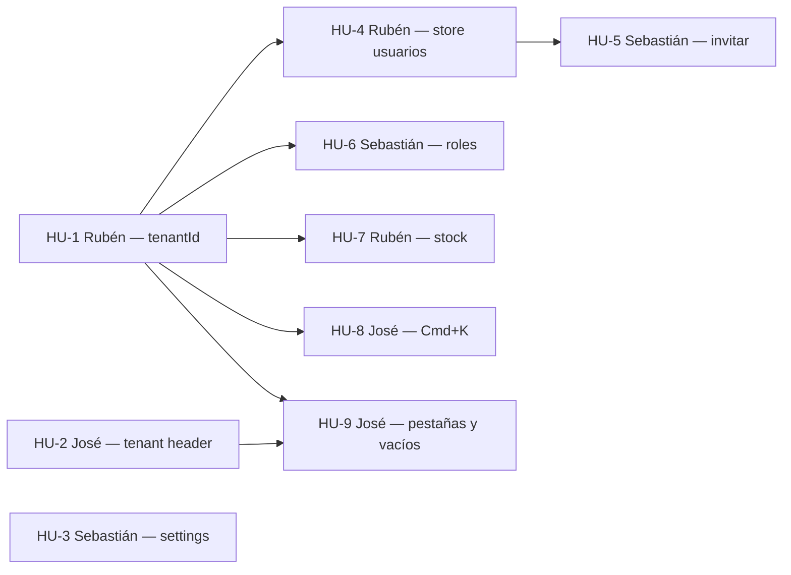

# Roadmap — SynchroDesk

Plan vigente: **Iniciativa 1**. Historias de usuario para el prototipo **front mock** (sin backend).

El ciclo anterior por sprints (`S{n}·HU-{m}`, gate Supabase) **no se incluye**. Archivo: [`ROADMAP-historico.md`](./ROADMAP-historico.md).

**Fuera de esta iniciativa:** API real, Postgres, Supabase, autenticación verdadera, middleware, RLS, Storage, Realtime, E2E, Kanban con drag & drop, export de servidor.

Estado actual del producto: [`FEATURES.md`](./FEATURES.md) · arquitectura: [`PROJECT.md`](./PROJECT.md).

**Estados:** `Pendiente` · `En curso` · `Hecho`

---

## Convenciones

| Campo | Descripción |
|-------|-------------|
| **ID** | `I1·HU-N` — Iniciativa 1, historia N |
| **Depende de** | `HU-N` dentro de la iniciativa |
| **Prioridad** | Alta · Media · Baja |
| **Asignado a** | Desarrollador responsable (también en el **título** de cada HU) |
| **Complejidad** | 1–10 (1 = trivial · 10 = muy compleja) |

**DoD de cada HU:** textos en español, respeta [`STYLES.md`](./STYLES.md), `npm run lint` limpio, sin backend ni variables de API.

**DoD de la iniciativa:** recargar la pestaña no deshace el trabajo de demo; Google, Andes y Nexus muestran datos distintos en todos los módulos de negocio; invitar usuario y guardar rol se ven en sus listados.

---

## Equipo

| Persona | Rol | Encaje en esta iniciativa |
|---------|-----|---------------------------|
| **Rubén** | Fullstack senior | Modelo de datos, stores, `tenantId`, lógica de stock. HUs bloqueantes. Code review del resto |
| **José** | Frontend junior | Header, paleta Cmd+K, pestañas, empty states, sessionStorage de UI. Sigue patrones que Rubén deje en stores |
| **Sebastián** | Fullstack junior | Formularios, modales, listados CRUD de demo. Pair con Rubén en el store de usuarios |

### Reglas

1. Rubén mergea PRs de tipos, mocks y stores.
2. José mergea PRs de `src/components/layout/` y pulido visual de búsqueda/pestañas.
3. Nadie arranca una HU si su dependencia no está **Hecho**.
4. Sebastián abre PR en draft si el store aún no está listo, para revisión temprana.



---

## Resumen Iniciativa 1

| ID | Título | Asignado a | Complejidad | Prioridad |
|----|--------|------------|-------------|-----------|
| [HU-1](#i1hu-1--rubén--aislar-datos-mock-por-tenant) | Aislar datos mock por tenant | **Rubén** (Fullstack senior) | 8/10 | Alta |
| [HU-2](#i1hu-2--josé--persistir-tenant-activo-y-recientes) | Persistir tenant activo y recientes | **José** (Frontend junior) | 4/10 | Alta |
| [HU-3](#i1hu-3--sebastián--configuración-completa-en-sesión) | Configuración completa en sesión | **Sebastián** (Fullstack junior) | 3/10 | Media |
| [HU-4](#i1hu-4--rubén--store-de-usuarios-en-sesión) | Store de usuarios en sesión | **Rubén** (Fullstack senior) | 6/10 | Alta |
| [HU-5](#i1hu-5--sebastián--invitar-usuario-añade-fila) | Invitar usuario añade fila | **Sebastián** (Fullstack junior) | 4/10 | Alta |
| [HU-6](#i1hu-6--sebastián--crear-y-guardar-rol-en-sesión) | Crear y guardar rol en sesión | **Sebastián** (Fullstack junior) | 5/10 | Alta |
| [HU-7](#i1hu-7--rubén--movimiento-de-inventario-actualiza-stock) | Movimiento de inventario actualiza stock | **Rubén** (Fullstack senior) | 7/10 | Alta |
| [HU-8](#i1hu-8--josé--cmdk-busca-conocimiento-e-inventario) | Cmd+K busca conocimiento e inventario | **José** (Frontend junior) | 5/10 | Media |
| [HU-9](#i1hu-9--josé--pestañas-persistentes-y-vacíos-al-cambiar-tenant) | Pestañas persistentes y vacíos al cambiar tenant | **José** (Frontend junior) | 4/10 | Media |

| Desarrollador | HUs | Perfil de las historias |
|---------------|-----|-------------------------|
| **Rubén** | HU-1, HU-4, HU-7 | Arquitectura y lógica de negocio mock |
| **José** | HU-2, HU-8, HU-9 | UI, navegación y persistencia de cromo |
| **Sebastián** | HU-3, HU-5, HU-6 | Formularios, modal y CRUD de demo |

---

## Historias de usuario

Agrupadas por persona. Cada HU lleva **asignado, rol y HUs suyas** en el título y en la cabecera, sin depender de la tabla de arriba.

- [Rubén — Fullstack senior](#historias-de-rubén--fullstack-senior) · HU-1, HU-4, HU-7
- [José — Frontend junior](#historias-de-josé--frontend-junior) · HU-2, HU-8, HU-9
- [Sebastián — Fullstack junior](#historias-de-sebastián--fullstack-junior) · HU-3, HU-5, HU-6

---

## Historias de Rubén — Fullstack senior

HUs: **I1·HU-1**, **I1·HU-4**, **I1·HU-7**. Arquitectura, stores y lógica de negocio mock. Code review del resto.

### I1·HU-1 — Rubén — Aislar datos mock por tenant

| | |
|---|---|
| **Asignado a** | Rubén · Fullstack senior |
| **Sus otras HUs** | [HU-4](#i1hu-4--rubén--store-de-usuarios-en-sesión) · [HU-7](#i1hu-7--rubén--movimiento-de-inventario-actualiza-stock) |
| **Iniciativa** | 1 · **Estado:** Pendiente · **Prioridad:** Alta · **Complejidad:** 8/10 |
| **Depende de** | — |

**Como** administrador de plataforma  
**Quiero** que inventario, conocimiento, roles, equipos, activos y notificaciones dependan del cliente activo  
**Para** que la demo aísle empresas igual que ya hacen tickets y usuarios

**Criterios de aceptación:**

- Campo `tenantId` en tipos y seeds de inventario, conocimiento, roles, equipos, activos y notificaciones
- Seeds diferenciados para `TEN-GOOGLE`, `TEN-ANDES` y `TEN-NEXUS`
- Nexus Salud **sin** filas de inventario (el 403 de módulo contratado se mantiene)
- `lib/api` de inventario y notificaciones filtra con `filterByTenant` (hoy ignoran `tenantId`)
- Altas de artículo y movimiento heredan el tenant activo
- `sessionStorage` de inventario particionado: `synchrodesk:inventory:{tenantId}`
- Comentario `// TODO: supabase.from('...')` en lecturas nuevas de `lib/api`

Por qué le toca a Rubén: define el contrato de datos y toca `lib/api`, tipos y stores. Bloquea al resto.

---

### I1·HU-4 — Rubén — Store de usuarios en sesión

| | |
|---|---|
| **Asignado a** | Rubén · Fullstack senior |
| **Sus otras HUs** | [HU-1](#i1hu-1--rubén--aislar-datos-mock-por-tenant) · [HU-7](#i1hu-7--rubén--movimiento-de-inventario-actualiza-stock) |
| **Iniciativa** | 1 · **Estado:** Pendiente · **Prioridad:** Alta · **Complejidad:** 6/10 |
| **Depende de** | HU-1 |

**Como** desarrollador  
**Quiero** un store de usuarios equivalente al de tickets  
**Para** que el alta simulada no toque arrays mock mutables y prepare el listado de HU-5

**Criterios de aceptación:**

- `UsersProvider` (o equivalente) carga seeds vía `lib/api/users`
- Operaciones: listar por `tenantId`, obtener por id, añadir usuario
- Persistencia en `sessionStorage` de la pestaña
- `/usuarios` y `/usuarios/[id]` leen el store, no el seed suelto
- Al recargar, las altas de sesión siguen; al cerrar la pestaña vuelven los seeds

Por qué le toca a Rubén: mismo patrón de arquitectura que `TicketsProvider`. Sebastián no debería inventar un segundo modelo de store.

---

### I1·HU-7 — Rubén — Movimiento de inventario actualiza stock

| | |
|---|---|
| **Asignado a** | Rubén · Fullstack senior |
| **Sus otras HUs** | [HU-1](#i1hu-1--rubén--aislar-datos-mock-por-tenant) · [HU-4](#i1hu-4--rubén--store-de-usuarios-en-sesión) |
| **Iniciativa** | 1 · **Estado:** Pendiente · **Prioridad:** Alta · **Complejidad:** 7/10 |
| **Depende de** | HU-1 |

**Como** operador de inventario  
**Quiero** que al registrar un movimiento cambie el stock del artículo  
**Para** que dashboard y listado de artículos coincidan con el historial

**Criterios de aceptación:**

- Entrada suma; salida y ajuste restan; sin stock negativo
- Salida mayor que stock → error de validación, no se crea el movimiento
- Traslado: si el prototipo solo tiene cantidad global, no altera el total (documentar en comentario del store); sí registra el movimiento
- `deriveStockStatus` se recalcula (Disponible / Stock bajo / Agotado)
- Artículos, alertas del dashboard `/inventario` y listado se actualizan en la misma sesión
- Todo particionado por tenant (HU-1)

Por qué le toca a Rubén: lógica de negocio en `inventory-store`, fácil de romper el dashboard si queda a medias.

---

## Historias de José — Frontend junior

HUs: **I1·HU-2**, **I1·HU-8**, **I1·HU-9**. Header, paleta Cmd+K, pestañas y empty states.

### I1·HU-2 — José — Persistir tenant activo y recientes

| | |
|---|---|
| **Asignado a** | José · Frontend junior |
| **Sus otras HUs** | [HU-8](#i1hu-8--josé--cmdk-busca-conocimiento-e-inventario) · [HU-9](#i1hu-9--josé--pestañas-persistentes-y-vacíos-al-cambiar-tenant) |
| **Iniciativa** | 1 · **Estado:** Pendiente · **Prioridad:** Alta · **Complejidad:** 4/10 |
| **Depende de** | — |

**Como** visitante de demo  
**Quiero** que al recargar la pestaña siga el cliente que elegí  
**Para** no volver siempre a Google a mitad de una presentación

**Criterios de aceptación:**

- `TenantProvider` guarda tenant activo y `recentTenantIds` (máx. 5) en `sessionStorage`
- Mismo patrón que `ui-preferences-storage.ts` (try/catch, sin `localStorage`)
- Al montar: restaura id, logo del header y lista de recientes
- Si el id guardado no existe, fallback a `TEN-GOOGLE`
- El `TenantSwitcher` no parpadea a Google y después al tenant real más de lo inevitable (hidratation: semilla + efecto, como el tema)


Por qué le toca a José: es cromo de header/`TenantSwitcher`, el mismo tipo de UI que ya mantiene. Puede ir en paralelo a HU-1.

---

### I1·HU-8 — José — Cmd+K busca conocimiento e inventario

| | |
|---|---|
| **Asignado a** | José · Frontend junior |
| **Sus otras HUs** | [HU-2](#i1hu-2--josé--persistir-tenant-activo-y-recientes) · [HU-9](#i1hu-9--josé--pestañas-persistentes-y-vacíos-al-cambiar-tenant) |
| **Iniciativa** | 1 · **Estado:** Pendiente · **Prioridad:** Media · **Complejidad:** 5/10 |
| **Depende de** | HU-1 |

**Como** agente de mesa de ayuda  
**Quiero** encontrar artículos de conocimiento y SKUs desde la paleta y el header  
**Para** no cambiar de módulo para una consulta rápida

**Criterios de aceptación:**

- `global-search.ts` añade grupos **Conocimiento** e **Inventario**
- Filtra por `tenantId`; Nexus no devuelve ítems de inventario
- Mínimo 2 caracteres, debounce 300 ms, flechas + Enter, Escape cierra
- Click → `/conocimiento/[id]` o `/inventario/articulos` (query `?q=SKU` o equivalente barato)
- Misma fuente en paleta y `HeaderSearch`
- Iconos y agrupación alineados a tickets/usuarios; focus visible (`sd-command-result`)

Por qué le toca a José: es dueño de Cmd+K y del header. Trabajo de UI/búsqueda, no de modelo.

---

### I1·HU-9 — José — Pestañas persistentes y vacíos al cambiar tenant

| | |
|---|---|
| **Asignado a** | José · Frontend junior |
| **Sus otras HUs** | [HU-2](#i1hu-2--josé--persistir-tenant-activo-y-recientes) · [HU-8](#i1hu-8--josé--cmdk-busca-conocimiento-e-inventario) |
| **Iniciativa** | 1 · **Estado:** Pendiente · **Prioridad:** Media · **Complejidad:** 4/10 |
| **Depende de** | HU-1, HU-2 |

**Como** visitante de demo  
**Quiero** conservar las pestañas de sistema al recargar y ver estados vacíos claros al cambiar de cliente  
**Para** no perder el contexto de inventario y no ver tablas “fantasma” de otro tenant

**Criterios de aceptación:**

- `WorkspaceProvider` persiste `openIds` (y lastPath si aplica) en `sessionStorage`
- Recargar con inventario abierto no vuelve solo a mesa de ayuda
- Al cambiar de tenant, listados de conocimiento / roles / equipos / activos / inventario muestran `EmptyState` si no hay filas (Nexus inventario sigue en 403)
- No usar el empty como loading; skeletons donde ya existan
- Coherente con el tenant restaurado en HU-2

Por qué le toca a José: shell, pestañas y empty states; su foco de frontend junior.

---

## Historias de Sebastián — Fullstack junior

HUs: **I1·HU-3**, **I1·HU-5**, **I1·HU-6**. Formularios, modal de invitar y CRUD de demo.

### I1·HU-3 — Sebastián — Configuración completa en sesión

| | |
|---|---|
| **Asignado a** | Sebastián · Fullstack junior |
| **Sus otras HUs** | [HU-5](#i1hu-5--sebastián--invitar-usuario-añade-fila) · [HU-6](#i1hu-6--sebastián--crear-y-guardar-rol-en-sesión) |
| **Iniciativa** | 1 · **Estado:** Pendiente · **Prioridad:** Media · **Complejidad:** 3/10 |
| **Depende de** | — |

**Como** administrador de plataforma  
**Quiero** que zona horaria, idioma y los interruptores de notificaciones se guarden con el resto de ajustes  
**Para** que `/configuracion` no “olvide” campos al recargar

**Criterios de aceptación:**

- `TenantSettings` incluye timezone, idioma y los 3 switches (SLA en riesgo, tickets críticos, resumen diario)
- Campos controlados (no `defaultValue` / Switch suelto)
- Misma clave `tenant-settings-storage` ya particionada por tenant
- Recargar restaura todos los campos
- Toast “Cambios guardados (demo)” al enviar

Por qué le toca a Sebastián: extiende el formulario de settings que ya existe; alcance acotado para fullstack junior. En paralelo a HU-1.

---

### I1·HU-5 — Sebastián — Invitar usuario añade fila

| | |
|---|---|
| **Asignado a** | Sebastián · Fullstack junior |
| **Sus otras HUs** | [HU-3](#i1hu-3--sebastián--configuración-completa-en-sesión) · [HU-6](#i1hu-6--sebastián--crear-y-guardar-rol-en-sesión) |
| **Iniciativa** | 1 · **Estado:** Pendiente · **Prioridad:** Alta · **Complejidad:** 4/10 |
| **Depende de** | HU-4 (Rubén) |

**Como** administrador de plataforma  
**Quiero** que el modal Invitar deje un usuario `Invitado` en el directorio  
**Para** demostrar el alta sin Auth real

**Criterios de aceptación:**

- Correo válido; duplicado en el tenant → error inline + toast
- Delay 400–800 ms, botón loading
- Crea fila con `tenantId` activo, rol y equipo del formulario, estado `Invitado`
- Aparece en `/usuarios` sin recargar; `/usuarios/[id]` abre la ficha
- Toast de éxito; el modal se cierra y limpia
- Sigue siendo mock: no se envía correo

Por qué le toca a Sebastián: modal y validación de formulario, sobre el store que deja Rubén. Pair si hace falta.

---

### I1·HU-6 — Sebastián — Crear y guardar rol en sesión

| | |
|---|---|
| **Asignado a** | Sebastián · Fullstack junior |
| **Sus otras HUs** | [HU-3](#i1hu-3--sebastián--configuración-completa-en-sesión) · [HU-5](#i1hu-5--sebastián--invitar-usuario-añade-fila) |
| **Iniciativa** | 1 · **Estado:** Pendiente · **Prioridad:** Alta · **Complejidad:** 5/10 |
| **Depende de** | HU-1 (Rubén) |

**Como** administrador de plataforma  
**Quiero** crear un rol y guardar la matriz de permisos  
**Para** que `/roles` no sea solo una maqueta con el botón deshabilitado

**Criterios de aceptación:**

- Store de roles (sesión) a partir de los seeds; roles nuevos con `tenantId` (HU-1)
- `/roles/nuevo`: nombre + descripción + matriz; botón **Guardar** habilitado
- Genera id `ROL-xxxx`, toast, redirect a `/roles/[id]`
- `/roles/[id]`: editar nombre, descripción y matriz; toast al guardar
- El listado refleja altas y cambios
- Checkboxes de `PermissionMatrix` se hidratan desde el store, no solo estado local huérfano

Por qué le toca a Sebastián: formularios y listado, complejidad media. Puede copiar el patrón del store de tickets/usuarios; Rubén revisa el PR de arquitectura ligera.

---

## Orden de arranque

```
Día 1     Rubén → HU-1 (tenantId)     │  José → HU-2 (header)  │  Sebastián → HU-3 (settings)
Día 2–3   Rubén → HU-4 (store users)  │  José espera HU-1 para HU-8
Día 3–4   Rubén → HU-7 (stock)        │  Sebastián → HU-5 (invitar) + HU-6 (roles)
Día 4–5   José → HU-8 + HU-9          │  Rubén → review
```

**Primera HU bloqueante:** **I1·HU-1** (Rubén).  
**En paralelo día 1:** **I1·HU-2** (José) y **I1·HU-3** (Sebastián).

---

## Siguientes iniciativas

No se abren hasta que I1 esté Hecho. Quedan **fuera** de este documento: backend, Supabase, auth real, drag & drop de Kanban, adjuntos fuera de blob URL, Playwright.

---

## Referencias

- Qué hace el front hoy: [`FEATURES.md`](./FEATURES.md)
- Arquitectura: [`PROJECT.md`](./PROJECT.md)
- Estilos: [`STYLES.md`](./STYLES.md)
- Plan anterior (archivo): [`ROADMAP-historico.md`](./ROADMAP-historico.md)
