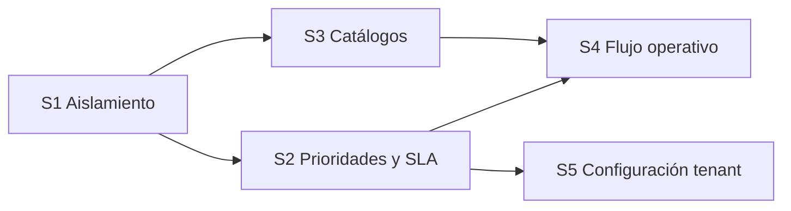
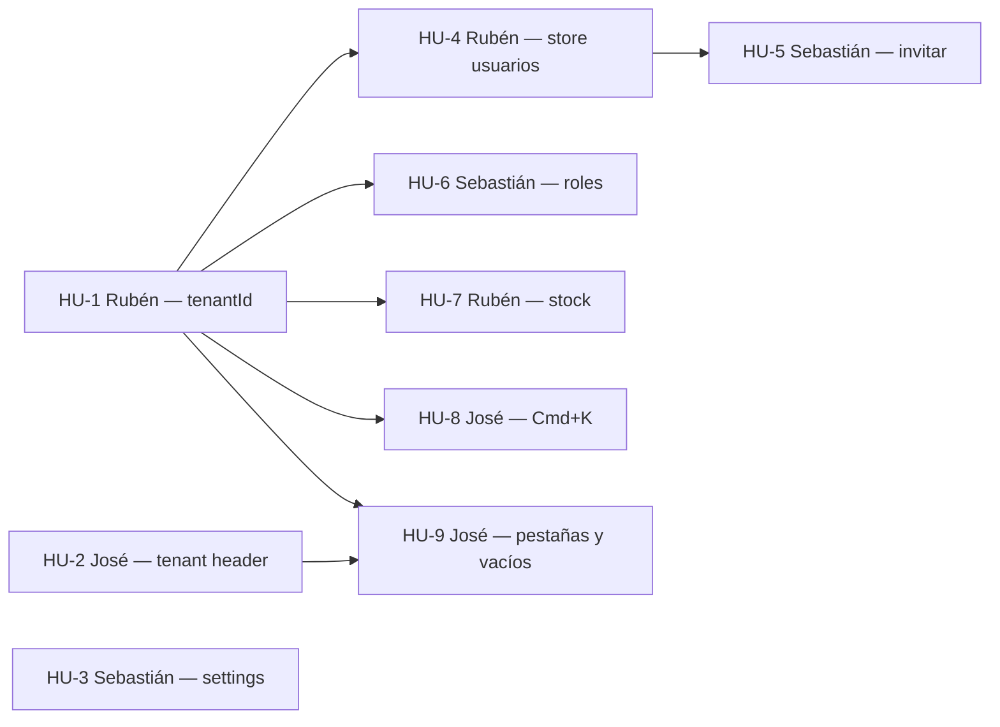
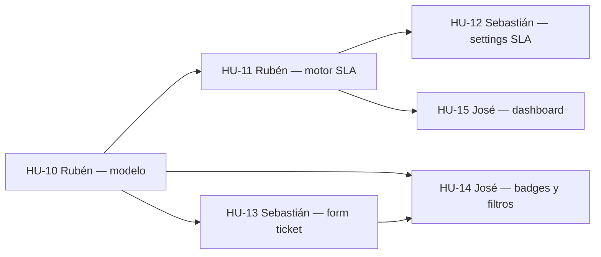
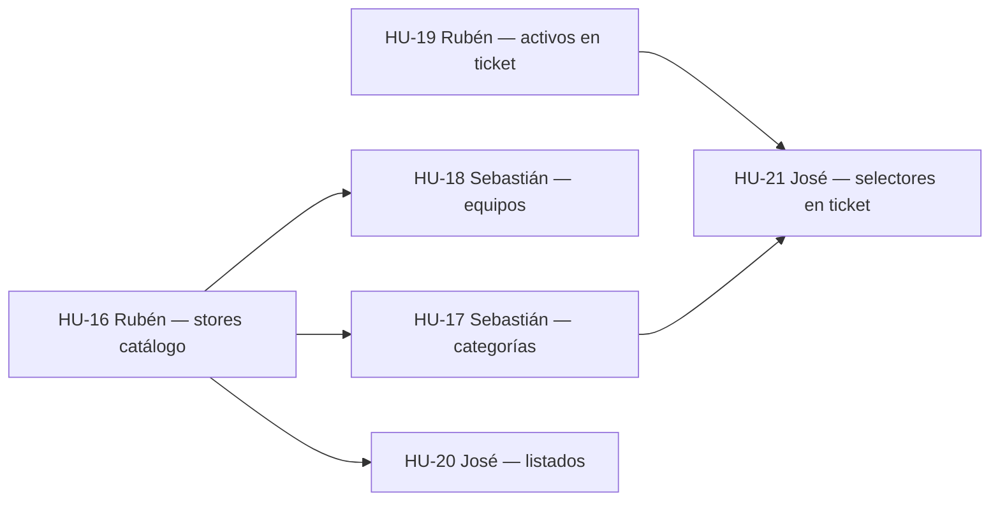
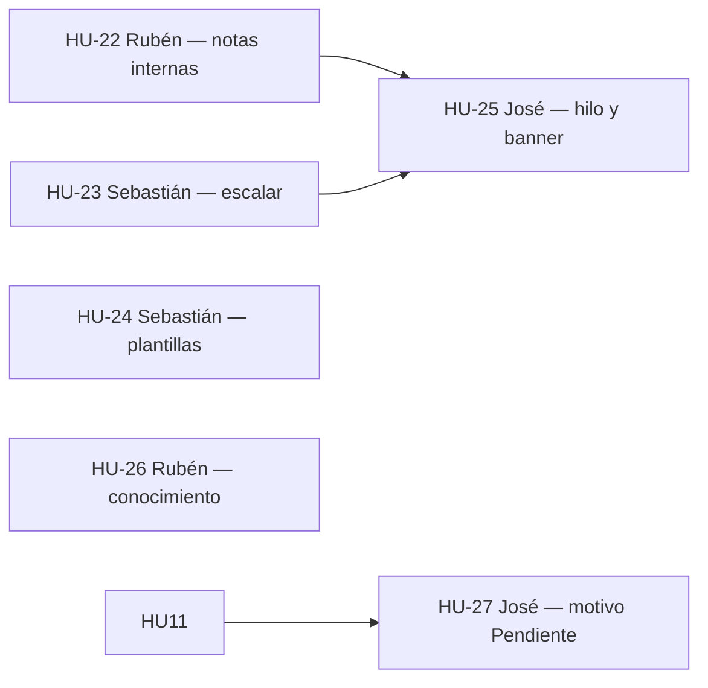
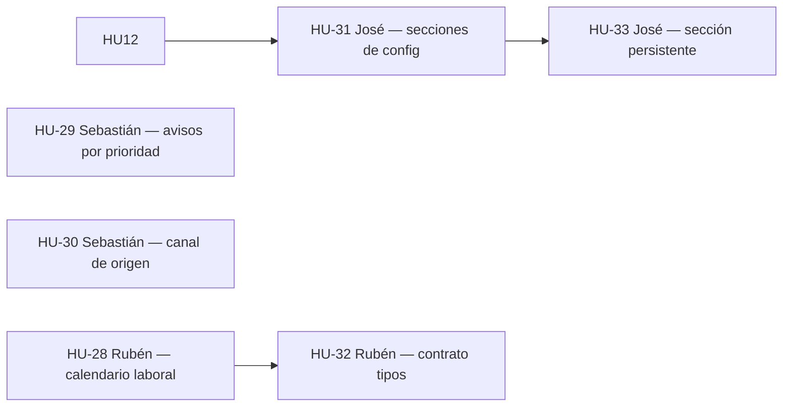

# Roadmap — SynchroDesk

Plan vigente: épica **Mesa de ayuda IT lista para backend**, organizada en **sprints** (no iniciativas). Historias de usuario para el prototipo **front mock** (sin backend).

Objetivo: cuando arranque el backend, el front ya tenga el **modelo, los catálogos y las políticas** de una mesa de soporte informático — no solo pantallas bonitas.

El ciclo anterior (`S{n}·HU-{m}` hacia Supabase) **no se incluye**. Archivo: [`ROADMAP-historico.md`](./ROADMAP-historico.md).

**Fuera de esta épica:** API real, Postgres, Supabase, autenticación verdadera, middleware, RLS, Storage, Realtime, E2E, Kanban con drag & drop, export de servidor, adjuntos fuera de blob URL.

Estado actual del producto: [`FEATURES.md`](./FEATURES.md) · arquitectura: [`PROJECT.md`](./PROJECT.md).

**Estados de HU:** `Pendiente` · `En curso` · `Hecho`

---

## Épica — Mesa de ayuda IT lista para backend

Una mesa de soporte informático no es solo una cola de tickets. Antes de persistir en Postgres hace falta que el prototipo ya separe **empresas**, fije **prioridades y SLA**, tenga **catálogos editables** (categorías, equipos, activos) y un **flujo operativo** (notas internas, escalamiento, origen, plantillas).

### Qué ya hay (no se tira)

| Pieza | Estado en el código hoy |
|-------|-------------------------|
| Estados | Nuevo · En progreso · Pendiente · Resuelto · Cerrado |
| Prioridades de ticket | **Baja · Media · Alta · Crítica** (`TicketPriority`) |
| Categorías fijas | Conectividad, Hardware, Correo, Acceso remoto, Solicitud, Seguridad, Licencias |
| SLA en el ticket | Texto libre (`"1h 18m restantes"`, `"En riesgo · 12m"`, `"Cumplido"`) |
| SLA en `/configuracion` | Solo dos campos: primera respuesta **crítica** (15 min) y resolución **alta** (4 h) + horario de cobertura |
| Aislamiento por tenant | Tickets, usuarios y dashboard. El resto de módulos aún es seed global |
| Alta / gestión de ticket | Formulario, panel, hilo público, evidencias blob, Kanban sin drag & drop |

### DoD de la épica

Al cerrar los cinco sprints, en demo (sessionStorage, misma pestaña):

1. Google, Andes y Nexus muestran datos distintos en **todos** los módulos de negocio.
2. Recargar no deshace altas ni configuración de la sesión.
3. Un ticket tiene **tipo**, **impacto**, **urgencia**, **prioridad** (las cuatro etiquetas actuales + código P1–P4) y **SLA calculado** según política del tenant.
4. `/configuracion` edita la matriz SLA de los **cuatro** niveles, horario, notificaciones por prioridad y catálogos.
5. Categorías, equipos y activos se crean/editan en sesión y se enlazan al ticket.
6. El hilo distingue comentario público y nota interna; se puede escalar y marcar motivo de Pendiente.
7. Tipos, stores y `lib/api` llevan `tenantId` y `// TODO: supabase.from('...')` alineados al modelo — listos para copiar a tablas.

**DoD de cada HU:** textos en español, respeta [`STYLES.md`](./STYLES.md), `npm run lint` limpio, sin backend ni variables de API.

---

## Modelo de prioridades — soporte informático

Dos cosas distintas (no mezclarlas):

| Dónde | Escala | Para qué |
|-------|--------|----------|
| **Este roadmap (HUs)** | Alta · Media · Baja | Orden de trabajo del equipo |
| **Tickets de la mesa** | Baja · Media · Alta · Crítica | Atención al incidente / solicitud del cliente |

Las etiquetas de ticket **se conservan**. Un sistema de soporte IT las completa con código operativo, impacto, urgencia y SLA por nivel — hoy eso no existe: la prioridad se elige a mano y el SLA no depende de ella.

### Niveles de ticket (objetivo)

Mapeo 1:1 con `TicketPriority` actual. El código P1–P4 es el que usará backend / ITIL; la UI sigue mostrando el nombre en español.

| Código | Prioridad (UI actual) | Cuándo usarla | Ejemplo |
|--------|----------------------|---------------|---------|
| **P1** | **Crítica** | Servicio caído, seguridad activa o muchos usuarios bloqueados | VPN corporativa caída, ransomware, datacenter sin red |
| **P2** | **Alta** | Degradación grave o una persona clave sin poder trabajar | Correo de gerencia caído, POS de una sucursal, laptop del CEO |
| **P3** | **Media** | Incidente con workaround o solicitud con plazo de negocio | Impresora lenta, acceso a una carpeta, alta de usuario no urgente |
| **P4** | **Baja** | Consulta, mejora o trabajo planificado | Cambio de fondo de pantalla, duda de how-to, cable extra |

No se añade un quinto nivel ni se renombra a “P1/P2” en los chips: `PriorityBadge` sigue diciendo Crítica / Alta / Media / Baja. El código P1–P4 va en tooltip, filtros avanzados y configuración de SLA.

### Impacto × urgencia → prioridad sugerida

Hoy el formulario pide la prioridad a ojo. En soporte IT la prioridad **se deriva** (el técnico puede override):

| Impacto ↓ / Urgencia → | Alta | Media | Baja |
|------------------------|------|-------|------|
| **Alto** (empresa / sucursal / sistema core) | Crítica (P1) | Alta (P2) | Media (P3) |
| **Medio** (equipo o varios usuarios) | Alta (P2) | Media (P3) | Baja (P4) |
| **Bajo** (una persona, hay alternativa) | Media (P3) | Baja (P4) | Baja (P4) |

- **Impacto:** cuántos usuarios o qué tan crítico es el servicio afectado.
- **Urgencia:** qué tan rápido hay que actuar (hay fecha de negocio, hay workaround, está parado ahora).

Valores de impacto y urgencia: `Alto` · `Medio` · `Bajo` (urgencia: `Alta` · `Media` · `Baja`).

### SLA por prioridad (extiende lo que ya está)

Los defaults **reutilizan** los dos campos actuales de `/configuracion`:

- `slaCriticalFirstResponse` = **15 minutos** → primera respuesta **P1 / Crítica**
- `slaHighResolution` = **4 horas** → resolución **P1 / Crítica** (el nombre del campo se aclara; P2 ya no comparte ese único número)

| Prioridad | Primera respuesta | Resolución | Origen del default |
|-----------|-------------------|------------|--------------------|
| Crítica (P1) | 15 min | 4 h | Ya en settings |
| Alta (P2) | 1 h | 8 h | Nuevo |
| Media (P3) | 4 h | 2 días laborables | Nuevo |
| Baja (P4) | 1 día laborable | 5 días laborables | Nuevo |

El string `ticket.sla` deja de ser decorativo: el store lo calcula con la política del tenant + horario de cobertura (`slaCoverageHours`, hoy `Lun–Vie 08:00–19:00`) + reloj de la sesión. Estados visuales: `Xh Ym restantes` · `En riesgo` · `Vencido` · `Cumplido` (Resuelto/Cerrado).

Pausar el reloj SLA cuando el ticket está **Pendiente** (esperando al usuario o a un proveedor) — Sprint 4.

### Tipo de ticket (hoy mezclado en categorías)

La cola dice “Incidentes y solicitudes”, pero no hay campo `type`. “Solicitud” es solo una categoría. Objetivo:

| Tipo | Qué es | Prioridad típica |
|------|--------|------------------|
| **Incidente** | Algo que funcionaba dejó de funcionar | Matriz impacto × urgencia |
| **Solicitud** | Pedido de servicio (alta, permiso, equipo) | Por defecto Media (P3) o Baja (P4); no usa P1 salvo excepción |
| **Problema** | Causa raíz de varios incidentes | Alta (P2) o Media (P3) |
| **Cambio** | Cambio controlado (ventana, riesgo) | Baja (P4) salvo cambio de emergencia → Crítica (P1) |

Las categorías actuales se quedan como catálogo de **clasificación**, no como tipo. Sprint 3 las hace editables por tenant (con subcategoría opcional).

### Canal de origen

Campo de configuración / alta (Sprint 5): **Portal** · **Correo** · **Teléfono** · **Presencial** · **Chat**. En demo el alta web usa Portal. Prepara la columna `source` del backend.

### Qué no se inventa

- No se sustituyen Baja/Media/Alta/Crítica por otra paleta de colores.
- No se añade “severidad” como quinto eje (impacto + urgencia bastan).
- No hay P5 ni “planificado” aparte de Baja (P4).
- Kanban sigue en los **estados** actuales, no en prioridades.

---

## Convenciones

| Campo | Descripción |
|-------|-------------|
| **ID** | `S{sprint}·HU-{n}` — `n` es el orden **secuencial de la épica** (HU-1 … HU-33) |
| **Sprint** | 1–5 de esta épica (no los S0–S10 archivados) |
| **Depende de** | `HU-N` de la épica |
| **Prioridad (HU)** | Alta · Media · Baja — backlog del equipo |
| **Asignado a** | En el **título** y la cabecera de cada HU |
| **Complejidad** | 1–10 (1 = trivial · 10 = muy compleja) |

Nadie arranca una HU si su dependencia no está **Hecho**. Un sprint no se da por cerrado si quedan HUs Pendiente; el siguiente puede **preparar** UI en draft si el store ya está Hecho.

---

## Equipo

| Persona | Rol | Encaje en la épica |
|---------|-----|---------------------|
| **Rubén** | Fullstack senior | Modelo de datos, stores, `tenantId`, motor SLA, stock. HUs bloqueantes. Único que mergea PRs |
| **José** | Frontend junior | Header, paleta Cmd+K, badges, filtros, pestañas, empty states, cromo de `/configuracion` |
| **Sebastián** | Fullstack junior | Formularios, modales, CRUD de catálogos y settings. Pair con Rubén si el store es nuevo |

### Reglas

1. **Solo Rubén mergea los PRs** (el de cualquiera: tipos, stores, UI, formularios). José y Sebastián abren PR; no mergean.
2. Rubén hace code review antes de mergear.
3. Nadie arranca una HU si su dependencia no está **Hecho**.
4. Sebastián abre PR en draft si el store aún no está listo, para revisión temprana.
5. José y Sebastián no empujan a `main` ni aprueban su propio merge.

| Desarrollador | HUs | Perfil |
|---------------|-----|--------|
| **Rubén** | 1, 4, 7, 10, 11, 16, 19, 22, 26, 28, 32 | Arquitectura, stores, SLA, contrato para backend |
| **José** | 2, 8, 9, 14, 15, 20, 21, 25, 27, 31, 33 | UI, navegación, badges, filtros, cromo |
| **Sebastián** | 3, 5, 6, 12, 13, 17, 18, 23, 24, 29, 30 | Formularios, settings, CRUD de demo |

---

## Sprints de la épica

| Sprint | Nombre | Cierra cuando… |
|--------|--------|----------------|
| [**S1**](#sprint-1--aislamiento-y-persistencia-de-la-demo) | Aislamiento y persistencia de la demo | Recargar y cambiar de tenant no rompe la presentación |
| [**S2**](#sprint-2--prioridades-tipos-y-sla) | Prioridades, tipos y SLA | El ticket ya es un ticket de soporte IT, no un chip a mano |
| [**S3**](#sprint-3--catálogos-de-la-mesa) | Catálogos de la mesa | Categorías, equipos y activos se configuran por tenant |
| [**S4**](#sprint-4--flujo-operativo-del-ticket) | Flujo operativo del ticket | Notas internas, escalamiento, Pendiente con motivo, conocimiento |
| [**S5**](#sprint-5--configuración-del-tenant) | Configuración del tenant | `/configuracion` es el panel que el backend solo tendrá que persistir |



S2 y S3 pueden solaparse cuando S1·HU-1 esté Hecho.

---

# Sprint 1 — Aislamiento y persistencia de la demo

Deuda actual: inventario, conocimiento, roles, equipos, activos y notificaciones **no** filtran por tenant; el selector y las pestañas se pierden al recargar; invitar usuario y guardar rol no escriben el listado; un movimiento no cambia el stock.



| ID | Título | Asignado a | Complejidad | Prioridad |
|----|--------|------------|-------------|-----------|
| [HU-1](#s1hu-1--rubén--aislar-datos-mock-por-tenant) | Aislar datos mock por tenant | **Rubén** | 8/10 | Alta |
| [HU-2](#s1hu-2--josé--persistir-tenant-activo-y-recientes) | Persistir tenant activo y recientes | **José** | 4/10 | Alta |
| [HU-3](#s1hu-3--sebastián--configuración-completa-en-sesión) | Configuración completa en sesión | **Sebastián** | 3/10 | Media |
| [HU-4](#s1hu-4--rubén--store-de-usuarios-en-sesión) | Store de usuarios en sesión | **Rubén** | 6/10 | Alta |
| [HU-5](#s1hu-5--sebastián--invitar-usuario-añade-fila) | Invitar usuario añade fila | **Sebastián** | 4/10 | Alta |
| [HU-6](#s1hu-6--sebastián--crear-y-guardar-rol-en-sesión) | Crear y guardar rol en sesión | **Sebastián** | 5/10 | Alta |
| [HU-7](#s1hu-7--rubén--movimiento-de-inventario-actualiza-stock) | Movimiento de inventario actualiza stock | **Rubén** | 7/10 | Alta |
| [HU-8](#s1hu-8--josé--cmdk-busca-conocimiento-e-inventario) | Cmd+K busca conocimiento e inventario | **José** | 5/10 | Media |
| [HU-9](#s1hu-9--josé--pestañas-persistentes-y-vacíos-al-cambiar-tenant) | Pestañas persistentes y vacíos al cambiar tenant | **José** | 4/10 | Media |

---

### S1·HU-1 — Rubén — Aislar datos mock por tenant

| | |
|---|---|
| **Asignado a** | Rubén · Fullstack senior |
| **Sus otras HUs (S1)** | [HU-4](#s1hu-4--rubén--store-de-usuarios-en-sesión) · [HU-7](#s1hu-7--rubén--movimiento-de-inventario-actualiza-stock) |
| **Sprint** | 1 · **Estado:** Pendiente · **Prioridad:** Alta · **Complejidad:** 8/10 |
| **Depende de** | — |

**Como** administrador de plataforma  
**Quiero** que inventario, conocimiento, roles, equipos, activos y notificaciones dependan del cliente activo  
**Para** que la demo aísle empresas igual que ya hacen tickets y usuarios

**Criterios de aceptación:**

- Campo `tenantId` en tipos y seeds de inventario, conocimiento, roles, equipos, activos y notificaciones
- Seeds diferenciados para `TEN-GOOGLE`, `TEN-ANDES` y `TEN-NEXUS`
- Nexus Salud **sin** filas de inventario (el 403 de módulo contratado se mantiene)
- `lib/api` de inventario y notificaciones filtra con `filterByTenant` (hoy ignoran `tenantId`)
- Altas de artículo y movimiento heredan el tenant activo
- `sessionStorage` de inventario particionado: `synchrodesk:inventory:{tenantId}`
- Comentario `// TODO: supabase.from('...')` en lecturas nuevas de `lib/api`

Por qué le toca a Rubén: define el contrato de datos y toca `lib/api`, tipos y stores. Bloquea al resto de la épica.

---

### S1·HU-2 — José — Persistir tenant activo y recientes

| | |
|---|---|
| **Asignado a** | José · Frontend junior |
| **Sus otras HUs (S1)** | [HU-8](#s1hu-8--josé--cmdk-busca-conocimiento-e-inventario) · [HU-9](#s1hu-9--josé--pestañas-persistentes-y-vacíos-al-cambiar-tenant) |
| **Sprint** | 1 · **Estado:** Pendiente · **Prioridad:** Alta · **Complejidad:** 4/10 |
| **Depende de** | — |

**Como** visitante de demo  
**Quiero** que al recargar la pestaña siga el cliente que elegí  
**Para** no volver siempre a Google a mitad de una presentación

**Criterios de aceptación:**

- `TenantProvider` guarda tenant activo y `recentTenantIds` (máx. 5) en `sessionStorage`
- Mismo patrón que `ui-preferences-storage.ts` (try/catch, sin `localStorage`)
- Al montar: restaura id, logo del header y lista de recientes
- Si el id guardado no existe, fallback a `TEN-GOOGLE`
- El `TenantSwitcher` no parpadea a Google y después al tenant real más de lo inevitable (hidratación: semilla + efecto, como el tema)

Por qué le toca a José: cromo de header/`TenantSwitcher`. Puede ir en paralelo a HU-1.

---

### S1·HU-3 — Sebastián — Configuración completa en sesión

| | |
|---|---|
| **Asignado a** | Sebastián · Fullstack junior |
| **Sus otras HUs (S1)** | [HU-5](#s1hu-5--sebastián--invitar-usuario-añade-fila) · [HU-6](#s1hu-6--sebastián--crear-y-guardar-rol-en-sesión) |
| **Sprint** | 1 · **Estado:** Pendiente · **Prioridad:** Media · **Complejidad:** 3/10 |
| **Depende de** | — |

**Como** administrador de plataforma  
**Quiero** que zona horaria, idioma y los interruptores de notificaciones se guarden con el resto de ajustes  
**Para** que `/configuracion` no “olvide” campos al recargar

**Criterios de aceptación:**

- `TenantSettings` incluye timezone, idioma y los 3 switches (SLA en riesgo, tickets críticos, resumen diario)
- Campos controlados (no `defaultValue` / Switch suelto)
- Misma clave `tenant-settings-storage` ya particionada por tenant
- Recargar restaura todos los campos
- Toast “Cambios guardados (demo)” al enviar

Por qué le toca a Sebastián: extiende el formulario de settings. En paralelo a HU-1. El Sprint 2 ampliará SLA; esta HU no toca aún la matriz de cuatro niveles.

---

### S1·HU-4 — Rubén — Store de usuarios en sesión

| | |
|---|---|
| **Asignado a** | Rubén · Fullstack senior |
| **Sus otras HUs (S1)** | [HU-1](#s1hu-1--rubén--aislar-datos-mock-por-tenant) · [HU-7](#s1hu-7--rubén--movimiento-de-inventario-actualiza-stock) |
| **Sprint** | 1 · **Estado:** Pendiente · **Prioridad:** Alta · **Complejidad:** 6/10 |
| **Depende de** | HU-1 |

**Como** desarrollador  
**Quiero** un store de usuarios equivalente al de tickets  
**Para** que el alta simulada no toque arrays mock mutables y prepare el listado de HU-5

**Criterios de aceptación:**

- `UsersProvider` (o equivalente) carga seeds vía `lib/api/users`
- Operaciones: listar por `tenantId`, obtener por id, añadir usuario
- Persistencia en `sessionStorage` de la pestaña
- `/usuarios` y `/usuarios/[id]` leen el store, no el seed suelto
- Al recargar, las altas de sesión siguen; al cerrar la pestaña vuelven los seeds

Por qué le toca a Rubén: mismo patrón que `TicketsProvider`.

---

### S1·HU-5 — Sebastián — Invitar usuario añade fila

| | |
|---|---|
| **Asignado a** | Sebastián · Fullstack junior |
| **Sus otras HUs (S1)** | [HU-3](#s1hu-3--sebastián--configuración-completa-en-sesión) · [HU-6](#s1hu-6--sebastián--crear-y-guardar-rol-en-sesión) |
| **Sprint** | 1 · **Estado:** Pendiente · **Prioridad:** Alta · **Complejidad:** 4/10 |
| **Depende de** | HU-4 (Rubén) |

**Como** administrador de plataforma  
**Quiero** que el modal Invitar deje un usuario `Invitado` en el directorio  
**Para** demostrar el alta sin Auth real

**Criterios de aceptación:**

- Correo válido; duplicado en el tenant → error inline + toast
- Delay 400–800 ms, botón loading
- Crea fila con `tenantId` activo, rol y equipo del formulario, estado `Invitado`
- Aparece en `/usuarios` sin recargar; `/usuarios/[id]` abre la ficha
- Toast de éxito; el modal se cierra y limpia
- Sigue siendo mock: no se envía correo

Por qué le toca a Sebastián: modal y validación sobre el store de Rubén.

---

### S1·HU-6 — Sebastián — Crear y guardar rol en sesión

| | |
|---|---|
| **Asignado a** | Sebastián · Fullstack junior |
| **Sus otras HUs (S1)** | [HU-3](#s1hu-3--sebastián--configuración-completa-en-sesión) · [HU-5](#s1hu-5--sebastián--invitar-usuario-añade-fila) |
| **Sprint** | 1 · **Estado:** Pendiente · **Prioridad:** Alta · **Complejidad:** 5/10 |
| **Depende de** | HU-1 (Rubén) |

**Como** administrador de plataforma  
**Quiero** crear un rol y guardar la matriz de permisos  
**Para** que `/roles` no sea solo una maqueta con el botón deshabilitado

**Criterios de aceptación:**

- Store de roles (sesión) a partir de los seeds; roles nuevos con `tenantId` (HU-1)
- `/roles/nuevo`: nombre + descripción + matriz; botón **Guardar** habilitado
- Genera id `ROL-xxxx`, toast, redirect a `/roles/[id]`
- `/roles/[id]`: editar nombre, descripción y matriz; toast al guardar
- El listado refleja altas y cambios
- Checkboxes de `PermissionMatrix` se hidratan desde el store

Por qué le toca a Sebastián: formularios y listado. Rubén revisa el PR de arquitectura ligera.

---

### S1·HU-7 — Rubén — Movimiento de inventario actualiza stock

| | |
|---|---|
| **Asignado a** | Rubén · Fullstack senior |
| **Sus otras HUs (S1)** | [HU-1](#s1hu-1--rubén--aislar-datos-mock-por-tenant) · [HU-4](#s1hu-4--rubén--store-de-usuarios-en-sesión) |
| **Sprint** | 1 · **Estado:** Pendiente · **Prioridad:** Alta · **Complejidad:** 7/10 |
| **Depende de** | HU-1 |

**Como** operador de inventario  
**Quiero** que al registrar un movimiento cambie el stock del artículo  
**Para** que dashboard y listado de artículos coincidan con el historial

**Criterios de aceptación:**

- Entrada suma; salida y ajuste restan; sin stock negativo
- Salida mayor que stock → error de validación, no se crea el movimiento
- Traslado: si el prototipo solo tiene cantidad global, no altera el total (documentar en comentario del store); sí registra el movimiento
- `deriveStockStatus` se recalcula (Disponible / Stock bajo / Agotado)
- Artículos, alertas del dashboard `/inventario` y listado se actualizan en la misma sesión
- Todo particionado por tenant (HU-1)

Por qué le toca a Rubén: lógica de negocio en `inventory-store`.

---

### S1·HU-8 — José — Cmd+K busca conocimiento e inventario

| | |
|---|---|
| **Asignado a** | José · Frontend junior |
| **Sus otras HUs (S1)** | [HU-2](#s1hu-2--josé--persistir-tenant-activo-y-recientes) · [HU-9](#s1hu-9--josé--pestañas-persistentes-y-vacíos-al-cambiar-tenant) |
| **Sprint** | 1 · **Estado:** Pendiente · **Prioridad:** Media · **Complejidad:** 5/10 |
| **Depende de** | HU-1 |

**Como** agente de mesa de ayuda  
**Quiero** encontrar artículos de conocimiento y SKUs desde la paleta y el header  
**Para** no cambiar de módulo para una consulta rápida

**Criterios de aceptación:**

- `global-search.ts` añade grupos **Conocimiento** e **Inventario**
- Filtra por `tenantId`; Nexus no devuelve ítems de inventario
- Mínimo 2 caracteres, debounce 300 ms, flechas + Enter, Escape cierra
- Click → `/conocimiento/[id]` o `/inventario/articulos` (query `?q=SKU` o equivalente barato)
- Misma fuente en paleta y `HeaderSearch`
- Iconos y agrupación alineados a tickets/usuarios; focus visible (`sd-command-result`)

Por qué le toca a José: dueño de Cmd+K y del header.

---

### S1·HU-9 — José — Pestañas persistentes y vacíos al cambiar tenant

| | |
|---|---|
| **Asignado a** | José · Frontend junior |
| **Sus otras HUs (S1)** | [HU-2](#s1hu-2--josé--persistir-tenant-activo-y-recientes) · [HU-8](#s1hu-8--josé--cmdk-busca-conocimiento-e-inventario) |
| **Sprint** | 1 · **Estado:** Pendiente · **Prioridad:** Media · **Complejidad:** 4/10 |
| **Depende de** | HU-1, HU-2 |

**Como** visitante de demo  
**Quiero** conservar las pestañas de sistema al recargar y ver estados vacíos claros al cambiar de cliente  
**Para** no perder el contexto de inventario y no ver tablas “fantasma” de otro tenant

**Criterios de aceptación:**

- `WorkspaceProvider` persiste `openIds` (y lastPath si aplica) en `sessionStorage`
- Recargar con inventario abierto no vuelve solo a mesa de ayuda
- Al cambiar de tenant, listados de conocimiento / roles / equipos / activos / inventario muestran `EmptyState` si no hay filas (Nexus inventario sigue en 403)
- No usar el empty como loading; skeletons donde ya existan
- Coherente con el tenant restaurado en HU-2

Por qué le toca a José: shell, pestañas y empty states.

---

# Sprint 2 — Prioridades, tipos y SLA

Cierra el hueco de producto: prioridad a mano + SLA decorativo → modelo de soporte IT descrito [arriba](#modelo-de-prioridades--soporte-informático).



| ID | Título | Asignado a | Complejidad | Prioridad |
|----|--------|------------|-------------|-----------|
| [HU-10](#s2hu-10--rubén--modelo-de-prioridad-impacto-urgencia-y-tipo) | Modelo de prioridad, impacto, urgencia y tipo | **Rubén** | 7/10 | Alta |
| [HU-11](#s2hu-11--rubén--motor-sla-por-prioridad) | Motor SLA por prioridad | **Rubén** | 8/10 | Alta |
| [HU-12](#s2hu-12--sebastián--matriz-sla-en-configuración) | Matriz SLA en configuración | **Sebastián** | 5/10 | Alta |
| [HU-13](#s2hu-13--sebastián--alta-y-gestión-con-tipo-impacto-y-urgencia) | Alta y gestión con tipo, impacto y urgencia | **Sebastián** | 6/10 | Alta |
| [HU-14](#s2hu-14--josé--badges-filtros-y-leyenda-p1p4) | Badges, filtros y leyenda P1–P4 | **José** | 4/10 | Alta |
| [HU-15](#s2hu-15--josé--dashboard-y-cola-según-prioridad-y-sla) | Dashboard y cola según prioridad y SLA | **José** | 5/10 | Media |

---

### S2·HU-10 — Rubén — Modelo de prioridad, impacto, urgencia y tipo

| | |
|---|---|
| **Asignado a** | Rubén · Fullstack senior |
| **Sus otras HUs (S2)** | [HU-11](#s2hu-11--rubén--motor-sla-por-prioridad) |
| **Sprint** | 2 · **Estado:** Pendiente · **Prioridad:** Alta · **Complejidad:** 7/10 |
| **Depende de** | — (idealmente tras HU-1; no bloquea el tipo `Ticket`) |

**Como** desarrollador de la mesa  
**Quiero** que el ticket tenga tipo, impacto, urgencia y código P1–P4 sin romper Baja/Media/Alta/Crítica  
**Para** que el backend herede un modelo ITSM, no cuatro strings sueltos

**Criterios de aceptación:**

- `TicketPriority` **sigue** siendo `'Baja' | 'Media' | 'Alta' | 'Crítica'`
- Constantes `TICKET_PRIORITY_CODES`: Crítica→P1, Alta→P2, Media→P3, Baja→P4
- Nuevos tipos: `TicketType` = Incidente · Solicitud · Problema · Cambio; `TicketImpact` = Alto · Medio · Bajo; `TicketUrgency` = Alta · Media · Baja
- Función pura `suggestTicketPriority(impact, urgency, type)` implementa la [matriz](#impacto--urgencia--prioridad-sugerida); Solicitud no sugiere Crítica salvo impacto Alto + urgencia Alta (override documentado)
- `Ticket` añade `type`, `impact`, `urgency` (prioridad se mantiene)
- Seeds de Google / Andes / Nexus rellenan los campos nuevos de forma coherente (incidentes P1/P2 visibles; solicitudes mayormente P3/P4)
- `lib/api/tickets` y el store aceptan los campos; `// TODO: supabase.from('tickets')` menciona columnas `type`, `impact`, `urgency`, `priority`
- Tickets antiguos de sesión sin los campos: fallback `type: 'Incidente'`, impacto/urgencia según prioridad actual (Crítica → Alto+Alta, etc.)

Por qué le toca a Rubén: contrato de datos. José y Sebastián no inventan un segundo enum.

---

### S2·HU-11 — Rubén — Motor SLA por prioridad

| | |
|---|---|
| **Asignado a** | Rubén · Fullstack senior |
| **Sus otras HUs (S2)** | [HU-10](#s2hu-10--rubén--modelo-de-prioridad-impacto-urgencia-y-tipo) |
| **Sprint** | 2 · **Estado:** Pendiente · **Prioridad:** Alta · **Complejidad:** 8/10 |
| **Depende de** | HU-10 |

**Como** agente de mesa  
**Quiero** que el SLA del ticket salga de la política del tenant y de la prioridad  
**Para** dejar de mostrar un texto inventado en el seed

**Criterios de aceptación:**

- Tipo `SlaPolicy` por tenant: primera respuesta + resolución para P1–P4 + horario de cobertura
- Defaults de la [tabla SLA](#sla-por-prioridad-extiende-lo-que-ya-está); migrar `slaCriticalFirstResponse` / `slaHighResolution` existentes a P1
- Utilidad `computeTicketSla({ priority, createdAt, status, now, policy })` → `{ label, state: 'ok' | 'risk' | 'breached' | 'met' }`
- Al crear o cambiar prioridad, el store recalcula `ticket.sla` (y opcionalmente `slaState`)
- Resuelto/Cerrado → `Cumplido`; “En riesgo” cuando queda &lt; 20 % del plazo de resolución
- Reloj usa el horario de cobertura (fuera de Lun–Vie 08:00–19:00 el tiempo no corre en el mock; documentar la regla en comentario)
- Seeds dejan de hardcodear strings incoherentes con la prioridad

Por qué le toca a Rubén: lógica fácil de romper KPIs si queda a medias.

---

### S2·HU-12 — Sebastián — Matriz SLA en configuración

| | |
|---|---|
| **Asignado a** | Sebastián · Fullstack junior |
| **Sus otras HUs (S2)** | [HU-13](#s2hu-13--sebastián--alta-y-gestión-con-tipo-impacto-y-urgencia) |
| **Sprint** | 2 · **Estado:** Pendiente · **Prioridad:** Alta · **Complejidad:** 5/10 |
| **Depende de** | HU-3, HU-11 |

**Como** administrador del tenant  
**Quiero** editar primera respuesta y resolución de Crítica, Alta, Media y Baja  
**Para** que cada cliente de demo tenga su política, no dos campos sueltos

**Criterios de aceptación:**

- `/configuracion` sustituye los dos TextField actuales por una tabla 4×2 (prioridad × primera respuesta / resolución) + horario de cobertura
- Etiqueta de fila: **Crítica (P1)** … **Baja (P4)** — se ven nombre y código
- Valores controlados en `TenantSettings` / `SlaPolicy`; recargar restaura
- Texto de ayuda: “Los plazos corren en el horario de cobertura”
- Guardar recalcula el SLA de los tickets abiertos del tenant (usa el motor de HU-11)
- Validación: no vacío; resolución ≥ primera respuesta (comparar parseo simple de “15 minutos”, “4 horas”, “2 días”)
- Toast al guardar

Por qué le toca a Sebastián: formulario de settings que ya mantiene.

---

### S2·HU-13 — Sebastián — Alta y gestión con tipo, impacto y urgencia

| | |
|---|---|
| **Asignado a** | Sebastián · Fullstack junior |
| **Sus otras HUs (S2)** | [HU-12](#s2hu-12--sebastián--matriz-sla-en-configuración) |
| **Sprint** | 2 · **Estado:** Pendiente · **Prioridad:** Alta · **Complejidad:** 6/10 |
| **Depende de** | HU-10 |

**Como** agente  
**Quiero** indicar tipo, impacto y urgencia al crear y en el panel  
**Para** que la prioridad se sugiera y se pueda ajustar

**Criterios de aceptación:**

- `/tickets/nuevo`: selectores Tipo, Impacto, Urgencia; Prioridad se rellena con `suggestTicketPriority` y permanece editable (override)
- Si el usuario cambia impacto o urgencia, se actualiza la sugerencia **salvo** que ya hubiera hecho override (flag local o comparar con la última sugerencia)
- Texto de ayuda bajo prioridad: “Sugerida por impacto × urgencia (P1–P4)”
- Panel de gestión del detalle: mismos campos; al cambiar prioridad o tipo, timeline `cambio_estado` o nueva kind `cambio_prioridad`
- Tipo Incidente por defecto en el alta
- Validación: los tres campos obligatorios
- Asunto y descripción siguen obligatorios

Por qué le toca a Sebastián: `NewTicketForm` y `TicketManagementPanel`.

---

### S2·HU-14 — José — Badges, filtros y leyenda P1–P4

| | |
|---|---|
| **Asignado a** | José · Frontend junior |
| **Sus otras HUs (S2)** | [HU-15](#s2hu-15--josé--dashboard-y-cola-según-prioridad-y-sla) |
| **Sprint** | 2 · **Estado:** Pendiente · **Prioridad:** Alta · **Complejidad:** 4/10 |
| **Depende de** | HU-10 |

**Como** agente  
**Quiero** ver la prioridad como ahora (colores y nombre) y el código P1–P4 al inspeccionar  
**Para** no reaprender la cola y sí poder hablar en lenguaje de mesa

**Criterios de aceptación:**

- `PriorityBadge` conserva colores actuales; `title` = `Crítica · P1` (y equivalentes)
- En tabla, opcional compacto `P1` en viewport `xs` si el chip “Crítica” se corta — el `title` sigue completo
- Filtro avanzado: prioridades iguales (Baja/Media/Alta/Crítica) + filtro **Tipo** (query `tipo=`)
- Leyenda corta en `/tickets` (texto o popover): las cuatro filas de la tabla de niveles
- Chip de tipo en la fila o en el detalle (Incidente / Solicitud / …) alineado a `StatusBadge`
- Print: prioridad + código + tipo

Por qué le toca a José: badges, filtros y cromo de listado.

---

### S2·HU-15 — José — Dashboard y cola según prioridad y SLA

| | |
|---|---|
| **Asignado a** | José · Frontend junior |
| **Sus otras HUs (S2)** | [HU-14](#s2hu-14--josé--badges-filtros-y-leyenda-p1p4) |
| **Sprint** | 2 · **Estado:** Pendiente · **Prioridad:** Media · **Complejidad:** 5/10 |
| **Depende de** | HU-11, HU-14 |

**Como** coordinador de mesa  
**Quiero** ver cuántos P1/P2 abiertos y cuáles van tarde  
**Para** priorizar la cola de verdad

**Criterios de aceptación:**

- Dashboard: el KPI “SLA en riesgo” cuenta tickets con `slaState` risk/breached del tenant (no el número estático del snapshot si ya hay store)
- Nuevo KPI o desglose: abiertos Crítica + Alta (P1+P2)
- Cola: orden por defecto prioridad (Crítica→Baja) y después `updatedAt`; se puede volver al orden actual si hay control, o documentar el cambio en el header
- Indicador visual de SLA en la fila (color de texto o punto) usando `slaState`
- Kanban no cambia de columnas (siguen siendo estados)

Por qué le toca a José: dashboard y `TicketsBoard` / `TicketRow`.

---

# Sprint 3 — Catálogos de la mesa

Sin catálogos editables el backend tendría que inventar taxonomía. Categorías hoy son constantes; equipos y activos son tablas muertas.



| ID | Título | Asignado a | Complejidad | Prioridad |
|----|--------|------------|-------------|-----------|
| [HU-16](#s3hu-16--rubén--stores-de-equipos-y-categorías) | Stores de equipos y categorías | **Rubén** | 6/10 | Alta |
| [HU-17](#s3hu-17--sebastián--crud-de-categorías-y-subcategorías) | CRUD de categorías y subcategorías | **Sebastián** | 5/10 | Alta |
| [HU-18](#s3hu-18--sebastián--crear-y-editar-equipos) | Crear y editar equipos | **Sebastián** | 5/10 | Alta |
| [HU-19](#s3hu-19--rubén--activos-por-tenant-y-vínculo-al-ticket) | Activos por tenant y vínculo al ticket | **Rubén** | 6/10 | Alta |
| [HU-20](#s3hu-20--josé--listados-y-vacíos-de-catálogos) | Listados y vacíos de catálogos | **José** | 3/10 | Media |
| [HU-21](#s3hu-21--josé--selectores-de-categoría-equipo-y-activo) | Selectores de categoría, equipo y activo | **José** | 4/10 | Media |

---

### S3·HU-16 — Rubén — Stores de equipos y categorías

| | |
|---|---|
| **Asignado a** | Rubén · Fullstack senior |
| **Sus otras HUs (S3)** | [HU-19](#s3hu-19--rubén--activos-por-tenant-y-vínculo-al-ticket) |
| **Sprint** | 3 · **Estado:** Pendiente · **Prioridad:** Alta · **Complejidad:** 6/10 |
| **Depende de** | HU-1 |

**Como** desarrollador  
**Quiero** categorías y equipos en sesión, por tenant  
**Para** que el CRUD y los selectores no muten constantes globales

**Criterios de aceptación:**

- `TicketCategory` (id, tenantId, name, parentId opcional, active) sustituye el uso rígido de `TICKET_CATEGORIES` en lecturas
- Seeds iniciales = las 7 categorías actuales para cada tenant demo
- Store de equipos a partir de `teams.ts` + `tenantId` (HU-1); operaciones listar / obtener / crear / actualizar
- `lib/api` para categorías y equipos con `filterByTenant` y TODO supabase (`ticket_categories`, `teams`)
- sessionStorage particionado por tenant

Por qué le toca a Rubén: contrato y stores.

---

### S3·HU-17 — Sebastián — CRUD de categorías y subcategorías

| | |
|---|---|
| **Asignado a** | Sebastián · Fullstack junior |
| **Sus otras HUs (S3)** | [HU-18](#s3hu-18--sebastián--crear-y-editar-equipos) |
| **Sprint** | 3 · **Estado:** Pendiente · **Prioridad:** Alta · **Complejidad:** 5/10 |
| **Depende de** | HU-16 |

**Como** administrador del tenant  
**Quiero** añadir o desactivar categorías de ticket  
**Para** no depender de un array compilado cuando llegue el backend

**Criterios de aceptación:**

- UI en `/configuracion` (sección Catálogos) o ruta `/configuracion/categorias`: listar, crear, renombrar, desactivar
- Subcategoría opcional (`parentId`)
- No eliminar si hay tickets que la usan: desactivar + toast explicativo
- Nombre único por tenant (case insensitive)
- Las categorías inactivas no salen en el alta de ticket (sí en tickets ya creados)

Por qué le toca a Sebastián: formulario/CRUD de demo.

---

### S3·HU-18 — Sebastián — Crear y editar equipos

| | |
|---|---|
| **Asignado a** | Sebastián · Fullstack junior |
| **Sus otras HUs (S3)** | [HU-17](#s3hu-17--sebastián--crud-de-categorías-y-subcategorías) |
| **Sprint** | 3 · **Estado:** Pendiente · **Prioridad:** Alta · **Complejidad:** 5/10 |
| **Depende de** | HU-16 |

**Como** coordinador  
**Quiero** crear un equipo (nombre, lead, descripción)  
**Para** que `/equipos` no sea solo tarjetas de seed

**Criterios de aceptación:**

- CTA en `/equipos` abre formulario (página o modal): nombre, lead (usuarios del tenant), descripción
- Alta `EQU-xxxx`, aparece en el tablero, recargar conserva
- Editar los mismos campos desde la tarjeta o ficha
- El selector de equipo del ticket usa este store (HU-21 puede conectar el select; esta HU deja los datos)
- SLA % de la tarjeta puede seguir siendo mock derivado o “—” si no hay datos; no inventar backend

Por qué le toca a Sebastián: formularios sobre store de Rubén.

---

### S3·HU-19 — Rubén — Activos por tenant y vínculo al ticket

| | |
|---|---|
| **Asignado a** | Rubén · Fullstack senior |
| **Sus otras HUs (S3)** | [HU-16](#s3hu-16--rubén--stores-de-equipos-y-categorías) |
| **Sprint** | 3 · **Estado:** Pendiente · **Prioridad:** Alta · **Complejidad:** 6/10 |
| **Depende de** | HU-1 |

**Como** técnico de terreno  
**Quiero** asociar un activo TI al ticket  
**Para** que el incidente quede ligado al equipo/impresora/router (CMDB mínima)

**Criterios de aceptación:**

- `Asset` con `tenantId`; seeds por Google / Andes / Nexus (Nexus puede tener menos filas)
- Store de activos + sessionStorage
- `Ticket.assetIds: string[]` (0..n); seeds de ejemplo en 2–3 tickets
- `lib/api` get/list por tenant; TODO `assets` y columna `asset_ids` o tabla puente
- No hace falta CRUD completo de activos en esta HU (listado ya existe); sí `getAssetById`

Por qué le toca a Rubén: tipos y relación ticket–activo.

---

### S3·HU-20 — José — Listados y vacíos de catálogos

| | |
|---|---|
| **Asignado a** | José · Frontend junior |
| **Sus otras HUs (S3)** | [HU-21](#s3hu-21--josé--selectores-de-categoría-equipo-y-activo) |
| **Sprint** | 3 · **Estado:** Pendiente · **Prioridad:** Media · **Complejidad:** 3/10 |
| **Depende de** | HU-16, HU-9 |

**Como** visitante de demo  
**Quiero** empty states y listados coherentes al cambiar de tenant  
**Para** no ver equipos o activos de Google en Andes

**Criterios de aceptación:**

- `/equipos` y `/activos` leen stores filtrados
- EmptyState con CTA si el tenant no tiene filas
- Tarjetas de equipo muestran lead y recuento de miembros si el store lo trae
- Tipografía y spacing según STYLES.md; focus visible en CTAs

Por qué le toca a José: listados y vacíos.

---

### S3·HU-21 — José — Selectores de categoría, equipo y activo

| | |
|---|---|
| **Asignado a** | José · Frontend junior |
| **Sus otras HUs (S3)** | [HU-20](#s3hu-20--josé--listados-y-vacíos-de-catálogos) |
| **Sprint** | 3 · **Estado:** Pendiente · **Prioridad:** Media · **Complejidad:** 4/10 |
| **Depende de** | HU-17, HU-19 |

**Como** agente  
**Quiero** elegir categoría (y subcategoría), equipo y activo desde los catálogos  
**Para** no escribir texto libre que el backend no podrá normalizar

**Criterios de aceptación:**

- Alta y panel: categoría desde store (agrupar subcategorías); equipo desde store; activo opcional (buscador por nombre/serial, máx. 3 ids)
- Detalle: chips de activos con enlace a `/activos` (ancla o query `?id=` si no hay ficha; si no hay ruta de ficha, ir al listado destacado)
- Categoría inactiva no seleccionable en alta
- Accesible: labels, teclado, no placeholder como único label

Por qué le toca a José: selectores y chips en UI de ticket.

---

# Sprint 4 — Flujo operativo del ticket

Una mesa real distingue lo que ve el usuario, escala entre N1/N2, pausa el SLA y apunta a un artículo. Hoy el hilo es solo público y “Pendiente” no dice por qué.



| ID | Título | Asignado a | Complejidad | Prioridad |
|----|--------|------------|-------------|-----------|
| [HU-22](#s4hu-22--rubén--notas-internas-y-actividad) | Notas internas y actividad | **Rubén** | 6/10 | Alta |
| [HU-23](#s4hu-23--sebastián--escalar-y-reasignar-con-motivo) | Escalar y reasignar con motivo | **Sebastián** | 5/10 | Alta |
| [HU-24](#s4hu-24--sebastián--plantillas-de-respuesta-en-sesión) | Plantillas de respuesta en sesión | **Sebastián** | 4/10 | Media |
| [HU-25](#s4hu-25--josé--hilo-públicointerno-y-banner-sla) | Hilo público/interno y banner SLA | **José** | 5/10 | Alta |
| [HU-26](#s4hu-26--rubén--vincular-artículo-de-conocimiento) | Vincular artículo de conocimiento | **Rubén** | 5/10 | Media |
| [HU-27](#s4hu-27--josé--motivo-de-pendiente) | Motivo de Pendiente | **José** | 4/10 | Media |

---

### S4·HU-22 — Rubén — Notas internas y actividad

| | |
|---|---|
| **Asignado a** | Rubén · Fullstack senior |
| **Sus otras HUs (S4)** | [HU-26](#s4hu-26--rubén--vincular-artículo-de-conocimiento) |
| **Sprint** | 4 · **Estado:** Pendiente · **Prioridad:** Alta · **Complejidad:** 6/10 |
| **Depende de** | — (store de tickets ya existe) |

**Como** técnico  
**Quiero** dejar una nota que el solicitante no vería  
**Para** coordinar con N2 sin ensuciar el hilo del cliente

**Criterios de aceptación:**

- `TicketComment.visibility: 'publico' | 'interno'` (comentarios actuales = público)
- Activity kind `nota_interna`
- API/store: añadir comentario interno; listar filtrable
- Persistencia en la sesión igual que el hilo actual
- TODO supabase: columna `visibility` o tabla `ticket_notes`

Por qué le toca a Rubén: modelo del hilo. La UI de pestañas es HU-25.

---

### S4·HU-23 — Sebastián — Escalar y reasignar con motivo

| | |
|---|---|
| **Asignado a** | Sebastián · Fullstack junior |
| **Sus otras HUs (S4)** | [HU-24](#s4hu-24--sebastián--plantillas-de-respuesta-en-sesión) |
| **Sprint** | 4 · **Estado:** Pendiente · **Prioridad:** Alta · **Complejidad:** 5/10 |
| **Depende de** | HU-10, HU-16 |

**Como** agente N1  
**Quiero** escalar el ticket a otro equipo o técnico con un motivo  
**Para** simular N1 → N2 sin backend de workflow

**Criterios de aceptación:**

- Acción **Escalar** en el panel: equipo destino, técnico opcional, motivo obligatorio
- Cambia `team` / `technician`; si el tipo es Incidente y la prioridad era Media/Baja, no auto-sube prioridad (el agente puede subirla aparte)
- Timeline: `escalado` con from/to y motivo
- Reasignar técnico sin cambiar equipo sigue existiendo (panel actual) y deja activity `asignado`
- Delay + toast de demo

Por qué le toca a Sebastián: diálogo/formulario de gestión.

---

### S4·HU-24 — Sebastián — Plantillas de respuesta en sesión

| | |
|---|---|
| **Asignado a** | Sebastián · Fullstack junior |
| **Sus otras HUs (S4)** | [HU-23](#s4hu-23--sebastián--escalar-y-reasignar-con-motivo) |
| **Sprint** | 4 · **Estado:** Pendiente · **Prioridad:** Media · **Complejidad:** 4/10 |
| **Depende de** | HU-1 |

**Como** agente  
**Quiero** guardar una plantilla nueva y que sobreviva al F5  
**Para** no depender solo de `comment-templates.ts` estático

**Criterios de aceptación:**

- Store de plantillas por tenant (seeds actuales + altas)
- En `/configuracion` o bloque en el hilo: crear / editar / desactivar plantilla (nombre + cuerpo)
- `CommentTemplatesPicker` lee el store; las chips siguen insertando texto en el draft
- Recargar conserva plantillas de la pestaña

Por qué le toca a Sebastián: CRUD chico de formulario.

---

### S4·HU-25 — José — Hilo público/interno y banner SLA

| | |
|---|---|
| **Asignado a** | José · Frontend junior |
| **Sus otras HUs (S4)** | [HU-27](#s4hu-27--josé--motivo-de-pendiente) |
| **Sprint** | 4 · **Estado:** Pendiente · **Prioridad:** Alta · **Complejidad:** 5/10 |
| **Depende de** | HU-22, HU-11 |

**Como** técnico  
**Quiero** un interruptor Público / Interno al comentar y ver el SLA arriba del detalle  
**Para** no mezclar notas y no perder de vista el reloj

**Criterios de aceptación:**

- Toggle o pestañas en `TicketThread`: Todos / Público / Interno
- Composer: switch “Nota interna”; estilo distinto (fondo warning suave, no el mismo bubble)
- Banner en detalle si `slaState` es risk o breached (texto + color error/warning, focus no aplica)
- Interno nunca se imprime (`ticket-print.css` oculta notas internas)
- Vacío del hilo: copy distinto si solo hay internas filtradas

Por qué le toca a José: hilo, banner, print.

---

### S4·HU-26 — Rubén — Vincular artículo de conocimiento

| | |
|---|---|
| **Asignado a** | Rubén · Fullstack senior |
| **Sus otras HUs (S4)** | [HU-22](#s4hu-22--rubén--notas-internas-y-actividad) |
| **Sprint** | 4 · **Estado:** Pendiente · **Prioridad:** Media · **Complejidad:** 5/10 |
| **Depende de** | HU-1 |

**Como** agente  
**Quiero** asociar un artículo de la KB al ticket  
**Para** dejar constancia de la solución o el procedimiento

**Criterios de aceptación:**

- `Ticket.knowledgeIds: string[]`
- API: sugerir artículos del tenant por misma `category` (máx. 3)
- Store: add/remove vínculo; activity `conocimiento`
- TODO supabase: tabla puente `ticket_knowledge`

La UI de picker puede ser mínima (select) si José no está libre; si no hay picker pulido, un select en el panel cuenta como Hecho siempre que persista.

---

### S4·HU-27 — José — Motivo de Pendiente

| | |
|---|---|
| **Asignado a** | José · Frontend junior |
| **Sus otras HUs (S4)** | [HU-25](#s4hu-25--josé--hilo-públicointerno-y-banner-sla) |
| **Sprint** | 4 · **Estado:** Pendiente · **Prioridad:** Media · **Complejidad:** 4/10 |
| **Depende de** | HU-11 |

**Como** agente  
**Quiero** decir por qué el ticket queda Pendiente  
**Para** pausar el SLA con un motivo que el backend podrá replicar

**Criterios de aceptación:**

- Al pasar a Pendiente (diálogo ya existente): motivo obligatorio — `Esperando al usuario` · `Esperando proveedor` · `Esperando cambio` · `Otro` (+ texto si Otro)
- Campo `pendingReason` en el ticket; se muestra en el detalle
- El motor SLA (HU-11) **pausa** el reloj en Pendiente (el label indica “En espera · {motivo}”)
- Al volver a En progreso, el reloj continúa (documentar: mock puede congelar `remaining` al pausar)

Por qué le toca a José: diálogo de estado ya es UI suya en el detalle; coordina el campo con el motor de Rubén (Rubén expone pause si no quedó en HU-11).

---

# Sprint 5 — Configuración del tenant

Último mile: `/configuracion` como panel que el backend persistirá. Horario laboral real para el SLA, notificaciones por prioridad, canal de origen, secciones de UI.



| ID | Título | Asignado a | Complejidad | Prioridad |
|----|--------|------------|-------------|-----------|
| [HU-28](#s5hu-28--rubén--horario-laboral-y-zona-horaria-en-el-sla) | Horario laboral y zona horaria en el SLA | **Rubén** | 6/10 | Alta |
| [HU-29](#s5hu-29--sebastián--notificaciones-por-prioridad) | Notificaciones por prioridad | **Sebastián** | 4/10 | Media |
| [HU-30](#s5hu-30--sebastián--canal-de-origen-del-ticket) | Canal de origen del ticket | **Sebastián** | 3/10 | Media |
| [HU-31](#s5hu-31--josé--configuración-en-secciones) | Configuración en secciones | **José** | 5/10 | Alta |
| [HU-32](#s5hu-32--rubén--alinear-tipos-y-todos-supabase) | Alinear tipos y TODOs Supabase | **Rubén** | 5/10 | Alta |
| [HU-33](#s5hu-33--josé--persistir-sección-activa-de-configuración) | Persistir sección activa de configuración | **José** | 2/10 | Baja |

---

### S5·HU-28 — Rubén — Horario laboral y zona horaria en el SLA

| | |
|---|---|
| **Asignado a** | Rubén · Fullstack senior |
| **Sus otras HUs (S5)** | [HU-32](#s5hu-32--rubén--alinear-tipos-y-todos-supabase) |
| **Sprint** | 5 · **Estado:** Pendiente · **Prioridad:** Alta · **Complejidad:** 6/10 |
| **Depende de** | HU-3, HU-11 |

**Como** administrador  
**Quiero** que timezone y horario de cobertura alimenten el motor SLA  
**Para** no dejar el TextField de cobertura como copy decorativo

**Criterios de aceptación:**

- `TenantSettings.timezone` (HU-3) e.g. `America/Santiago` / `America/Los_Angeles` según tenant demo
- Parsear `slaCoverageHours` o, mejor, campos estructurados `coverageWeekdays` + `coverageStart` + `coverageEnd` (migración desde el string actual)
- `computeTicketSla` usa esos campos (ya no solo el comentario de Lun–Vie)
- Tres tenants demo pueden diferir (Nexus horario 24×7 opcional para contrastar)
- Sin librería pesada de feriados; lista opcional `holidays: string[]` (ISO dates) vacía por defecto, restada del reloj si hay valores

Por qué le toca a Rubén: el motor SLA es suyo.

---

### S5·HU-29 — Sebastián — Notificaciones por prioridad

| | |
|---|---|
| **Asignado a** | Sebastián · Fullstack junior |
| **Sus otras HUs (S5)** | [HU-30](#s5hu-30--sebastián--canal-de-origen-del-ticket) |
| **Sprint** | 5 · **Estado:** Pendiente · **Prioridad:** Media · **Complejidad:** 4/10 |
| **Depende de** | HU-3, HU-10 |

**Como** coordinador  
**Quiero** decidir qué prioridades disparan la campana de demo  
**Para** que “tickets críticos” no sea un switch huérfano

**Criterios de aceptación:**

- Switches existentes se mapean: “Nuevos tickets críticos” → P1; añadir “Tickets altos (P2)”
- “SLA en riesgo” usa `slaState` al mutar tickets (si el store de notificaciones lo permite; si no, toast + item mock al guardar un ticket que quede en riesgo)
- Preferencias en `TenantSettings`; recargar conserva
- Sin push real ni mail

Por qué le toca a Sebastián: settings + enganche ligero a notificaciones.

---

### S5·HU-30 — Sebastián — Canal de origen del ticket

| | |
|---|---|
| **Asignado a** | Sebastián · Fullstack junior |
| **Sus otras HUs (S5)** | [HU-29](#s5hu-29--sebastián--notificaciones-por-prioridad) |
| **Sprint** | 5 · **Estado:** Pendiente · **Prioridad:** Media · **Complejidad:** 3/10 |
| **Depende de** | HU-10 |

**Como** agente  
**Quiero** registrar si el ticket vino por portal, correo, teléfono, presencial o chat  
**Para** tener la columna `source` lista para backend

**Criterios de aceptación:**

- `TicketSource` = Portal · Correo · Teléfono · Presencial · Chat
- Alta: default Portal; selector visible
- Detalle e impresión muestran el canal
- Filtro opcional en avanzados (`origen=`)
- Seeds variados por canal
- TODO supabase: `source text`

Por qué le toca a Sebastián: campo de formulario acotado.

---

### S5·HU-31 — José — Configuración en secciones

| | |
|---|---|
| **Asignado a** | José · Frontend junior |
| **Sus otras HUs (S5)** | [HU-33](#s5hu-33--josé--persistir-sección-activa-de-configuración) |
| **Sprint** | 5 · **Estado:** Pendiente · **Prioridad:** Alta · **Complejidad:** 5/10 |
| **Depende de** | HU-12, HU-17 |

**Como** administrador  
**Quiero** `/configuracion` partido en secciones claras  
**Para** no un único scroll con org, SLA, catálogos y avisos mezclados

**Criterios de aceptación:**

- Secciones (tabs o anclas con nav): Organización · Prioridades y SLA · Catálogos · Notificaciones
- Cada sección reutiliza los bloques ya hechos (no reescribir formularios)
- Responsive: tabs scrollables en móvil; focus visible
- Copy de cabecera: aclara que es demo en sesión, modelo listo para persistir

Por qué le toca a José: layout de página, no lógica de negocio.

---

### S5·HU-32 — Rubén — Alinear tipos y TODOs Supabase

| | |
|---|---|
| **Asignado a** | Rubén · Fullstack senior |
| **Sus otras HUs (S5)** | [HU-28](#s5hu-28--rubén--horario-laboral-y-zona-horaria-en-el-sla) |
| **Sprint** | 5 · **Estado:** Pendiente · **Prioridad:** Alta · **Complejidad:** 5/10 |
| **Depende de** | HU-10, HU-11, HU-19, HU-22, HU-28 |

**Como** desarrollador que va a abrir el backend  
**Quiero** un único mapa campo UI → columna prevista  
**Para** no rediscutir el modelo en el primer PR de Postgres

**Criterios de aceptación:**

- Comentario de bloque o `docs` corto **dentro de esta épica** (sección al final de `src/shared/types/ticket.ts` o lista en `lib/api/tickets.ts`) con: `priority`, `type`, `impact`, `urgency`, `sla_*`, `source`, `pending_reason`, `asset_ids`, `knowledge_ids`, `visibility` de comentarios
- Todas las lecturas nuevas de la épica pasan por `lib/api` + `tenantId` + `// TODO: supabase.from('...')`
- No crear proyecto Supabase ni `.env` de API
- Actualizar el banner de [`supabase.md`](./supabase.md) solo para decir que el **contrato de ticket** lo define esta épica; el SQL histórico queda como referencia, no como fuente

Por qué le toca a Rubén: es el puente al siguiente ciclo. No es un dump de schema.

---

### S5·HU-33 — José — Persistir sección activa de configuración

| | |
|---|---|
| **Asignado a** | José · Frontend junior |
| **Sus otras HUs (S5)** | [HU-31](#s5hu-31--josé--configuración-en-secciones) |
| **Sprint** | 5 · **Estado:** Pendiente · **Prioridad:** Baja · **Complejidad:** 2/10 |
| **Depende de** | HU-31 |

**Como** visitante de demo  
**Quiero** que F5 me deje en la misma sección de `/configuracion`  
**Para** no perder el sitio en una presentación

**Criterios de aceptación:**

- Query `?seccion=` o sessionStorage de UI (mismo patrón que preferencias)
- Recargar restaura el tab; tenant change vuelve a Organización
- Teclado: tabs con flechas si son MUI Tabs

Por qué le toca a José: cromo mínimo, cierra el sprint.

---

## Orden de arranque

```
Sprint 1
  En paralelo: Rubén HU-1 · José HU-2 · Sebastián HU-3
  Luego:      Rubén HU-4 → Sebastián HU-5
               Rubén HU-7 · Sebastián HU-6 · José HU-8 → HU-9

Sprint 2  (tras HU-1; HU-10 puede adelantarse)
  Rubén HU-10 → HU-11
  Sebastián HU-13 (con HU-10) · HU-12 (con HU-11 + HU-3)
  José HU-14 → HU-15

Sprint 3  (tras HU-1; paralelo a S2 si hay capacidad)
  Rubén HU-16 → Sebastián HU-17 y HU-18 · José HU-20
  Rubén HU-19 → José HU-21

Sprint 4  (tras S2 modelo SLA; catálogos de S3 para escalar)
  Rubén HU-22 · José HU-25
  Sebastián HU-23 y HU-24
  Rubén HU-26 · José HU-27

Sprint 5  (cierra configuración)
  Rubén HU-28 · Sebastián HU-29 y HU-30
  José HU-31 → HU-33
  Rubén HU-32 al final (contrato)
```

**Primera HU bloqueante de la épica:** **S1·HU-1** (Rubén).  
**En paralelo día 1:** **S1·HU-2** (José) y **S1·HU-3** (Sebastián).  
**Merge:** solo Rubén.

---

## Fuera de esta épica

No se abren hasta que la épica esté Hecho. Quedan fuera de este documento de trabajo:

- Backend, Postgres, cliente Supabase, `.env` de API
- Auth real, middleware, cookies, RLS, Storage, Realtime
- Drag & drop de Kanban, Playwright, export CSV/PDF de servidor
- Adjuntos fuera de blob URL, push/mail reales, feriados oficiales de un país
- Portal del usuario final (solicitante) distinto de la consola de operador

---

## Referencias

- Qué hace el front hoy: [`FEATURES.md`](./FEATURES.md)
- Arquitectura: [`PROJECT.md`](./PROJECT.md)
- Estilos: [`STYLES.md`](./STYLES.md)
- Plan anterior (archivo): [`ROADMAP-historico.md`](./ROADMAP-historico.md)
