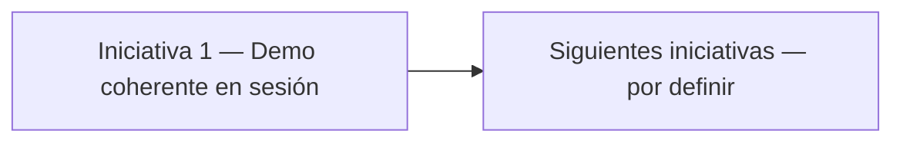

# Roadmap — SynchroDesk

Plan vigente de **cosas a añadir** al prototipo. Solo front, datos mock, sin backend.

El plan anterior por sprints (historias `S{n}·HU-{m}`, gate Supabase, Better Auth) **queda fuera de este ciclo**. Archivo: [`ROADMAP-historico.md`](./ROADMAP-historico.md).

**Fuera de este roadmap (no se incluye):** API real, Postgres, Supabase, autenticación verdadera, middleware, RLS, Storage, Realtime, E2E, export de servidor.

**Estados:** `Pendiente` · `En curso` · `Hecho`

Estado actual del producto: [`FEATURES.md`](./FEATURES.md) · arquitectura: [`PROJECT.md`](./PROJECT.md).



---

## Iniciativa 1 — Demo coherente en una sesión

**Objetivo:** Que la consola se comporte como un producto en la pestaña: cada acción visible se guarda en sesión y cambiar de cliente aísla los datos. Hoy eso solo es cierto en tickets (y a medias en inventario).

**Alcance:** front mock. `sessionStorage` / stores. Sin backend.

**No entra en esta iniciativa:** login real, drag & drop de Kanban, adjuntos en la nube, Playwright, scaffold Supabase.

**DoD:** Recargar la pestaña no deshace el trabajo de demo; Google, Andes y Nexus muestran datos distintos en todos los módulos de negocio; invitar usuario y guardar rol se ven en sus listados.

| ID | Entrega | Estado |
|----|---------|--------|
| I1-1 | Persistir tenant activo y recientes | Pendiente |
| I1-2 | Aislar datos mock por tenant en toda la consola | Pendiente |
| I1-3 | Invitar usuario añade fila en sesión | Pendiente |
| I1-4 | Crear y guardar rol en sesión | Pendiente |
| I1-5 | Movimiento de inventario actualiza stock | Pendiente |
| I1-6 | Cmd+K busca conocimiento e inventario del tenant | Pendiente |
| I1-7 | Configuración: timezone, idioma y switches en sesión | Pendiente |

---

### I1-1 — Persistir tenant activo y recientes

Al recargar la pestaña se restaura el cliente elegido y la lista de 5 recientes (`sessionStorage`, mismo patrón que el tema).

**Hoy:** el selector vuelve a Google.

**Criterios:**

- Claves junto a `ui-preferences-storage` (p. ej. `synchrodesk:tenant-active` y `synchrodesk:tenant-recent`)
- Logo, eyebrow y listados coinciden con el tenant restaurado
- Si el id guardado ya no existe, fallback a `TEN-GOOGLE`

**Estado:** Pendiente

---

### I1-2 — Aislar datos mock por tenant en toda la consola

Inventario, conocimiento, roles, equipos, activos y notificaciones respetan el tenant activo, igual que tickets y usuarios.

**Hoy:** esos catálogos son globales; Nexus Salud ve el mismo stock que Google (salvo el 403 de inventario).

**Criterios:**

- `tenantId` en tipos y seeds (Google, Andes, Nexus). Nexus **sin** filas de inventario
- Listados y dashboard de inventario filtran por tenant
- Conocimiento, roles, equipos, activos y campana también
- Altas de artículo/movimiento heredan el `tenantId` activo
- sessionStorage de inventario **particionado** por tenant (`synchrodesk:inventory:{tenantId}`)

**Estado:** Pendiente · **Depende de:** — (puede ir en paralelo a I1-1)

---

### I1-3 — Invitar usuario añade fila en sesión

El modal de `/usuarios` deja un usuario `Invitado` en el directorio del tenant, no solo un toast.

**Hoy:** valida el correo, espera 400–800 ms y no muta el listado.

**Criterios:**

- Alta en store de usuarios (o extensión de `TicketsProvider`-like) con `tenantId` activo
- Fila visible sin recargar; ficha `/usuarios/[id]` funciona
- Persistencia en sessionStorage de la pestaña
- Email duplicado en el tenant → error inline + toast
- Sigue siendo mock: no hay correo real ni Auth

**Estado:** Pendiente · **Depende de:** I1-2 (scoping de usuarios ya existe; el store nuevo debe respetar tenant)

---

### I1-4 — Crear y guardar rol en sesión

`/roles/nuevo` y `/roles/[id]` dejan de tener el botón deshabilitado. La matriz y el nombre se guardan en la pestaña.

**Hoy:** los checkboxes solo viven en estado React; Guardar no hace nada.

**Criterios:**

- Store de roles con seeds + altas/ediciones
- Crear genera un id (`ROL-xxxx`), toast y redirect al detalle
- Editar nombre, descripción y matriz; toast al guardar
- Listado `/roles` refleja cambios
- Roles nuevos heredan `tenantId` (tras I1-2)

**Estado:** Pendiente · **Depende de:** I1-2

---

### I1-5 — Movimiento de inventario actualiza stock

Registrar entrada, salida, traslado o ajuste cambia el stock del artículo y su estado (Disponible / Stock bajo / Agotado).

**Hoy:** el movimiento aparece en el historial y el SKU no se toca.

**Criterios:**

- Entrada suma; salida/ajuste restan (sin stock negativo)
- Traslado no cambia el total si origen y destino son almacenes del mismo catálogo; sí actualiza el almacén mostrado si el modelo lo permite, o documentar que el prototipo solo mueve cantidad global
- `deriveStockStatus` se recalcula
- Listado de artículos y alertas del dashboard de inventario se actualizan
- Validación: salida mayor que stock → error, no se crea el movimiento

**Estado:** Pendiente · **Depende de:** I1-2 (para no mezclar stock entre tenants)

---

### I1-6 — Cmd+K busca conocimiento e inventario del tenant

La paleta y la búsqueda del header incluyen artículos y SKUs del cliente activo.

**Hoy:** solo tickets, clientes, usuarios y rutas.

**Criterios:**

- Grupos nuevos: Conocimiento, Inventario
- Filtro por `tenantId`
- Click → `/conocimiento/[id]` o `/inventario/articulos` (ancla o query al SKU si es barato)
- Mínimo 2 caracteres y debounce 300 ms, igual que ahora
- Nexus no devuelve ítems de inventario

**Estado:** Pendiente · **Depende de:** I1-2

---

### I1-7 — Configuración completa en sesión

Zona horaria, idioma y los tres switches de notificaciones se guardan con org, dominio y SLA.

**Hoy:** esos campos son `defaultValue` / Switch no controlado.

**Criterios:**

- Entran en `TenantSettings` y `tenant-settings-storage` (ya particionado por tenant)
- Recargar `/configuracion` restaura todo
- Toast al guardar, igual que ahora

**Estado:** Pendiente

---

## Orden sugerido

```
I1-1  tenant en sessionStorage          (independiente)
I1-7  settings que faltan               (independiente)
I1-2  tenantId en el resto de mocks     (bloquea 3–6)
I1-3  invitar usuario
I1-4  guardar rol
I1-5  stock al mover
I1-6  Cmd+K conocimiento + inventario
```

I1-1 y I1-7 pueden salir en paralelo a I1-2.

---

## Siguientes iniciativas

No forman parte de este documento todavía. Cuando I1 esté Hecho se abre una iniciativa nueva. Candidatas explícitamente **no** arrancadas aquí:

- Backend / Supabase
- Auth real o middleware
- Kanban con drag & drop
- Adjuntos persistentes fuera de blob URL
- Pruebas E2E

---

## Referencias

- Qué hace el front hoy: [`FEATURES.md`](./FEATURES.md)
- Arquitectura: [`PROJECT.md`](./PROJECT.md)
- Estilos: [`STYLES.md`](./STYLES.md)
- Plan anterior (archivo): [`ROADMAP-historico.md`](./ROADMAP-historico.md)
