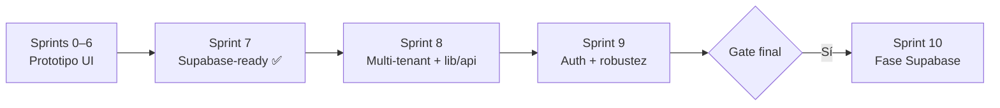

# Sprint previo a Supabase — Sprint 7

Antes de crear el proyecto en Supabase y ejecutar la **Fase Supabase** (auth, RLS, Storage, Realtime), el equipo debe cerrar el **Sprint 7 — Pulido y preparación para Supabase** y, recomendado, los **Sprints 8 y 9** de consolidación.

Los sprints 0–6 construyen el prototipo UI (mesa de ayuda, listados, multi-tenant, navegación, tickets, módulos secundarios). El Sprint 7 consolida esa base en una capa lista para sustituir mocks por PostgreSQL sin reescribir pantallas.

---

## Resumen ejecutivo

| Pregunta | Respuesta |
|----------|-----------|
| ¿Qué sprint hacer antes de Supabase? | **Sprint 7** (obligatorio) + **Sprints 8 y 9** (recomendados) |
| ¿Qué sprints son prerequisito? | **Sprints 0–6** (features que consume `lib/api`) |
| ¿Qué documento define el schema? | [`supabase.md`](./supabase.md) |
| ¿Mejoras adicionales propuestas? | [`sprints-8-9-pre-supabase.md`](./sprints-8-9-pre-supabase.md) |
| ¿Qué viene después? | **Sprint 10 / Fase Supabase** — ver [`ROADMAP.md` § Backlog](./ROADMAP.md#backlog--fase-supabase-post-prototipo) |

---

## Sprint 7 — Historias de usuario ✅ Cerrado

**Objetivo:** Capa API mock, calidad y contratos listos para Supabase.

**Definition of Done del sprint:** Pantallas críticas consumen `lib/api`; tipos y schema documentados; flujos E2E básicos cubiertos.

| HU | Título | Responsable | Estado | PR / notas |
|----|--------|-------------|--------|------------|
| S7·HU-1 | Capa `lib/api` con mocks | Rubén | ✅ Hecho | #39 |
| S7·HU-2 | Páginas de error / 403 | Rubén | ✅ Hecho | #40 |
| S7·HU-3 | Accesibilidad de teclado | José | ✅ Hecho | #41 |
| S7·HU-4 | Reduced motion | José | ✅ Hecho | #42 |
| S7·HU-5 | Preferencias en sessionStorage | Rubén | ✅ Hecho | #43 |
| S7·HU-6 | Contratos de datos Supabase | Rubén | ✅ Hecho | #44 — [`supabase.md`](./supabase.md) |
| S7·HU-7 | Pruebas E2E básicas | Rubén + Sebastián | ✅ Hecho | Playwright — 3 specs |

### S7·HU-1 — Capa `lib/api` con mocks

**Para** sustituir por cliente Supabase sin reescribir pantallas.

**Entregables:**

- Módulos: `tickets`, `users`, `tenants`, `inventory`, `notifications` en `src/lib/api/`
- Misma firma que tendrán las queries Supabase (filtros, paginación, `tenantId`)
- Comentarios `// TODO: supabase.from('...')` en cada función
- Stores y pantallas críticas migrados a `lib/api`

**Deuda heredada (Sprints 8–9):** conocimiento, roles, equipos y activos siguen importando mocks directamente; inventario sin `tenant_id` en runtime.

### S7·HU-6 — Contratos de datos para Supabase

- Schema propuesto, matriz `tenant_id`, mapeo TS → PG, RLS, Storage y Realtime
- Ver [`supabase.md`](./supabase.md)

### S7·HU-7 — Pruebas E2E básicas

- Playwright + `npm run test:e2e`
- Flujos: login → dashboard; listado tickets → detalle; crear ticket
- Mínimo 3 specs verdes

---

## Sprints 8 y 9 — Recomendados antes de Supabase

El Sprint 7 cierra la funcionalidad de demo, pero el análisis del código revela huecos que conviene resolver **antes** de conectar Postgres:

| Área | Problema actual | Sprint |
|------|----------------|--------|
| Multi-tenant | Inventario, conocimiento y notificaciones sin `tenant_id` en runtime | S8 |
| `lib/api` | 12 archivos importan mocks directamente; sin mutaciones async | S8 |
| Auth | Sin middleware ni sesión; dashboard accesible sin login | S9 |
| Errores | Sin `error.tsx` ni patrón de reintento | S9 |
| Infra | Sin `.env.example` ni cliente Supabase stub | S9 |

**Detalle completo:** [`sprints-8-9-pre-supabase.md`](./sprints-8-9-pre-supabase.md)

---

## Gate — checklist antes de crear el proyecto Supabase

### Sprint 7 ✅

- [x] `src/lib/api/` con módulos principales y TODOs Supabase
- [x] Pantallas críticas consumen `lib/api` (tickets, usuarios, tenants, inventario, notificaciones)
- [x] [`docs/supabase.md`](./supabase.md) documentado
- [x] S7·HU-7 — E2E con Playwright (3 specs verdes)

### Sprint 8 (recomendado)

- [ ] `tenantId` en todos los tipos de negocio
- [ ] Scoping runtime por tenant (inventario, notificaciones, conocimiento)
- [ ] Cero imports de `@/shared/mock` en UI
- [ ] Mutaciones en `lib/api` usadas por stores

### Sprint 9 (recomendado)

- [ ] Middleware + sesión mock
- [ ] `error.tsx` y patrón retry
- [ ] E2E multi-tenant (≥6 specs)
- [ ] `.env.example` + `src/lib/supabase/` + SQL borrador

### Revisión de equipo

- [ ] Demo interna tras S8–S9
- [ ] [`supabase.md`](./supabase.md) aprobado por el equipo

---

## Orden de trabajo

1. ~~Cerrar Sprint 7~~ ✅
2. Ejecutar **Sprint 8** — consolidación multi-tenant y `lib/api` completo
3. Ejecutar **Sprint 9** — auth skeleton, errores, E2E ampliados, scaffold Supabase
4. Iniciar **Sprint 10 / Fase Supabase** — ver [`supabase.md` § Próximos pasos](./supabase.md#próximos-pasos)

---

## Referencias

- Mejoras propuestas S8–S9: [`sprints-8-9-pre-supabase.md`](./sprints-8-9-pre-supabase.md)
- Roadmap completo: [`ROADMAP.md`](./ROADMAP.md)
- Contrato de datos: [`supabase.md`](./supabase.md)
- Auth (migración futura): [`auth.md`](./auth.md)
- Capa API: `src/lib/api/`

---

*Última actualización: agosto 2026*
