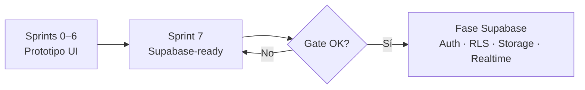

# Sprint previo a Supabase — Sprint 7

Antes de crear el proyecto en Supabase y ejecutar la **Fase Supabase** (auth, RLS, Storage, Realtime), el equipo debe cerrar el **Sprint 7 — Pulido y preparación para Supabase**.

Los sprints 0–6 construyen el prototipo UI (mesa de ayuda, listados, multi-tenant, navegación, tickets, módulos secundarios). El Sprint 7 consolida esa base en una capa lista para sustituir mocks por PostgreSQL sin reescribir pantallas.

---

## Resumen ejecutivo

| Pregunta | Respuesta |
|----------|-----------|
| ¿Qué sprint hacer antes de Supabase? | **Sprint 7** |
| ¿Qué sprints son prerequisito? | **Sprints 0–6** (features que consume `lib/api`) |
| ¿Qué documento define el schema? | [`supabase.md`](./supabase.md) |
| ¿Qué viene después? | **Fase Supabase** — ver [`ROADMAP.md` § Backlog](./ROADMAP.md#backlog--fase-supabase-post-prototipo) |



---

## Sprint 7 — Historias de usuario

**Objetivo:** Capa API mock, calidad y contratos listos para Supabase.

**Definition of Done del sprint:** Pantallas críticas consumen `lib/api`; tipos y schema documentados; flujos E2E básicos cubiertos.

| HU | Título | Responsable | Estado | PR / notas |
|----|--------|-------------|--------|------------|
| S7·HU-1 | Capa `lib/api` con mocks | Rubén | ✅ Hecho | #39 |
| S7·HU-2 | Páginas de error / 403 | Rubén | ✅ Hecho | #40 |
| S7·HU-3 | Accesibilidad de teclado | José | ✅ Hecho | #41 |
| S7·HU-4 | Reduced motion | José | ✅ Hecho | #42 |
| S7·HU-5 | Preferencias en sessionStorage | Rubén | ✅ Hecho | #43 |
| S7·HU-6 | Contratos de datos Supabase | Rubén | ✅ Hecho | #44 — [`supabase.md`](./supabase.md) |
| S7·HU-7 | Pruebas E2E básicas | Rubén + Sebastián | ⏳ Pendiente | Playwright no configurado aún |

### S7·HU-1 — Capa `lib/api` con mocks

**Para** sustituir por cliente Supabase sin reescribir pantallas.

**Entregables:**

- Módulos: `tickets`, `users`, `tenants`, `inventory`, `notifications` en `src/lib/api/`
- Misma firma que tendrán las queries Supabase (filtros, paginación, `tenantId`)
- Comentarios `// TODO: supabase.from('...')` en cada función
- Stores y pantallas críticas migrados a `lib/api`

**Migración parcial aceptable en demo:** conocimiento, roles, equipos y activos siguen importando mocks directamente; se migrarán en la Fase Supabase o en una HU de limpieza opcional.

### S7·HU-2 — Páginas de error y acceso denegado

- `not-found.tsx` en dashboard
- Guard 403 para inventario sin permiso (`InventoryAccessGuard`)
- Botón volver al dashboard

### S7·HU-3 — Accesibilidad de teclado

- Focus ring visible (sidebar, chips, tablas, command palette)
- Tab order lógico en formularios
- `aria-label` en icon buttons del header

### S7·HU-4 — Reduced motion

- `prefers-reduced-motion` desactiva o reduce `fade-up`, `stagger` y hovers

### S7·HU-5 — Preferencias en sessionStorage

- Tema claro/oscuro y tamaño de página por listado persisten en la sesión

### S7·HU-6 — Contratos de datos para Supabase

- Schema propuesto, matriz `tenant_id`, mapeo TS → PG, RLS, Storage y Realtime
- Ver [`supabase.md`](./supabase.md)

### S7·HU-7 — Pruebas E2E básicas *(bloqueante para abrir Supabase)*

**Criterios de aceptación:**

- Playwright instalado y script `npm run test:e2e`
- Flujos mínimos:
  1. Login mock → dashboard
  2. Listado tickets → detalle
  3. Crear ticket
- CI local documentado en README o en este doc
- Mínimo 3 specs verdes

**Por qué antes de Supabase:** al sustituir mocks por Supabase, los E2E validan que la firma de `lib/api` y los flujos críticos no regresan.

---

## Gate — checklist antes de crear el proyecto Supabase

Marcar **todas** las casillas antes de ejecutar la Fase Supabase:

### Prerequisitos de producto (Sprints 0–6)

- [x] Store y flujos de tickets operativos (crear, comentar, filtros, Kanban)
- [x] Multi-tenant con `tenantId` en tickets y usuarios
- [x] Listados con paginación, búsqueda y estados vacíos
- [x] Navegación global (Cmd+K, breadcrumbs, notificaciones enlazadas)
- [x] Módulos secundarios: conocimiento, usuarios, clientes, inventario

### Sprint 7 — Supabase-ready

- [x] `src/lib/api/` con módulos principales y TODOs Supabase
- [x] Pantallas críticas consumen `lib/api` (tickets, usuarios, tenants, inventario, notificaciones)
- [x] [`docs/supabase.md`](./supabase.md) revisado y aprobado por el equipo
- [ ] **S7·HU-7** — E2E con Playwright (3 specs verdes)

### Deuda técnica conocida (no bloquea el gate, pero planificar en Fase Supabase)

| Ítem | Estado | Cuándo resolver |
|------|--------|-----------------|
| `tenant_id` en tipos/mocks de inventario | Pendiente en TS | Migración SQL + seeds |
| Conocimiento, roles, equipos, activos sin `lib/api` | Mock directo | Al migrar cada módulo |
| Auth real (Better Auth / Supabase Auth) | Solo UI en `/login` | Fase Supabase · HU-1 |
| Adjuntos como blob URL local | Modelo listo en UI | Fase Supabase · Storage |

---

## Orden de trabajo recomendado

### 1. Cerrar Sprint 7

```
Prioridad 1 → S7·HU-7 (E2E con Playwright)
Revisión    → Demo del equipo sobre docs/supabase.md
```

### 2. Iniciar Fase Supabase (post-gate)

Orden sugerido alineado con [`supabase.md` § Próximos pasos](./supabase.md#próximos-pasos) y el backlog del roadmap:

| Orden | Historia | Entregable |
|-------|----------|------------|
| 1 | Crear proyecto Supabase + migración inicial | Tablas `tenants`, `users`, `tickets` e hijas |
| 2 | Auth + claim `tenant_id` en JWT | Sesión real; ver [`auth.md`](./auth.md) |
| 3 | RLS por `tenant_id` | Políticas del borrador en `supabase.md` |
| 4 | Sustituir mocks en `lib/api` | Módulo a módulo sin cambiar pantallas |
| 5 | Storage | Buckets `ticket-attachments`, `ticket-evidences` |
| 6 | Realtime | Canal `notifications` en header |

Detalle de historias: [`ROADMAP.md` § Backlog — Fase Supabase](./ROADMAP.md#backlog--fase-supabase-post-prototipo).

---

## Criterios para dar por cerrado el Sprint 7

1. **S7·HU-7** completada (única HU pendiente).
2. Equipo alineado con [`supabase.md`](./supabase.md) (revisión en reunión o async).
3. `npm run build` sin errores.
4. Demo interna: flujos ticket + multi-tenant + inventario funcionando sobre `lib/api`.

Tras eso, se puede crear el proyecto en Supabase y abrir el **Sprint 8 / Fase Supabase**.

---

## Referencias

- Roadmap completo: [`ROADMAP.md`](./ROADMAP.md)
- Contrato de datos: [`supabase.md`](./supabase.md)
- Auth (migración futura): [`auth.md`](./auth.md)
- Capa API: `src/lib/api/`

---

*Última actualización: agosto 2026*
