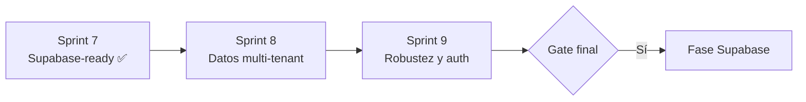

# Sprints 8 y 9 — Mejoras antes de Supabase

Con el **Sprint 7 cerrado** (incluida S7·HU-7 E2E), el prototipo UI está listo en funcionalidad. Antes de crear el proyecto en Supabase conviene ejecutar **dos sprints adicionales** que reducen riesgo en la migración: alinear el modelo multi-tenant en toda la app y preparar auth, errores y mutaciones en `lib/api`.



---

## Por qué no ir directo a Supabase

| Riesgo si migramos ya | Mitigación en S8–S9 |
|----------------------|---------------------|
| Inventario y notificaciones sin `tenant_id` en runtime | S8·HU-1, HU-2 |
| 12 pantallas importan mocks directamente | S8·HU-3 |
| Stores escriben en sessionStorage sin pasar por API | S8·HU-4 |
| Sin middleware ni sesión → auth será un big-bang | S9·HU-1 |
| Sin `error.tsx` ni patrón de reintento | S9·HU-2 |
| E2E solo cubre 3 flujos básicos | S9·HU-3 |
| Sin `.env.example` ni cliente Supabase vacío | S9·HU-4 |

---

## Sprint 8 — Consolidación multi-tenant y `lib/api`

**Objetivo:** Que toda entidad de negocio respete `tenant_id` y toda lectura pase por `lib/api`, igual que tickets y usuarios hoy.

**DoD del sprint:** Cambiar de tenant altera inventario, conocimiento, roles y notificaciones; cero imports directos a `shared/mock` en componentes.

| HU | Título | Responsable | Complejidad | Prioridad |
|----|--------|-------------|-------------|-----------|
| S8·HU-1 | `tenantId` en tipos y mocks | Rubén | 7/10 | Alta |
| S8·HU-2 | Scoping runtime por tenant | Rubén | 8/10 | Alta |
| S8·HU-3 | Ampliar `lib/api` (6 módulos) | Rubén | 7/10 | Alta |
| S8·HU-4 | Mutaciones mock en `lib/api` | Rubén | 8/10 | Alta |
| S8·HU-5 | Búsqueda global ampliada | José | 4/10 | Media |
| S8·HU-6 | Tenant reciente en sessionStorage | Sebastián | 3/10 | Baja |

---

### S8·HU-1 — `tenantId` en tipos y mocks

**Como** desarrollador  
**Quiero** que inventario, conocimiento, roles, equipos, activos y notificaciones tengan `tenantId` en tipos y seeds  
**Para** alinear el front con el schema de [`supabase.md`](./supabase.md)

**Criterios de aceptación:**

- Añadir `tenantId: string` en:
  - `src/shared/types/inventory.ts` (items, movements, warehouses, suppliers)
  - `src/shared/types/knowledge.ts`
  - `src/shared/types/role.ts` (`tenantId` nullable para plantillas globales)
  - `src/shared/types/team.ts`, `asset.ts`
  - `AppNotification` movido a `src/shared/types/notification.ts`
- Seeds en `src/shared/mock/` con `tenant_id` coherente con `TEN-GOOGLE`, `TEN-ANDES`, `TEN-NEXUS`
- Hijos de ticket (`TicketComment`, adjuntos, evidencias, actividad) con `tenantId` redundante para RLS futuro
- Nexus Salud sin filas de inventario (solo mesa de ayuda)

**Depende de:** S7·HU-6

---

### S8·HU-2 — Scoping runtime por tenant

**Como** administrador de plataforma  
**Quiero** que al cambiar de cliente vea solo sus datos en inventario, conocimiento y notificaciones  
**Para** validar el aislamiento multi-tenant antes de RLS en Postgres

**Criterios de aceptación:**

- `lib/api/inventory.ts` y `lib/api/notifications.ts` filtran con `filterByTenant` (eliminar `void tenantId`)
- `InventoryProvider` y claves de sessionStorage particionadas por `tenantId` (ej. `synchrodesk:inventory:{tenantId}`)
- Pantallas de inventario, conocimiento, roles, equipos y activos pasan `tenantId` desde `TenantProvider`
- Dashboard KPIs y gráfico consumen datos del tenant activo (no mock global)

**Depende de:** S8·HU-1, S3·HU-1

---

### S8·HU-3 — Ampliar `lib/api` (6 módulos)

**Como** desarrollador  
**Quiero** módulos API para conocimiento, roles, equipos, activos, dashboard y plantillas de comentario  
**Para** eliminar imports directos a mocks en la UI

**Criterios de aceptación:**

- Nuevos archivos: `knowledge.ts`, `roles.ts`, `teams.ts`, `assets.ts`, `dashboard.ts`, `comment-templates.ts`
- Exportados desde `src/lib/api/index.ts`
- Comentarios `// TODO: supabase.from('...')` en cada función
- Migrar los 12 archivos que hoy importan `@/shared/mock/*` directamente
- `filterByTenant` solo dentro de `lib/api`, no en `shared/constants`

**Depende de:** S8·HU-1

---

### S8·HU-4 — Mutaciones mock en `lib/api`

**Como** desarrollador  
**Quiero** firmas async de escritura en `lib/api` (crear ticket, comentar, marcar notificación, etc.)  
**Para** que los stores deleguen en la API y Supabase sustituya solo la implementación

**Criterios de aceptación:**

- Funciones nuevas (mock con delay simulado):
  - `tickets`: `createTicket`, `updateTicket`, `addComment`
  - `notifications`: `markAsRead`, `markAllAsRead`
  - `tenants`: `updateTenantStatus`, `updateTenantPlan` (acciones de cliente)
  - `inventory`: `createItem`, `createMovement` (opcional)
- `TicketsProvider` y `NotificationsProvider` llaman a `lib/api` en lugar de mutar arrays locales directamente
- Misma firma que tendrán los `insert`/`update` de Supabase

**Depende de:** S7·HU-1, S8·HU-3

---

### S8·HU-5 — Búsqueda global ampliada

**Como** agente de mesa de ayuda  
**Quiero** buscar artículos de conocimiento e ítems de inventario desde Cmd+K  
**Para** encontrar recursos sin cambiar de módulo

**Criterios de aceptación:**

- `src/shared/search/global-search.ts` incluye knowledge + inventory (filtrados por tenant)
- Resultados enlazan a `/conocimiento/[id]` e `/inventario/articulos`
- Iconos y agrupación coherentes con tickets/usuarios actuales

**Depende de:** S8·HU-3, S4·HU-1

---

### S8·HU-6 — Tenant reciente en sessionStorage

**Como** administrador de plataforma  
**Quiero** que el último tenant visitado persista al refrescar  
**Para** no reelegir cliente en cada sesión de demo

**Criterios de aceptación:**

- `TenantProvider` persiste `recentTenantIds` y tenant activo en `sessionStorage`
- Mismo patrón que `ui-preferences-storage.ts`
- Restaura al cargar la app

**Depende de:** S7·HU-5, S3·HU-2

---

## Sprint 9 — Robustez, auth preparatoria e infraestructura

**Objetivo:** Preparar la app para sesión real, errores de red y el primer commit de infra Supabase sin conectar datos productivos.

**DoD del sprint:** Dashboard protegido por middleware; patrón loading/error unificado; E2E multi-tenant; `.env.example` y cliente Supabase stub.

| HU | Título | Responsable | Complejidad | Prioridad |
|----|--------|-------------|-------------|-----------|
| S9·HU-1 | Auth skeleton (middleware + sesión mock) | Rubén | 8/10 | Alta |
| S9·HU-2 | Patrón loading / error / retry | José | 6/10 | Alta |
| S9·HU-3 | E2E ampliados (multi-tenant) | Rubén + Sebastián | 5/10 | Alta |
| S9·HU-4 | Scaffold cliente Supabase | Rubén | 5/10 | Alta |
| S9·HU-5 | Completar stubs de demo | Sebastián | 5/10 | Media |
| S9·HU-6 | Auditoría a11y en formularios | José | 4/10 | Baja |

---

### S9·HU-1 — Auth skeleton (middleware + sesión mock)

**Como** desarrollador  
**Quiero** middleware y un tipo de sesión `{ userId, tenantId, platformOperator }`  
**Para** integrar Supabase Auth sin reestructurar rutas

**Criterios de aceptación:**

- `middleware.ts` protege `(dashboard)/*` — sin sesión mock → redirect `/login`
- Cookie o header de demo con usuario fijo (ej. operador plataforma / agente tenant)
- `SessionProvider` o extensión de `TenantProvider` expone `session` al árbol React
- `LoginForm` establece sesión mock antes de `router.push('/dashboard')`
- Logout limpia sesión (no solo `<Link>`)
- Documentar en [`auth.md`](./auth.md) el contrato de sesión previsto

**Depende de:** S8·HU-2

**Nota:** No instalar Better Auth ni Supabase Auth aún; solo el contrato y el guard.

---

### S9·HU-2 — Patrón loading / error / retry

**Como** visitante de demo  
**Quiero** estados de carga y error coherentes en todos los listados  
**Para** que fallos de red futuros no dejen la UI colgada

**Criterios de aceptación:**

- `error.tsx` en `(dashboard)` y `global-error.tsx` en raíz
- Componente reutilizable `DataFetchError` con botón Reintentar
- Todos los boards async usan skeleton (no `EmptyState` como loading)
- `listUsers`, `listTickets`, etc. con `.catch()` y mensaje al usuario
- `loading.tsx` en rutas de inventario y conocimiento

**Depende de:** S7·HU-1

---

### S9·HU-3 — E2E ampliados (multi-tenant)

**Como** equipo  
**Quiero** specs que cubran cambio de tenant y permisos de inventario  
**Para** detectar regresiones al conectar Supabase

**Criterios de aceptación:**

- Specs adicionales (mínimo +3):
  1. Cambiar tenant → tickets distintos en listado
  2. Nexus Salud → inventario muestra 403
  3. Marcar notificación como leída → badge actualizado
- Specs existentes (S7·HU-7) siguen verdes
- Documentación de ejecución en README

**Depende de:** S7·HU-7, S8·HU-2

---

### S9·HU-4 — Scaffold cliente Supabase

**Como** desarrollador  
**Quiero** dependencias, variables de entorno y cliente stub  
**Para** que el Sprint 10 (Fase Supabase) empiece con wiring, no con configuración

**Criterios de aceptación:**

- `.env.example` con `NEXT_PUBLIC_SUPABASE_URL`, `NEXT_PUBLIC_SUPABASE_ANON_KEY`
- `src/lib/supabase/client.ts` (browser) y `server.ts` (RSC) con `@supabase/ssr`
- Cliente no usado en producción aún — `lib/api` sigue en mock
- Carpeta `supabase/migrations/` con SQL inicial generado desde [`supabase.md`](./supabase.md) (borrador, no aplicado)
- Script documentado: `npx supabase init` / `db push` para cuando exista el proyecto

**Depende de:** S7·HU-6, S8·HU-1

---

### S9·HU-5 — Completar stubs de demo

**Como** visitante de demo  
**Quiero** que invitar usuario, guardar rol y adjuntos simulen persistencia  
**Para** una demo más creíble antes del backend real

**Criterios de aceptación:**

- `InviteUserModal`: añade fila vía `lib/api/users.create` (mock) o store + API
- Rol nuevo: formulario habilitado con toast (persistencia en sesión)
- `ImageAttachField`: metadata guardada en ticket (path simulado, no solo blob URL huérfana)
- Acciones de cliente (`ClientDetailView`) delegan en `lib/api/tenants`

**Depende de:** S8·HU-4, S6·HU-4, S6·HU-5, S6·HU-6

---

### S9·HU-6 — Auditoría a11y en formularios

**Como** usuario con lector de pantalla  
**Quiero** labels, mensajes de error y diálogos accesibles en todos los formularios  
**Para** cumplir WCAG antes de producción

**Criterios de aceptación:**

- `aria-describedby` en campos con error de validación
- `role="alert"` en mensajes de error
- Trap de foco en modales (invitar usuario, confirmar cierre ticket)
- Checklist en comentario de PR o nota en `docs/DESIGN-README.md`

**Depende de:** S7·HU-3

---

## Gate final — checklist antes de Fase Supabase

### Sprint 7 ✅

- [x] `lib/api` principal + contratos `supabase.md`
- [x] E2E básicos (S7·HU-7)

### Sprint 8

- [ ] `tenantId` en todos los tipos de negocio
- [ ] Inventario y notificaciones filtrados por tenant en runtime
- [ ] Cero imports de `@/shared/mock` en `components/` y `app/`
- [ ] Mutaciones en `lib/api` usadas por stores

### Sprint 9

- [ ] Middleware + sesión mock
- [ ] `error.tsx` y patrón retry
- [ ] E2E multi-tenant (≥6 specs verdes)
- [ ] `.env.example` + `src/lib/supabase/` + migración SQL borrador

### Revisión de equipo

- [ ] Demo interna S8 + S9
- [ ] [`supabase.md`](./supabase.md) aprobado sin cambios de schema pendientes

---

## Orden de ejecución recomendado

### Sprint 8 (semana 1–2)

```
Día 1–2   Rubén → S8·HU-1 (tipos + seeds)
Día 3–4   Rubén → S8·HU-2 (scoping) + S8·HU-3 (módulos API)
Día 5     Rubén → S8·HU-4 (mutaciones)
Paralelo  José → S8·HU-5 · Sebastián → S8·HU-6
```

### Sprint 9 (semana 3–4)

```
Día 1–2   Rubén → S9·HU-1 (auth skeleton) + S9·HU-4 (scaffold Supabase)
Día 3     José → S9·HU-2 (errores)
Día 4–5   Rubén + Sebastián → S9·HU-3 (E2E)
Paralelo  Sebastián → S9·HU-5 · José → S9·HU-6
```

### Sprint 10 — Fase Supabase (después del gate)

Ver [`ROADMAP.md` § Backlog — Fase Supabase](./ROADMAP.md#backlog--fase-supabase-post-prototipo):

1. Crear proyecto Supabase + aplicar migración
2. Auth real + claim `tenant_id`
3. RLS
4. Sustituir mocks en `lib/api` módulo a módulo
5. Storage + Realtime

---

## Resumen de valor

| Sprint | Valor principal | Esfuerzo estimado |
|--------|-----------------|-------------------|
| **8** | Modelo de datos coherente; frontera API completa | ~6 HUs, mayoría Rubén |
| **9** | Auth, errores, E2E, infra lista | ~6 HUs, reparto equipo |
| **10+** | Supabase real | Backlog existente |

Invertir S8–S9 evita rehacer pantallas durante la migración: Supabase solo cambia el interior de `lib/api`, no la UI ni los stores.

---

## Referencias

- Sprint 7 (cerrado): [`sprint-pre-supabase.md`](./sprint-pre-supabase.md)
- Schema: [`supabase.md`](./supabase.md)
- Roadmap: [`ROADMAP.md`](./ROADMAP.md)
- Auth: [`auth.md`](./auth.md)

---

*Última actualización: agosto 2026*
