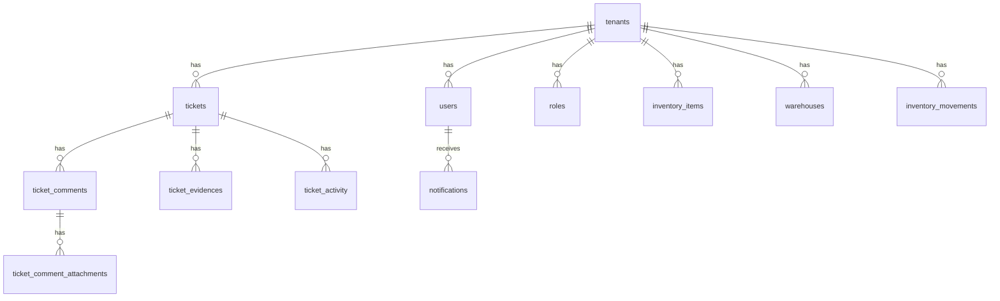

# Supabase — contrato de datos y RLS previsto

Documento de referencia para alinear al equipo **antes** de crear el proyecto en Supabase. Describe tablas, columnas, políticas RLS, Storage y Realtime que sustituirán los mocks actuales (`src/shared/mock/`) y la capa `src/lib/api/`.

## Principios

1. **Multi-tenant por fila** — Toda tabla de negocio incluye `tenant_id` (FK → `tenants.id`).
2. **RLS obligatorio** — Ninguna tabla expuesta en `public` sin Row Level Security.
3. **snake_case en Postgres, camelCase en TypeScript** — El mapeo vive en `lib/api` (select con alias o transformación en el cliente).
4. **IDs legibles en demo** — Se mantienen prefijos (`TEN-`, `TCK-`, `USR-`) en seeds; en producción pueden migrarse a `uuid` sin cambiar la forma del contrato en la app.
5. **Claims JWT** — El aislamiento usa `tenant_id` (y opcionalmente `role`) en `auth.jwt()` / `app_metadata`, nunca en `user_metadata` editable.

## Convenciones de nombres

| TypeScript (app) | PostgreSQL (Supabase) | Ejemplo |
|------------------|----------------------|---------|
| `tenantId` | `tenant_id` | `TEN-GOOGLE` |
| `createdAt` | `created_at` | `timestamptz` |
| `ticketId` | `ticket_id` | FK |
| `usersCount` | — | Campo calculado / agregado, no persistido |

Enums de la UI (estado, prioridad, etc.) se almacenan como `text` con `CHECK` o tipo `enum` de Postgres según preferencia del equipo.

---

## Diagrama de relaciones (resumen)



---

## Tablas

### `tenants` (catálogo de clientes / plataforma)

Sin `tenant_id` — es la entidad raíz del aislamiento.

| Columna | Tipo PG | TS (`Tenant`) | Notas |
|---------|---------|---------------|-------|
| `id` | `text` PK | `id` | Ej. `TEN-GOOGLE` |
| `name` | `text` | `name` | |
| `slug` | `text` UNIQUE | `slug` | Subdominio / ruta |
| `domain` | `text` | `domain` | |
| `plan` | `text` | `plan` | Starter / Business / Enterprise |
| `status` | `text` | `status` | Activo, Onboarding, Suspendido |
| `contracted_at` | `timestamptz` | `contractedAt` | Parsear desde string demo |
| `region` | `text` | `region` | |
| `logo` | `text` | `logo` | Clave de asset / Storage |
| `admin_name` | `text` | `adminName` | |
| `admin_email` | `text` | `adminEmail` | |
| `systems` | `text[]` | `systems` | Ej. `{Mesa de ayuda,Inventario}` |
| `created_at` | `timestamptz` | — | Default `now()` |

Campos solo demo (agregados, no persistir o vista): `users`, `ticketsOpen` → consultas `COUNT` o materialized view.

**RLS:** Solo operadores de plataforma (`app_metadata.platform_operator = true`) pueden listar todos; usuarios de tenant ven solo su fila.

---

### `users`

| Columna | Tipo PG | TS (`User`) | Notas |
|---------|---------|-------------|-------|
| `id` | `text` PK | `id` | Vincular con `auth.users.id` (uuid) en integración real |
| **`tenant_id`** | `text` FK → `tenants.id` | `tenantId` | **RLS** |
| `name` | `text` | `name` | |
| `email` | `text` | `email` | UNIQUE `(tenant_id, email)` |
| `role` | `text` | `role` | Denormalizado; FK opcional → `roles.id` |
| `status` | `text` | `status` | Activo, Inactivo, Invitado |
| `team` | `text` | `team` | |
| `initials` | `text` | `initials` | |
| `last_access_at` | `timestamptz` | `lastAccess` | |
| `created_at` | `timestamptz` | — | |

Índices: `(tenant_id)`, `(tenant_id, email)`.

---

### `roles`

| Columna | Tipo PG | TS (`Role`) | Notas |
|---------|---------|-------------|-------|
| `id` | `text` PK | `id` | |
| **`tenant_id`** | `text` FK NULL | — | `NULL` = plantilla global de plataforma |
| `name` | `text` | `name` | |
| `description` | `text` | `description` | |
| `color` | `text` | `color` | |
| `permissions` | `jsonb` | `permissions` | `Record<PermissionModule, PermissionAction[]>` |
| `created_at` | `timestamptz` | — | |

`usersCount` en TS es agregado (`COUNT` sobre `users`).

---

### `tickets`

| Columna | Tipo PG | TS (`Ticket`) | Notas |
|---------|---------|---------------|-------|
| `id` | `text` PK | `id` | Ej. `TCK-1001` |
| **`tenant_id`** | `text` FK | `tenantId` | **RLS** |
| `title` | `text` | `title` | |
| `description` | `text` | `description` | |
| `status` | `text` | `status` | TicketStatus |
| `priority` | `text` | `priority` | TicketPriority |
| `technician` | `text` | `technician` | FK futura → `users.id` |
| `requester` | `text` | `requester` | |
| `team` | `text` | `team` | |
| `category` | `text` | `category` | |
| `sla` | `text` | `sla` | |
| `created_at` | `timestamptz` | `createdAt` | |
| `updated_at` | `timestamptz` | `updatedAt` | |

Índice: `(tenant_id, status, created_at DESC)`.

Relaciones hijas en tablas separadas (no JSON embebido en producción).

---

### `ticket_comments`

| Columna | Tipo PG | TS (`TicketComment`) | Notas |
|---------|---------|----------------------|-------|
| `id` | `text` PK | `id` | |
| **`tenant_id`** | `text` FK | — | Redundante para RLS sin join |
| `ticket_id` | `text` FK → `tickets.id` | — | ON DELETE CASCADE |
| `author` | `text` | `author` | |
| `role` | `text` | `role` | |
| `message` | `text` | `message` | |
| `created_at` | `timestamptz` | `createdAt` | |

Índice: `(ticket_id, created_at)`.

---

### `ticket_comment_attachments`

| Columna | Tipo PG | TS (`TicketCommentAttachment`) | Notas |
|---------|---------|----------------------------------|-------|
| `id` | `text` PK | `id` | |
| **`tenant_id`** | `text` FK | — | RLS |
| `comment_id` | `text` FK → `ticket_comments.id` | — | |
| `name` | `text` | `name` | Nombre original |
| `storage_path` | `text` | — | Ruta en bucket Storage |
| `mime_type` | `text` | — | |
| `size_bytes` | `bigint` | — | |
| `created_at` | `timestamptz` | — | |

`previewUrl` en TS es URL firmada de Storage (no columna).

---

### `ticket_evidences`

| Columna | Tipo PG | TS (`TicketEvidence`) | Notas |
|---------|---------|----------------------|-------|
| `id` | `text` PK | `id` | |
| **`tenant_id`** | `text` FK | — | RLS |
| `ticket_id` | `text` FK → `tickets.id` | — | |
| `name` | `text` | `name` | |
| `type` | `text` | `type` | imagen \| documento \| log |
| `size_label` | `text` | `size` | Ej. `1.2 MB` |
| `storage_path` | `text` | — | Opcional si está en Storage |
| `created_at` | `timestamptz` | — | |

---

### `ticket_activity`

| Columna | Tipo PG | TS (`TicketActivity`) | Notas |
|---------|---------|------------------------|-------|
| `id` | `text` PK | `id` | |
| **`tenant_id`** | `text` FK | — | RLS |
| `ticket_id` | `text` FK | — | |
| `kind` | `text` | `kind` | TicketActivityKind |
| `actor` | `text` | `actor` | |
| `message` | `text` | `message` | |
| `meta` | `jsonb` | `meta` | `{ from, to, commentId }` |
| `occurred_at` | `timestamptz` | `at` | |

Índice: `(ticket_id, occurred_at DESC)`.

---

### Inventario

Todas con **`tenant_id`**. Los mocks actuales son globales; al migrar se añade `tenant_id` en tipos y seeds.

#### `inventory_items`

| Columna | Tipo PG | TS (`InventoryItem`) |
|---------|---------|----------------------|
| `sku` | `text` | `sku` | PK compuesta con `tenant_id` |
| **`tenant_id`** | `text` FK | — |
| `name` | `text` | `name` |
| `category` | `text` | `category` |
| `warehouse` | `text` | `warehouse` | FK futura → `warehouses.id` |
| `stock` | `integer` | `stock` |
| `min` | `integer` | `min` |
| `unit` | `text` | `unit` |
| `status` | `text` | `status` | Calculable; puede ser columna generada |

#### `inventory_movements`

| Columna | Tipo PG | TS (`InventoryMovement`) |
|---------|---------|--------------------------|
| `id` | `text` PK | `id` |
| **`tenant_id`** | `text` FK | — |
| `type` | `text` | `type` |
| `sku` | `text` | `sku` |
| `item` | `text` | `item` |
| `quantity` | `integer` | `quantity` |
| `from` | `text` | `from` |
| `to` | `text` | `to` |
| `user` | `text` | `user` |
| `created_at` | `timestamptz` | `createdAt` |

#### `warehouses`

| Columna | Tipo PG | TS (`Warehouse`) |
|---------|---------|------------------|
| `id` | `text` PK | `id` |
| **`tenant_id`** | `text` FK | — |
| `name` | `text` | `name` |
| `location` | `text` | `location` |
| `manager` | `text` | `manager` |
| `skus` | `integer` | `skus` | Agregado |
| `capacity` | `text` | `capacity` |
| `status` | `text` | `status` |

#### `suppliers`

| Columna | Tipo PG | TS (`Supplier`) |
|---------|---------|-----------------|
| `id` | `text` PK | `id` |
| **`tenant_id`** | `text` FK | — |
| `name` | `text` | `name` |
| `contact` | `text` | `contact` |
| `email` | `text` | `email` |
| `lead_time` | `text` | `leadTime` |
| `status` | `text` | `status` |

---

### `knowledge_articles`

| Columna | Tipo PG | TS (`KnowledgeArticle`) |
|---------|---------|------------------------|
| `id` | `text` PK | `id` |
| **`tenant_id`** | `text` FK | — |
| `title` | `text` | `title` |
| `category` | `text` | `category` |
| `excerpt` | `text` | `excerpt` |
| `content` | `text` | `content` |
| `updated_at` | `timestamptz` | `updatedAt` |
| `views` | `integer` | `views` |
| `helpful` | `integer` | `helpful` | % útil 0–100 |

---

### `assets`

| Columna | Tipo PG | TS (`Asset`) |
|---------|---------|--------------|
| `id` | `text` PK | `id` |
| **`tenant_id`** | `text` FK | — |
| `name` | `text` | `name` |
| `type` | `text` | `type` |
| `serial` | `text` | `serial` |
| `assignee` | `text` | `assignee` |
| `status` | `text` | `status` |
| `location` | `text` | `location` |

---

### `teams`

| Columna | Tipo PG | TS (`Team`) |
|---------|---------|-------------|
| `id` | `text` PK | `id` |
| **`tenant_id`** | `text` FK | — |
| `name` | `text` | `name` |
| `description` | `text` | `description` |
| `members` | `integer` | `members` | Agregado |
| `lead` | `text` | `lead` |
| `tickets_open` | `integer` | `ticketsOpen` | Agregado |
| `sla` | `text` | `sla` |
| `accent` | `text` | `accent` |

---

### `notifications`

| Columna | Tipo PG | TS (`AppNotification`) | Notas |
|---------|---------|------------------------|-------|
| `id` | `text` PK | `id` | |
| **`tenant_id`** | `text` FK | — | RLS |
| `user_id` | `text` FK → `users.id` | — | Destinatario |
| `title` | `text` | `title` | |
| `detail` | `text` | `detail` | |
| `ticket_id` | `text` FK NULL | `ticketId` | |
| `href` | `text` | `href` | Ruta si no hay ticket |
| `created_at` | `timestamptz` | — | Origen de `time` relativo en UI |
| `read_at` | `timestamptz` NULL | — | `unread` = `read_at IS NULL` |

Índice: `(user_id, created_at DESC)` donde `read_at IS NULL`.

---

### `dashboard_snapshots` (opcional)

Materializa `TenantDashboard` sin recalcular en cada request.

| Columna | Tipo PG | TS |
|---------|---------|-----|
| `tenant_id` | `text` FK | `tenantId` |
| `snapshot_date` | `date` | — |
| `payload` | `jsonb` | `kpis`, `ticketsByDay`, `activeTechnicians` |

PK compuesta: `(tenant_id, snapshot_date)`.

---

## Matriz `tenant_id`

| Tabla | `tenant_id` | RLS por tenant |
|-------|-------------|----------------|
| `tenants` | — (es el tenant) | Política especial plataforma |
| `users` | ✅ | ✅ |
| `roles` | ✅ (nullable) | ✅ |
| `tickets` | ✅ | ✅ |
| `ticket_comments` | ✅ | ✅ |
| `ticket_comment_attachments` | ✅ | ✅ |
| `ticket_evidences` | ✅ | ✅ |
| `ticket_activity` | ✅ | ✅ |
| `inventory_items` | ✅ | ✅ |
| `inventory_movements` | ✅ | ✅ |
| `warehouses` | ✅ | ✅ |
| `suppliers` | ✅ | ✅ |
| `knowledge_articles` | ✅ | ✅ |
| `assets` | ✅ | ✅ |
| `teams` | ✅ | ✅ |
| `notifications` | ✅ | ✅ |
| `dashboard_snapshots` | ✅ | ✅ |

---

## Mapeo TypeScript → PostgreSQL (referencia rápida)

### `Ticket` → `tickets` + hijas

```typescript
// lib/api/tickets.ts — consulta prevista
// supabase.from('tickets').select(`
//   *,
//   comments:ticket_comments(*, attachments:ticket_comment_attachments(*)),
//   evidences:ticket_evidences(*),
//   activity:ticket_activity(*)
// `).eq('tenant_id', tenantId)
```

| Campo TS | Tabla.columna PG |
|----------|------------------|
| `tenantId` | `tickets.tenant_id` |
| `createdAt` | `tickets.created_at` |
| `comments[].createdAt` | `ticket_comments.created_at` |
| `comments[].attachments` | `ticket_comment_attachments` + Storage URL |
| `activity[].at` | `ticket_activity.occurred_at` |

### `User` → `users`

| Campo TS | Columna PG |
|----------|------------|
| `tenantId` | `tenant_id` |
| `lastAccess` | `last_access_at` |

### `Tenant` → `tenants`

| Campo TS | Columna PG |
|----------|------------|
| `contractedAt` | `contracted_at` |
| `adminName` | `admin_name` |
| `adminEmail` | `admin_email` |
| `systems` | `systems` (`text[]`) |

### `AppNotification` → `notifications`

| Campo TS | Columna PG / lógica |
|----------|-------------------|
| `unread` | `read_at IS NULL` |
| `time` | `formatDistance(created_at)` en cliente |
| `ticketId` | `ticket_id` |

---

## Políticas RLS (borrador)

Función helper recomendada:

```sql
CREATE OR REPLACE FUNCTION auth.tenant_id()
RETURNS text
LANGUAGE sql
STABLE
AS $$
  SELECT COALESCE(
    auth.jwt() -> 'app_metadata' ->> 'tenant_id',
    ''
  );
$$;
```

Patrón estándar para tablas de negocio:

```sql
ALTER TABLE tickets ENABLE ROW LEVEL SECURITY;

CREATE POLICY tickets_select ON tickets
  FOR SELECT
  USING (tenant_id = auth.tenant_id());

CREATE POLICY tickets_insert ON tickets
  FOR INSERT
  WITH CHECK (tenant_id = auth.tenant_id());

CREATE POLICY tickets_update ON tickets
  FOR UPDATE
  USING (tenant_id = auth.tenant_id())
  WITH CHECK (tenant_id = auth.tenant_id());

-- UPDATE requiere también política SELECT en Postgres RLS
```

Repetir el mismo patrón en: `users`, `ticket_comments`, `ticket_evidences`, `inventory_*`, `notifications`, etc.

**Operador de plataforma** (consola `/clientes`):

```sql
CREATE POLICY tenants_platform_read ON tenants
  FOR SELECT
  USING (
    (auth.jwt() -> 'app_metadata' ->> 'platform_operator')::boolean IS TRUE
    OR id = auth.tenant_id()
  );
```

El claim `tenant_id` lo emitirá Better Auth / Supabase Auth tras login multi-tenant. **No** usar `user_metadata` para autorización.

---

## Storage (adjuntos)

Buckets propuestos:

| Bucket | Uso | RLS |
|--------|-----|-----|
| `ticket-attachments` | Imágenes en comentarios | Ruta `{tenant_id}/{ticket_id}/{file_id}` |
| `ticket-evidences` | Evidencias al crear ticket | Misma convención |
| `tenant-assets` | Logos (`tenants.logo`) | `{tenant_id}/logo.*` |

Política de objeto (ejemplo):

```sql
-- storage.objects: el primer segmento del path debe coincidir con tenant_id del JWT
CREATE POLICY tenant_storage_isolation ON storage.objects
  FOR ALL
  USING (
    bucket_id IN ('ticket-attachments', 'ticket-evidences')
    AND (storage.foldername(name))[1] = auth.tenant_id()
  );
```

Flujo en app:

1. Subir archivo → obtener `storage_path`.
2. Insertar fila en `ticket_comment_attachments` o `ticket_evidences`.
3. Leer con `createSignedUrl` para `previewUrl` en TS.

En la demo actual los adjuntos son blob URLs locales; `ImageAttachField` ya modela el contrato.

---

## Realtime (notificaciones)

Canal previsto para el header (`NotificationsProvider`):

```typescript
// lib/api/notifications.ts — suscripción futura
// supabase.channel(`notifications:${tenantId}:${userId}`)
//   .on('postgres_changes', {
//     event: 'INSERT',
//     schema: 'public',
//     table: 'notifications',
//     filter: `tenant_id=eq.${tenantId}`,
//   }, payload => { ... })
```

| Evento | Origen | UI |
|--------|--------|-----|
| `INSERT` | Nuevo ticket crítico, SLA en riesgo | Toast + badge en campana |
| `UPDATE` | `read_at` establecido | Sincronizar entre pestañas |
| `DELETE` | Limpieza admin | Quitar del listado |

`markAsRead` / `markAllAsRead` pasarán de `sessionStorage` a `UPDATE notifications SET read_at = now()`.

Considerar **broadcast** solo si hace falta latencia sub-segundo; para la demo basta `postgres_changes` en la tabla `notifications`.

---

## Tenants de demostración (seeds)

| `id` | Cliente | Inventario | Usuarios (mock) |
|------|---------|------------|-----------------|
| `TEN-GOOGLE` | Google | ✅ | 4 |
| `TEN-ANDES` | Andes Logistics | ✅ | 4 |
| `TEN-NEXUS` | Nexus Salud | ❌ solo mesa de ayuda | 4 |

Constantes: `demoTenantIds` en `src/shared/mock/tenants.ts`.

---

## Integración con `lib/api`

Cada función en `src/lib/api/*.ts` incluye un comentario `// TODO: supabase.from('...')` con la tabla objetivo. Al crear el proyecto Supabase:

1. Generar migraciones SQL desde este documento.
2. Activar RLS y políticas por tabla.
3. Crear buckets y políticas de Storage.
4. Sustituir implementación mock en `lib/api` manteniendo la misma firma (filtros, `tenantId`, paginación).
5. Habilitar Realtime en `notifications`.
6. Añadir `tenant_id` a tipos de inventario y mocks (pendiente en demo).

Helpers actuales que desaparecerán: `filterByTenant` → `.eq('tenant_id', id)` en el cliente Supabase.

---

## Próximos pasos

1. Crear proyecto Supabase y aplicar migración inicial (`tenants`, `users`, `tickets`, hijas).
2. Configurar Auth + claim `tenant_id` en `app_metadata`.
3. Implementar Storage para adjuntos de tickets.
4. Suscribir notificaciones por Realtime.
5. Migrar módulos en orden: `tenants` → `tickets` → `users` → `notifications` → `inventory` (ver `lib/api`).
